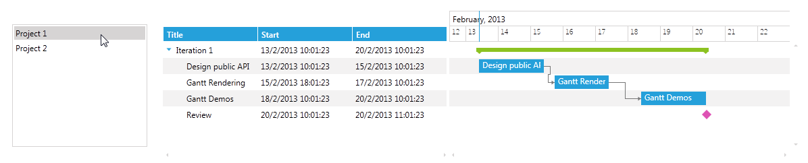
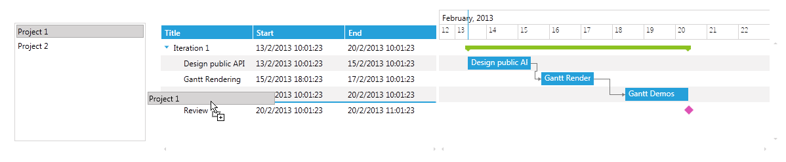
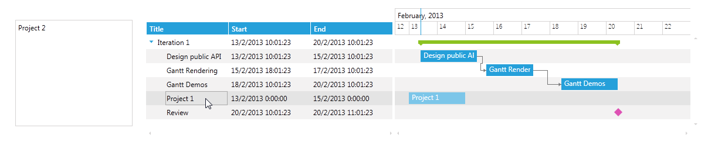

# Drag and Drop with RadListBox

__RadGanttView__ allows drag and drop functionality between the GanttView control and an outside source.

This help article demonstrates how to achieve drag and drop between __RadListBox__ and __RadGanttView__ controls.

>Before proceeding with this help article you should get familiar with [RadListBox: Binding To Object](), [RadListBox: Drag and Drop Overview]() and [RadGanttView: Implementing View-ViewModel]().          

1. First you will need to declare the __RadListBox__ control in the xaml and populate it with some sample data: 

	<snippet id='radganttview-features-drag-and-drop-dragdrop-radlistbox-block_1-xaml' />

	and the ViewModel should look like this:

	

	<snippet id='radganttview-features-drag-and-drop-dragdrop-radlistbox-block_2-cs' />

1. Next you should declare the __RadGanttView__ control in the xaml and populate it with some sample data:

	<snippet id='radganttview-features-drag-and-drop-dragdrop-radlistbox-block_3-xaml' />

	and the ViewModel should look like this:

	<snippet id='radganttview-features-drag-and-drop-dragdrop-radlistbox-block_4-cs' />

1. Create a custom __GanttDragDropBehavior__ and override its __CanStartDrag()__ method in order to restrict the drag and drop functionality from the Timeline of the GanttView control (in the current version of the control drag and drop from the Timeline is not supported):

	<snippet id='radganttview-features-drag-and-drop-dragdrop-radlistbox-block_5-cs' />

1. Create a custom __DataConverter__ that will convert the drag data from the GanttView to the ListBox control:  

	<snippet id='radganttview-features-drag-and-drop-dragdrop-radlistbox-block_6-cs' />

1. Create a custom __DataConverter__ for that will convert data from ListBox to the GanttView control:

	<snippet id='radganttview-features-drag-and-drop-dragdrop-radlistbox-block_7-cs' />

1. Declare the newly created GanttDragDropBehavior and converters to the ListBox and GanttView controls, the xaml of the two controls should look like this:

	<snippet id='radganttview-features-drag-and-drop-dragdrop-radlistbox-block_8-xaml' />

The next screenshots show the final result:

## See Also

 * [Overview]()

 * [Implementing View-ViewModel]()
