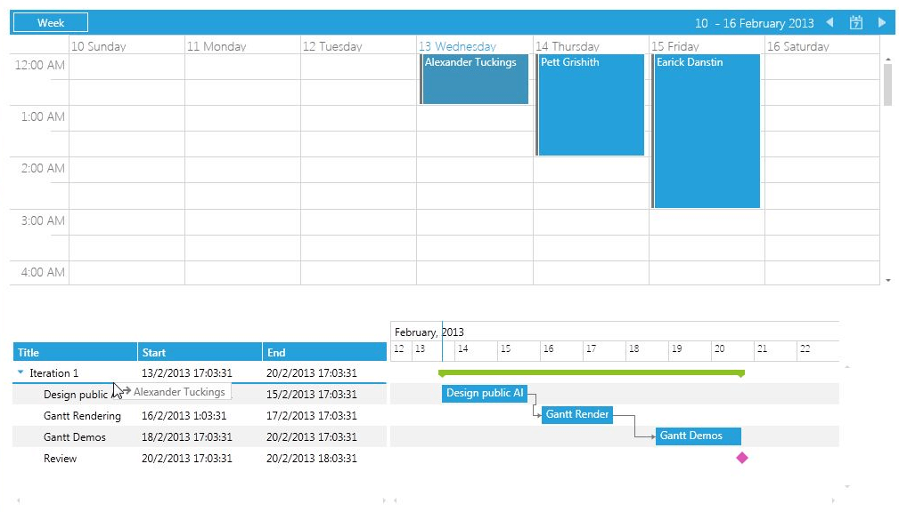
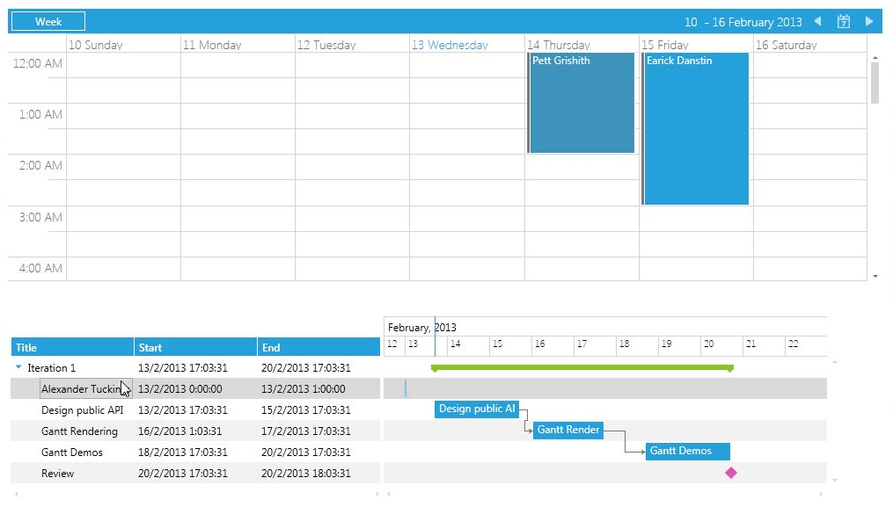

# Drag and Drop with RadScheduleView

With our Q1 2013 release of __RadGanttView__ control we have introduced a new built-in feature in the control that allows drag and drop functionality between the GanttView control and an outside source.

This help article demonstrates how to achieve drag and drop between RadScheduleView and RadGanttView controls.

>Before proceeding with this help article you should get familiar with [RadScheduleView: Implementing View-ViewModel]() and [RadGanttView: Implementing View-ViewModel]().

1. First you should declare the __RadScheduleView__  control and populate it with some sample data:

	#### __XAML__

	```XAML
		<telerik:RadScheduleView AppointmentsSource="{Binding Appointments}">
		    <telerik:RadScheduleView.ViewDefinitions>
		        <telerik:WeekViewDefinition/>
		    </telerik:RadScheduleView.ViewDefinitions>
		</telerik:RadScheduleView>
	```

	and the ViewModel should look like this:

	#### __C#__

	```C#
		public class ViewModel : ViewModelBase
		{
		    private ObservableCollection<Appointment> appointments;
		
		    public ViewModel()
		    {
		        this.appointments = this.GetAppointments();
		    }
		
		    public ObservableCollection<Appointment> Appointments
		    {
		        get
		        {
		            return this.appointments;
		        }
		
		        set
		        {
		            this.appointments = value;
		            this.OnPropertyChanged(() => this.Appointments);
		        }
		    }
		
		    private ObservableCollection<Appointment> GetAppointments()
		    {
		        var appointments = new ObservableCollection<Appointment>();
		        appointments.Add(new Appointment
		        {
		            Subject = "Alexander Tuckings",
		            Body = "Software Developer - C#, VB.NET / JavaScript",
		            Start = DateTime.Today,
		            End = DateTime.Today.AddHours(1)
		        });
		        appointments.Add(new Appointment
		        {
		            Subject = "Pett Grishith",
		            Body = "ASP.NET Support Officer - Microsot SQL Server 2005 /2008",
		            Start = DateTime.Today.AddDays(1),
		            End = DateTime.Today.AddDays(1).AddHours(2)
		        });
		        appointments.Add(new Appointment
		        {
		            Subject = "Earick Danstin",
		            Body = "Software Developer - experience with C# and ASP.NET, experience with MS SQL Server",
		            Start = DateTime.Today.AddDays(2),
		            End = DateTime.Today.AddDays(2).AddHours(3)
		        });
		
		        return appointments;
		    }
		}
	```

1. Next you should declare the GanttView control and populate it with some sample data:

	#### __XAML__

	```XAML
		<telerik:RadGanttView x:Name="radGanttView" 
		TasksSource="{Binding GanttTasks}" 
		VisibleRange="{Binding VisibleRange}">
		    <telerik:RadGanttView.Columns>
		        <telerik:TreeColumnDefinition MemberBinding="{Binding Title}" Header="Title" Width="AutoHeaderAndContent"/>
		        <telerik:ColumnDefinition MemberBinding="{Binding Start}" Header="Start" Width="AutoHeaderAndContent"/>
		        <telerik:ColumnDefinition MemberBinding="{Binding End}" Header="End" Width="AutoHeaderAndContent"/>
		    </telerik:RadGanttView.Columns>
		</telerik:RadGanttView>
	```

	and the ViewModel should look like this:

	#### __C#__

	```C#
		public class ViewModel : ViewModelBase
		{
		    //...
		    private ObservableCollection<GanttTask> tasks;
		
		    private DateRange visibleRange;
		
		    public ViewModel()
		    {
		        //...
		        var date = DateTime.Now;
		        var ganttAPI = new GanttTask() { Start = date, End = date.AddDays(2), Title = "Design public API" };
		        var ganttRendering = new GanttTask() { Start = date.AddDays(2).AddHours(8), End = date.AddDays(4), Title = "Gantt Rendering" };
		        var ganttDemos = new GanttTask() { Start = date.AddDays(5), End = date.AddDays(7), Title = "Gantt Demos" };
		        var milestone = new GanttTask() { Start = date.AddDays(7), End = date.AddDays(7).AddHours(1), Title = "Review", IsMilestone = true };
		        ganttRendering.Dependencies.Add(new Dependency() { FromTask = ganttAPI });
		        ganttDemos.Dependencies.Add(new Dependency() { FromTask = ganttRendering });
		        var iterationTask = new GanttTask(date, date.AddDays(7), "Iteration 1")
		        {
		            Children = { ganttAPI, ganttRendering, ganttDemos, milestone }
		        };
		        this.tasks = new ObservableCollection<GanttTask>() { iterationTask };
		        var start = this.tasks.Min(t => t.Start).Date;
		        var end = this.tasks.Max(t => t.End).Date;
		        this.visibleRange = new DateRange(start.AddHours(-12), end.AddDays(3));
		    }
		
		    public ObservableCollection<GanttTask> GanttTasks
		    {
		        get
		        {
		            return this.tasks;
		        }
		
		        set
		        {
		            this.tasks = value;
		            this.OnPropertyChanged(() => this.GanttTasks);
		        }
		    }
		
		    public DateRange VisibleRange
		    {
		        get
		        {
		            return this.visibleRange;
		        }
		
		        set
		        {
		            this.visibleRange = value;
		            this.OnPropertyChanged(() => this.VisibleRange);
		        }
		    }
		    //...
		}
	```

1. Create a custom __GanttDragDropBehavior__ and override its __CanStartDrag()__ method in order to restrict the drag and drop functionality from the Timeline of the GanttView control (in the current version of the control drag and drop from the Timeline is not supported):

	#### __C#__

	```C#
		public class CustomGanttDragDropBehavior : GanttDragDropBehavior
		{
		    protected override bool CanStartDrag(SchedulingDragDropState state)
		    {
		        return state.IsReorderOperation;
		    }
		}
	```

1. Create a custom __ScheduleViewDragDropBehavior__ and override its __ConvertDraggedData()__ and __CanStartDrag()__ methods:

	#### __C#__

	```C#
		public class CustomScheduleViewDragDropBehavior : ScheduleViewDragDropBehavior
		{
		    public override IEnumerable<IOccurrence> ConvertDraggedData(object data)
		    {
		        var payload = DataObjectHelper.GetData(data, typeof(SchedulingDragOperationPayload), true) as SchedulingDragOperationPayload;
		        if (payload != null)
		        {
		            return payload.DraggedItems.OfType<IGanttTask>().Select(p => new Appointment { Subject = p.Title, Start = p.Start, End = p.End }).ToList<IOccurrence>();
		        }
		
		        return base.ConvertDraggedData(data);
		    }
		
		    public override bool CanStartDrag(Telerik.Windows.Controls.DragDropState state)
		    {
		        return state.DraggedAppointments.Count() < 2;
		    }
		}
	```

1. Create a custom __IDataObjectProvider__ that will convert data from the ScheduleView to the GanttView control:

	#### __C#__

	```C#
		public class CustomScheduleViewConverter : IDataObjectProvider
		{
		    public object GetData(string type, bool autoConvert, IEnumerable<IOccurrence> draggedAppointments)
		    {
		        if (type == typeof(IDateRange).FullName)
		        {
		            return draggedAppointments.Select(this.CreateGanttTaskForOccurence);
		        }
		
		        return null;
		    }
		
		    public string[] GetFormats()
		    {
		        return new[] { typeof(ScheduleViewDragDropPayload).FullName };
		    }
		
		    private IDateRange CreateGanttTaskForOccurence(IOccurrence arg)
		    {
		        var app = arg as IAppointment;
		        if (app != null)
		        {
		            return new GanttTask { Title = app.Subject, Start = app.Start, End = app.End };
		        }
		
		        return null;
		    }
		}
	```

1. Declare the newly created behaviors and converter to the ScheduleView and GanttView controls, the xaml of the two controls should look like this:

	#### __XAML__

	```XAML
		<telerik:RadScheduleView AppointmentsSource="{Binding Appointments}"
		Margin="20">
		    <telerik:RadScheduleView.ViewDefinitions>
		        <telerik:WeekViewDefinition/>
		    </telerik:RadScheduleView.ViewDefinitions>
		    <telerik:RadScheduleView.DragDropBehavior>
		        <local:CustomScheduleViewDragDropBehavior />
		    </telerik:RadScheduleView.DragDropBehavior>
		    <telerik:RadScheduleView.DataObjectProvider>
		        <local:CustomScheduleViewConverter/>
		    </telerik:RadScheduleView.DataObjectProvider>
		</telerik:RadScheduleView>
		<telerik:RadGanttView TasksSource="{Binding GanttTasks}" 
		VisibleRange="{Binding VisibleRange}">
		    <telerik:RadGanttView.Columns>
		        <telerik:TreeColumnDefinition MemberBinding="{Binding Title}" Header="Title" Width="AutoHeaderAndContent"/>
		        <telerik:ColumnDefinition MemberBinding="{Binding Start}" Header="Start" Width="AutoHeaderAndContent"/>
		        <telerik:ColumnDefinition MemberBinding="{Binding End}" Header="End" Width="AutoHeaderAndContent"/>
		    </telerik:RadGanttView.Columns>
		    <telerik:RadGanttView.DragDropBehavior>
		        <local:CustomGanttDragDropBehavior/>
		    </telerik:RadGanttView.DragDropBehavior>
		</telerik:RadGanttView>
	```

The next screenshots show the final result:

1. 

1. 

1. 

## See Also

 * [Overview]()

 * [Implementing View-ViewModel]()
