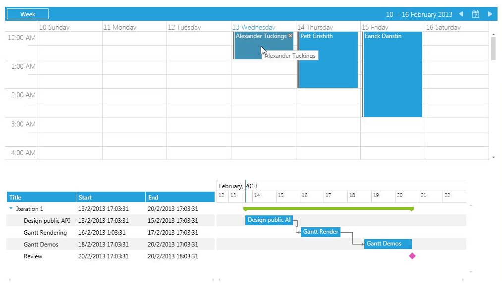
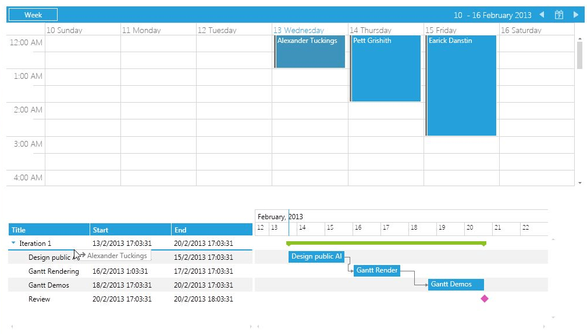
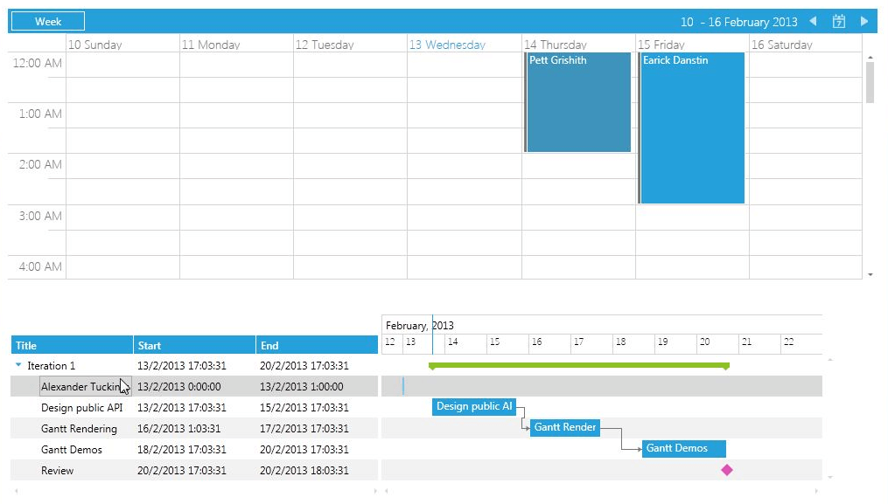

# Drag and Drop with RadScheduleView

__RadGanttView__ allows drag and drop functionality between the GanttView control and an outside source.

This help article demonstrates how to achieve drag and drop between RadScheduleView and RadGanttView controls.

>Before proceeding with this help article you should get familiar with [RadScheduleView: Implementing View-ViewModel]() and [RadGanttView: Implementing View-ViewModel]().

1. First you should declare the __RadScheduleView__  control and populate it with some sample data:

	<snippet id='radganttview-features-drag-and-drop-dragdrop-radscheduleview-block_1-xaml' />

	and the ViewModel should look like this:

	<snippet id='radganttview-features-drag-and-drop-dragdrop-radscheduleview-block_2-cs' />

1. Next you should declare the GanttView control and populate it with some sample data:

	<snippet id='radganttview-features-drag-and-drop-dragdrop-radscheduleview-block_3-xaml' />

	and the ViewModel should look like this:

	<snippet id='radganttview-features-drag-and-drop-dragdrop-radscheduleview-block_4-cs' />

1. Create a custom __GanttDragDropBehavior__ and override its __CanStartDrag()__ method in order to restrict the drag and drop functionality from the Timeline of the GanttView control (in the current version of the control drag and drop from the Timeline is not supported):

	<snippet id='radganttview-features-drag-and-drop-dragdrop-radscheduleview-block_5-cs' />

1. Create a custom __ScheduleViewDragDropBehavior__ and override its __ConvertDraggedData()__ and __CanStartDrag()__ methods:

	<snippet id='radganttview-features-drag-and-drop-dragdrop-radscheduleview-block_6-cs' />

1. Create a custom __IDataObjectProvider__ that will convert data from the ScheduleView to the GanttView control:

	<snippet id='radganttview-features-drag-and-drop-dragdrop-radscheduleview-block_7-cs' />

1. Declare the newly created behaviors and converter to the ScheduleView and GanttView controls, the xaml of the two controls should look like this:

	<snippet id='radganttview-features-drag-and-drop-dragdrop-radscheduleview-block_8-xaml' />

The next screenshots show the final result:

1. 

1. 

1. 

## See Also

 * [Overview]()

 * [Implementing View-ViewModel]()
