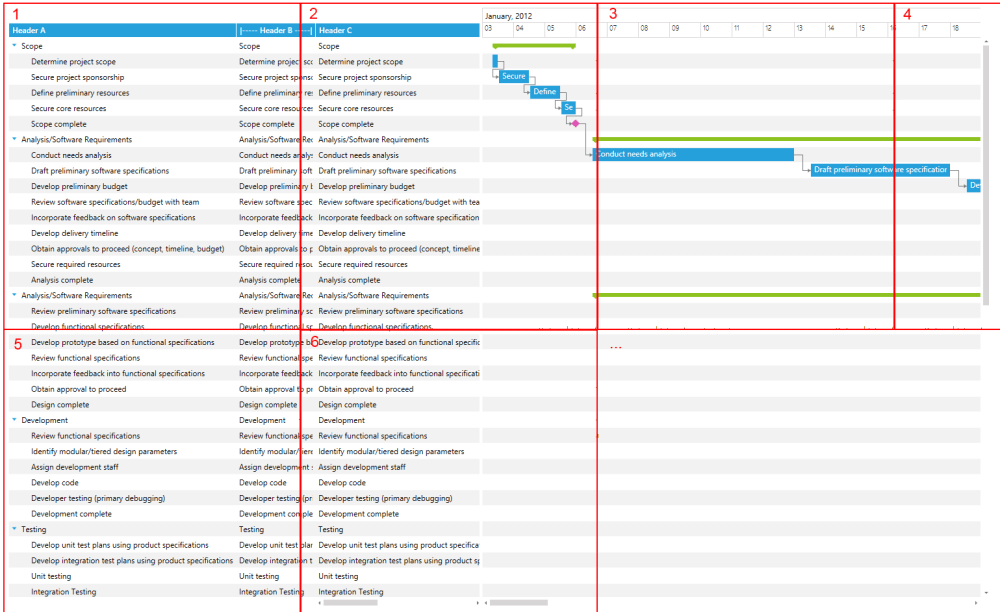
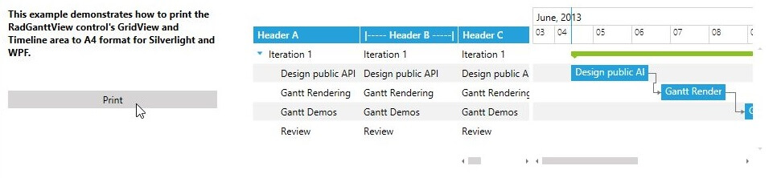
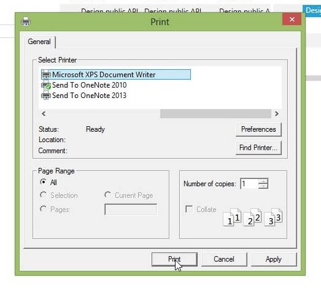
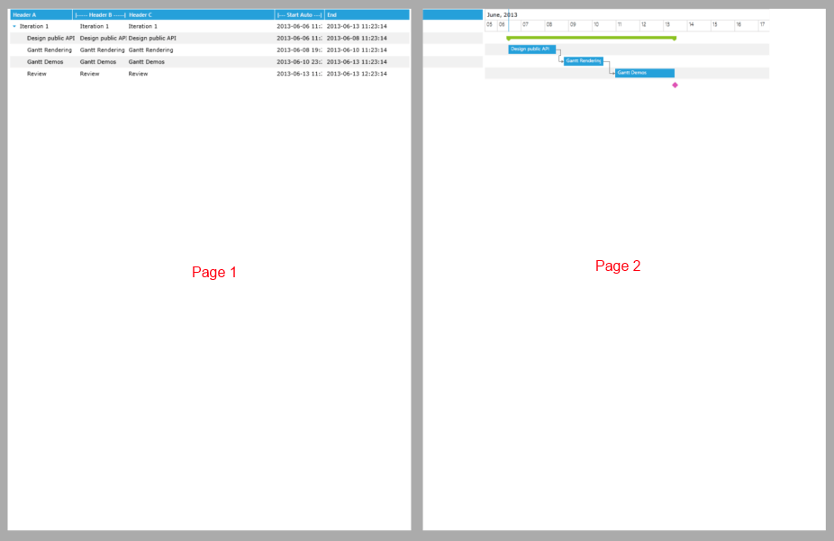

# Exporting Support

With the Q2 2013 release of __RadGanttView__ the control provides an image exporting mechanism which enables its printing functionality.

The exporting functionality is simple and all you need to do is pass the desired image size, printable areas etc. to the built-in exporting service which would generate images containing the contents of the control. The exporting functionality supports exporting the controls __GridView__ area, __TimeLine__ area or both. It is also customizable to include or exclude the Headers of the control.

The built-in exporting to images functionality of the RadGanttView control works in the following matter. By calling the ExportingService.BeginExporting method of the control you will need to pass an object of type ImageExportSettings. The BeginExporting method returns an object of __ImageExporter__ type which holds a collection of wrappers which are used to export the __BitmapSource__. Then next screenshot shows the principal with which the images are exported by the __ExportingService__:



## Export for Printing

The next example will demonstrate how to export the contents of the RadGanttView control in order for them to be printed on A4 format.

>Note: Before proceeding with the next example you should get familiar with [Implementing View-ViewModel]()

1. First you should create a collection of __GanttTasks__, in the ViewModel and populate it with some sample data.

1. Create a DateRange object for the __VisibleRange__ property and set in in the ViewModel.

1. After we will need to create a custom __DocumentPaginator__ class and override its GetPage(),IsPageCountValid(),PageCount() and PageSize() methods:

	#### __C#__

	```C#
		public class GanttPaginator : DocumentPaginator
		{
		    private IList<BitmapSource> exportImages;
		
		    public GanttPaginator(IEnumerable<BitmapSource> exportImages)
		    {
		        this.exportImages = exportImages.ToList();
		    }
		
		    public override DocumentPage GetPage(int pageNumber)
		    {
		        var bitmap = this.exportImages[pageNumber];
		        var imageSize = new Size(bitmap.Width, bitmap.Height);
		        var image = new Image { Source = bitmap };
		        image.Measure(imageSize);
		        image.Arrange(new Rect(imageSize));
		        image.UpdateLayout();
		        return new DocumentPage(image);
		    }
		
		    public override bool IsPageCountValid
		    {
		        get { return true; }
		    }
		
		    public override int PageCount
		    {
		        get { return exportImages.Count(); }
		    }
		
		    public override Size PageSize
		    {
		        get
		        {
		            return new Size(796.8, 1123.2);
		        }
		        set
		        {
		            throw new NotImplementedException();
		        }
		    }
		
		    public override IDocumentPaginatorSource Source
		    {
		        get { return null; }
		    }
		}
	```

1. Next we need to create a __PrintingService__ class that will handle the printing functionality with the use of a PrintDialog:

	#### __C#__

	```C#
		public static class PrintingService
		{
		    public static void Print(RadGanttView ganttView)
		    {
		        var printDialog = new PrintDialog();
		        if (printDialog.ShowDialog() == true)
		        {
		            var exportImages = Enumerable.Empty<BitmapSource>();
		            var printingSettings = new ImageExportSettings(new Size(printDialog.PrintableAreaWidth, printDialog.PrintableAreaHeight), true, GanttArea.AllAreas);
		            using (var export = ganttView.ExportingService.BeginExporting(printingSettings))
		            {
		                exportImages = export.ImageInfos.ToList().Select(info => info.Export());
		            }
		
		            var paginator = new GanttPaginator(exportImages);
		            printDialog.PrintDocument(paginator, "Print demo");
		        }
		    }
		}
	```

1. Finally we need to create a button that will make use of the newly created __PrintingService__ class:

	#### __XAML__

	```XAML
		<Grid DataContext="{StaticResource ViewModel}">
		
		    <!--...-->
		
		    <telerik:RadButton x:Name="PrintButton" Click="PrintButtonClick" Content="Print" />
		
		    <telerik:RadGanttView x:Name="GanttView">
		        <!--...-->
		    </telerik:RadGanttView>
		</Grid>
	```

	#### __C#__

	```C#
		private void PrintButtonClick(object sender, RoutedEventArgs e)
		{
		    PrintingService.Print(this.GanttView);
		}
	```




1. First you should create a collection of __GanttTasks__, in the ViewModel and populate it with some sample data.

1. Create a DateRange object for the __VisibleRange__ property and set in in the ViewModel.

1. Next we need to create a __PrintingService__ class that will handle the printing functionality with the use of a PrintDocument:

	#### __C#__

	```C#
		public static class PrintingService
		{
		    public static void Print(RadGanttView ganttView)
		    {
		        var isFirstPass = true;
		        var exportImages = Enumerable.Empty<BitmapSource>();
		        var enumerator = exportImages.GetEnumerator();
		        var pd = new PrintDocument();
		        pd.BeginPrint += pd_BeginPrint;
		        pd.PrintPage += (s, e) =>
		        {
		            if (isFirstPass)
		            {
		                var printingSettings = new ImageExportSettings(e.PrintableArea, true, GanttArea.AllAreas);
		                using (var export = ganttView.ExportingService.BeginExporting(printingSettings))
		                {
		                    exportImages = export.ImageInfos.ToList().Select(info => info.Export());
		                    enumerator = exportImages.GetEnumerator();
		                    enumerator.MoveNext();
		                }
		                isFirstPass = false;
		            }
		
		            e.PageVisual = PrintPage(enumerator.Current);
		            enumerator.MoveNext();
		            e.HasMorePages = enumerator.Current != null;
		        };
		        pd.Print("Gantt");
		    }
		
		    static void pd_BeginPrint(object sender, BeginPrintEventArgs e)
		    {
		    }
		
		    private static UIElement PrintPage(BitmapSource bitmap)
		    {
		        var bitmapSize = new System.Windows.Size(bitmap.PixelWidth, bitmap.PixelHeight);
		        var image = new System.Windows.Controls.Image { Source = bitmap };
		        image.Measure(bitmapSize);
		        image.Arrange(new System.Windows.Rect(new System.Windows.Point(0, 0), bitmapSize));
		        return image;
		    }
		}
	```

1. Finally we need to create a button that will make use of the newly created PrintingService class:

	#### __XAML__

	```XAML
		<Grid DataContext="{StaticResource ViewModel}">
		
		    <!--...-->
		
		    <telerik:RadButton x:Name="PrintButton" Click="PrintButtonClick" Content="Print" />
		
		    <telerik:RadGanttView x:Name="GanttView">
		        <!--...-->
		    </telerik:RadGanttView>
		</Grid>
	```

	#### __C#__

	```C#
		private void PrintButtonClick(object sender, RoutedEventArgs e)
		{
		    PrintingService.Print(this.GanttView);
		}
	```



>tip Find a runnable project of the previous example in the [WPF Samples GitHub repository](https://github.com/telerik/xaml-sdk/tree/master/GanttView/PrintingAndExporting).

The next screenshots show the final result:

1. The RadGanttView control with the Print button:

	

1. The default printing dialog that is opened from the Print button:

	

1. The generated .oxps file:

	
