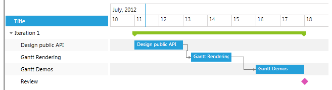
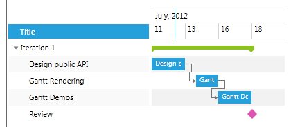

# Filtering TimeRulerItems

The purpose of this tutorial is to show you how to filter the TimeRulerItems of __RadGanttView__. This feature might be useful for hiding non-working time or days from the timeline. The behavior should point the intervals to be shown, and not the ones to be hidden.

>Before reading this tutorial you should get familiar with [Implementing View-ViewModel]() into __RadGanttView__ control.

__RadGanttView__ provides __TimeLineFilteringBehavior__ property which can be used to add a specific timeline behavior.

TimeLineFilteringBehavior is of type __IRangeGenerator__ and can be set to any of the following types:

* [SingleRangeGenerator](#singlerangegenerator)

* [WeekDaysGenerator](#weekdaysgenerator)

* [Custom IRangeGenerator](#custom-irangegenerator)

* [EmptyRangeGenerator](#emptyrangegenerator)

We will go through each of them separately.

## SingleRangeGenerator

SingleRangeGenerator allows you view the whole TimeRuler specified by the visible range of RadGanttView. It can be set like this:


```XAML
	<telerik:RadGanttView x:Name="ganttView" TasksSource="{Binding Tasks}">
	    <telerik:RadGanttView.TimeLineFilteringBehavior>
	        <telerik:SingleRangeGenerator />
	    </telerik:RadGanttView.TimeLineFilteringBehavior>
	</telerik:RadGanttView>
```

And here is the end result:



>In RadGanttView by default the TimeLineFilteringBehavior is set to SingleRangeGenerator.

## WeekDaysGenerator

WeekDaysGenerator allows you to filter the TimeRuler on certain week days. It provides two properties:

* FirstDay

* DaysCount

So it can be used to mark the working days, for example:


```XAML
	<telerik:RadGanttView x:Name="ganttView1" TasksSource="{Binding Tasks}">
	    <telerik:RadGanttView.TimeLineFilteringBehavior>
	        <telerik:WeekDaysGenerator FirstDay="Monday" DaysCount="5" />
	    </telerik:RadGanttView.TimeLineFilteringBehavior>
	</telerik:RadGanttView>
```

And here is the end result:


>Notice that the weekends (14th and 15th) are missing in the TimeRuler of the RadGanttView.

## Custom IRangeGenerator

In RadGanttView it is possible to implement a custom IRangeGenerator. You just need to create a custom class which implements IRangeGenerator interface and implement GetRanges method which receives as a parameter the current VisibleRange of the GanttView. The code snipped represents a sample Custom IRangeGenerator:


```C#
	public class CustomRangeGenerator : ViewModelBase, IRangeGenerator
	{
		public System.Collections.Generic.IEnumerable<IDateRange> GetRanges(IDateRange visibleRange)
		{
			for (DateTime current = visibleRange.Start; current < visibleRange.End; current += TimeSpan.FromDays(1))
			{
				int addDays = (int)current.DayOfWeek;
				if (addDays < 7 && (int)current.DayOfWeek % 2 != 0)
				{
					yield return new DateRange(current, current.AddDays(1));
					addDays = addDays + 1;
				}
			}
		}
	}
```

All that's left is to set the newly created class to the TimeLineFilteringBehavior property:


```XAML
	<telerik:RadGanttView x:Name="ganttView2" TasksSource="{Binding Tasks}">
	    <telerik:RadGanttView.TimeLineFilteringBehavior>
	        <example:CustomRangeGenerator />
	    </telerik:RadGanttView.TimeLineFilteringBehavior>
	</telerik:RadGanttView>
```

And here is the end result:



## EmptyRangeGenerator

EmptyRangeGenerator allows you to remove the TimeRuler completely when used in the TimeLineFilteringBehavior.

## See Also

 * [Special Slots]()

 * [Configuring the TimeRuler]()
