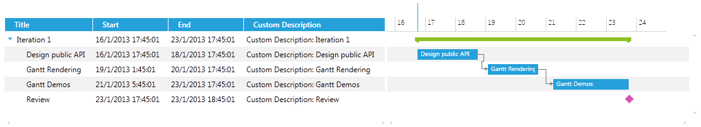

# Custom GanttTask

In __RadGanttView__ control you can create custom GanttTasks in order to customize the existing properties of the task or add custom properties. There are two approaches that could be used, the first one is to inherit from __GanttTask__ class and the second one is to create a class that implements __IGanttTask__, __ISummary__, __IMilestone__, __IDependant__ interfaces.

## Inheriting GanttTasks Class

The next example will demonstrate how to add an additional description property of type string to the tasks of the control by creating a custom class which inherits from GanttTasks class. This approach is appropriate when adding additional properties and not making customizations to the built-in properties of the GanttTask class.

>Before proceeding with this tutorial you should get familiar with [Implementing View-ViewModel]() help article.

1. First you will need to create a class and inherits __GanttTask__ class:

	```C#
		public class MyGanttTask : GanttTask
		{
		}
	```

1. Define a field of type string that will be the custom description property:

	```C#
		public class MyGanttTask : GanttTask
		{
		    public string CustomDescription { get; set; }
		}
	```

1. Next you will need to create a collection of __MyGanttTask__ objects in your __ViewModel__ and populate it with some sample data:

	```C#
		public class ViewModel : ViewModelBase
		{
		    private ObservableCollection<MyGanttTask> tasks;
		
		    private DateRange visibleTime;
		
		    public ViewModel()
		    {
		        var date = DateTime.Now;
		        var ganttAPI = new MyGanttTask()
		        {
		            Start = date,
		            End = date.AddDays(2),
		            Title = "Design public API",
		            Description = "Description: Design public API",
		            CustomDescription = "Custom Description: Design public API"
		        };
		        var ganttRendering = new MyGanttTask()
		        {
		            Start = date.AddDays(2).AddHours(8),
		            End = date.AddDays(4),
		            Title = "Gantt Rendering",
		            Description = "Description: Gantt Rendering",
		            CustomDescription = "Custom Description: Gantt Rendering"
		        };
		        var ganttDemos = new MyGanttTask()
		        {
		            Start = date.AddDays(4.5),
		            End = date.AddDays(7),
		            Title = "Gantt Demos",
		            Description = "Description: Gantt Demos",
		            CustomDescription = "Custom Description: Gantt Demos"
		        };
		        var milestone = new MyGanttTask()
		        {
		            Start = date.AddDays(7),
		            End = date.AddDays(7).AddHours(1),
		            Title = "Review",
		            Description = "Description: Review",
		            IsMilestone = true,
		            CustomDescription = "Custom Description: Review"
		        };
		
		        ganttRendering.Dependencies.Add(new Dependency() { FromTask = ganttAPI });
		        ganttDemos.Dependencies.Add(new Dependency() { FromTask = ganttRendering });
		
		        var iterationTask = new MyGanttTask()
		        {
		            Start = date,
		            End = date.AddDays(7),
		            Title = "Iteration 1",
		            Children = { ganttAPI, ganttRendering, ganttDemos, milestone },
		            CustomDescription = "Custom Description: Iteration 1"
		        };
		
		        this.tasks = new ObservableCollection<MyGanttTask>() { iterationTask };
		        this.visibleTime = new DateRange(date.AddDays(-1), date.AddDays(9));
		    }
		
		    public ObservableCollection<MyGanttTask> Tasks
		    {
		        get
		        {
		            return tasks;
		        }
		        set
		        {
		            tasks = value;
		            OnPropertyChanged(() => Tasks);
		        }
		    }
		
		    public DateRange VisibleTime
		    {
		        get { return this.visibleTime; }
		        set
		        {
		            if (this.visibleTime != value)
		            {
		                this.visibleTime = value;
		                this.OnPropertyChanged(() => this.VisibleTime);
		            }
		        }
		    }
		}
	```

The xaml of the GanttView control should look like this:

```XAML
	<telerik:RadGanttView TasksSource="{Binding Tasks}" Margin="5"
	VisibleRange="{Binding VisibleTime}">
	    <telerik:RadGanttView.Columns>
	        <telerik:TreeColumnDefinition Header="Title" MemberBinding="{Binding Title}" Width="AutoHeaderAndContent"/>
	        <telerik:ColumnDefinition MemberBinding="{Binding Start}" Header="Start" Width="AutoHeaderAndContent"/>
	        <telerik:ColumnDefinition MemberBinding="{Binding End}" Header="End" Width="AutoHeaderAndContent"/>
	        <telerik:ColumnDefinition MemberBinding="{Binding CustomDescription}" Header="Custom Description" Width="AutoHeaderAndContent"/>
	    </telerik:RadGanttView.Columns>
	</telerik:RadGanttView>
```

The next screenshot show the final result (the Custom Description column shows the CustomDescription values):



## Implementing IGanttTask, ISummary, IMilestone, IDependant

This approach is more appropriate when customizing the existing properties of the GanttTask class (Start, End, Title, Resources, Children etc.). All that you will need to do is create a class that implements the following interfaces: IGanttTask, ISummary, IMilestone, IDependant.

>If you want to enable the creating of relations by dragging the mouse you will need to implement the IDependant interface.

The next code snippet shows a sample implementation of __IDependant__ interface:

```C#
	IEnumerable IDependant.Dependencies
	{
	    get { return this.Dependencies; }
	}
	
	public IDependency AddDependency(IGanttTask fromTask, DependencyType type)
	{
	    if (fromTask != null)
	    {
	        var dependency = new Dependency { FromTask = fromTask, Type = type };
	
	        this.Dependencies.Add(dependency);
	        return dependency;
	    }
	
	    return null;
	}
	
	public bool RemoveDependency(IDependency dependency)
	{
	    return false;
	}
```

>tip Find a runnable project of the previous example in the [WPF Samples GitHub repository](https://github.com/telerik/xaml-sdk/tree/master/GanttView/CustomGanttTaskWithStatus).

## See Also

 * [Columns - Overview]()
