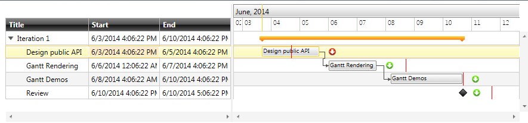
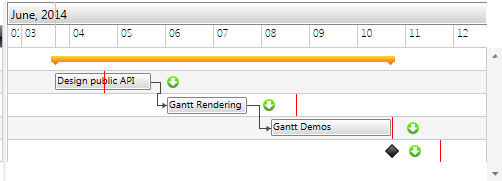
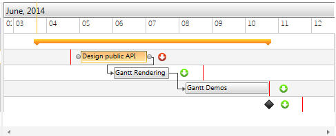

# GanttTask Deadline

With the official Q2 2014 release of UI for WPF/SL you will have the option to use the __Deadline__ property of the __GanttTask__ and visualize an indicator showing whether the task is expired.  

This help topic will describe the Deadline property in more details as well as how you could customize its behavior.

## Overview

Setting the __Deadline__ property of the GanttTask visualizes a vertical line showing the deadline for finishing the task as well as an indicator showing whether the task is on time or delayed.

__Example 1__ shows how the Deadline can be set.

#### __C#__

{{region radganttview-features-items-gantttask-deadline_0}}
	var task = new GanttTask()
	{
	    Start = new DateTime(2014, 6, 6),
	    End = new DateTime(2014, 6, 8),
	    Deadline = new DateTime(2014,6,9),
	    Title = "Gantt Rendering"
	};
	{{endregion}}

#### __VB__

{{region radganttview-features-items-gantttask-deadline_0}}
	Dim task = New GanttTask() With { _
		.Start = New DateTime(2014, 6, 6), _
		.[End] = New DateTime(2014, 6, 8), _
		.Deadline = New DateTime(2014, 6, 9), _
		.Title = "Gantt Rendering" _
	}
	{{endregion}}

When the __End__ time is before the set __Deadline__ of the Task, the Indicator is in green color, however, as soon as you expand the task after the __End__, the Indicator is replaced with one that has red color.

__Figure 1__ shows how the Deadline and the Indicator are visualized in the Timeline part of the control.

Figure 1: Deadline and Indicator

## Customization

There may be cases when you need to add different logic for marking tasks as expired. The default implementation is as soon as the __End__ goes after the __Deadline__, the task is marked as delayed.

In order to change this behavior, you will need to create a custom GanttTask and override its __CheckIsExpired__  method. __Example 2__ demonstrates how to override this method, so that the task is marked as expired only when its __Start__ property goes after the set __Deadline__:

__Example 2__ shows how to override CheckIsExpired method.
        

#### __C#__

{{region radganttview-features-items-gantttask-deadline_1}}
	public class CustomGanttTask : GanttTask
	{
	    protected override bool CheckIsExpired()
	    {
	        return this.Deadline < this.Start;
	    }
	}
	{{endregion}}

#### __VB__

{{region radganttview-features-items-gantttask-deadline_1}}
	Public Class CustomGanttTask
		Inherits GanttTask
		Protected Overrides Function CheckIsExpired() As Boolean
			Return Me.Deadline < Me.Start
		End Function
	End Class
	{{endregion}}

__Figure 2__ and __Figure 3__ show the result:

Figure 2: Even if the End is after the Deadline, the task is not marked as expired.

Figure 3: As soon as the Start goes after the Deadline, the task is marked as delayed.

# See Also

 * [Custom GanttTask]()
