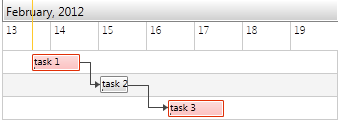

# Highlighting Items

With __RadGanttView__ you can easily highlight certain tasks in order to make them distinguishable on the Gantt chart.They can be, for example, late tasks or tasks participating in the critical path.

In this topic we will explain how you can define a collection of highlighted tasks and bind it to the __HighlightedItemsSource__ property of the __RadGanttView__.

>Before proceding with the tutorial, check [Implementing View-ViewModel]() topic where it is explained how to bind the GanttView with a ViewModel.

* First, define a property in the ViewModel which should hold the highlighted tasks:


```C#
	public class MyViewModel : PropertyChangedBase
	{
	    private ObservableCollection<GanttTask> tasks;
	
	    public ObservableCollection<GanttTask> Tasks
	    {
	        //...
	        get;
	        set;
	    }
	
	    private ObservableCollection<GanttTask> highlightedTasks;
	
	    public ObservableCollection<GanttTask> HighlightedTasks
	    {
	        get
	        {
	            return highlightedTasks;
	        }
	        set
	        {
	            highlightedTasks = value;
	            OnPropertyChanged(() => HighlightedTasks);
	        }
	    }
	    //...
	}
```

* Then add the needed tasks to the HighlightedTasks:


```C#
	public MyViewModel()
	{
	    //...
	    this.HighlightedTasks = new ObservableCollection<GanttTask>() { Tasks[0], Tasks[2] };
	}
```

* Finally, bind the HighlightedTasks to __HighlightedItemsSource__ property:


```XAML
	<telerik:RadGanttView x:Name="ganttView" 
	                      TasksSource="{Binding Tasks}" 
	                      HighlightedItemsSource="{Binding HighlightedTasks}" />
```

The end result should look like this:


