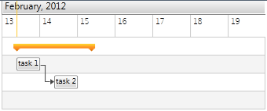

# Items Relations

Project plans normally require tasks to be performed in a certain order. To achieve this, __RadGanttView__ lets you create relations between the tasks, so that they depend on each other.

The relation is set through __Dependencies__ property of the __GanttTask__ class:


```C#
	var task1 = new GanttTask(date, date.AddDays(1), "task 1");
	var task2 = new GanttTask(date.AddDays(1), date.AddDays(1).AddHours(15), "task 2");
	
	task2.Dependencies.Add(new Dependency() { FromTask = task1 });
```

Here is the result in the Gantt chart:


