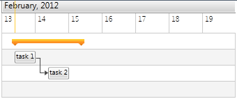

# Items Relations

Project plans normally require tasks to be performed in a certain order. To achieve this, __RadGanttView__ lets you create relations between the tasks, so that they depend on each other.

The relation is set through __Dependencies__ property of the __GanttTask__ class:

<snippet id='radganttview-features-items-relations-block_1-cs' />

Here is the result in the Gantt chart:

