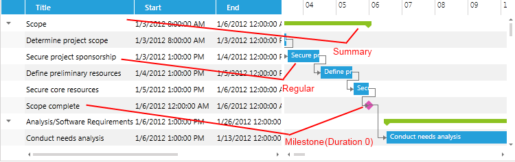

# Types of Items

__RadGanttView__ control is used to display and update a list of task items using a data grid and a Gantt chart.
    	A __task__ corresponds to some work to be completed. Tasks are often broken down into child tasks, thus forming a hierarchy.
    	

>All the tasks in __RadGanttView__ are __Telerik.Windows.Controls.GanttView.GanttTask__ objects.
    

__RadGanttView__ provides the following types of tasks:

* __Regular task__ - task that have no child tasks.       	
       	

* __Summary task__ - task with child tasks. They are set through SetChildren() method.
       	
       	

* __Milestone task__ - task with zero duration that corresponds to an event. 
       	__IsMilestone__ property should be set to true to create __Milestone__ tasks.
       	

The following screenshot shows how the different types of tasks are visualised in the data grid and the Gantt chart:

