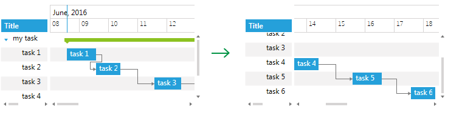
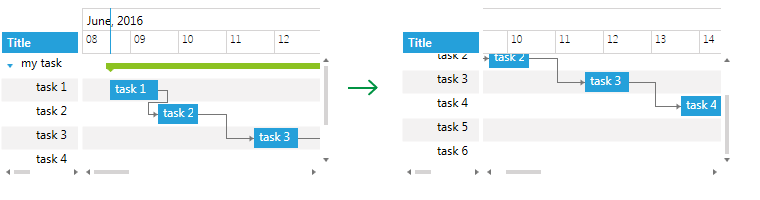
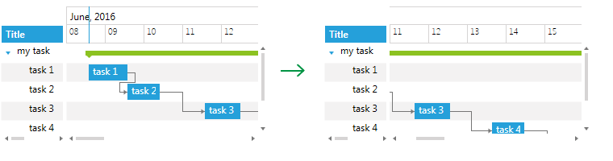
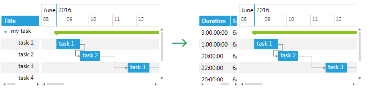
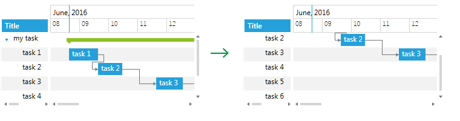
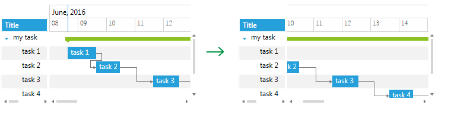
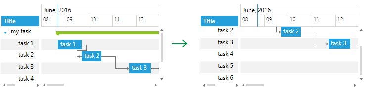
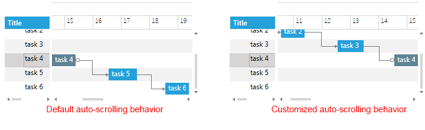

# Scrolling

This topic explains how you could set up __RadGanttView__ so that the view is scrolled to a specified location. The location could be a particular GanttTask, DateTime inside the TimeRuler or even a column inside the Grid part.

Additionally, with the R2 2016 release of UI for WPF, __RadGanttView__ provides the option to customize its auto-scrolling functionality.

* [Scrolling Methods](#scrolling-methods)

* [Customizing Auto-scrolling Functionality](#customizing-auto-scrolling-functionality)

## Scrolling Methods

You can modify how a __RadGanttView__ scrolls using its __ScrollingService__ property, which is of type __GanttScrollingService__ and provides multiple methods for scroll navigation:

* `ScrollIntoView (object param)`
* `ScrollIntoView (object item, ScrollSettings settings)`
* `ScrollToDateTime(DateTime dateTime)`
* `ScrollToColumn(int columnIndex) / ScrollToColumn(ColumnDefinitionBase columnDefinition)`
* `ScrollToRow(int rowIndex)`
* `ScrollHorizontalTo (double offset, GanttScrollArea ganttArea)`
* `ScrollVerticalTo(double offset) / ScrollVerticalWith(double offset)`

### ScrollIntoView (object item)

This method is used to scroll the view horizontally and vertically so that a particular GanttTask is in the currently visible area. __Example 1__ shows how you can use the ScrollIntoView method.

__Example 1: Calling the ScrollIntoView method__

```C#
	GanttView.ScrollingService.ScrollIntoView(task4);
```

__Figure 1__ illustrates how the view is scrolled vertically and TimeRuler part - horizontally when the code from __Example 1__ is executed for “task 4”. 

#### __Figure 1: GanttView before and after calling ScrollIntoView for “task 4"__


### ScrollIntoView (object item, ScrollSettings settings)

The ScrollIntoView method has an overload with an additional parameter of type __ScrollSettings__.

The __ScrollSettings__ object helps configure the alignment of the scrollbars through its HorizontalScrollPosition and VericalScrollPosition properties when navigating to a certain task. Sometimes exact alignment is not possible, and in such cases, the view is scrolled to a position nearest to the required.

>ScrollPosition properties of the ScrollSettings are of type enum and can receive the following values:
>
>HorizontalScrollPosition: Left, Center, Right, Anywhere, None
>VerticalScrollPosition: Top, Center, Bottom, Anywhere, None

__Example 2__ demonstrates how the ScrollIntoView method could be used with __ScrollSettings__ applied for “task 4”.

__Example 2: Calling ScrollIntoView method with ScrollSettings__

```C#
	var settings = new ScrollSettings() { HorizontalScrollPosition = HorizontalScrollPosition.Right, VerticalScrollPosition = VerticalScrollPosition.Anywhere };
	GanttView.ScrollingService.ScrollIntoView(task4, settings);
```

__Figure 2__ shows the result.

#### __Figure 2: GanttView before and after calling ScrollIntoView for “task 4” with ScrollingSettings applied__


### ScrollToDateTime(DateTime dateTime)

You can use the ScrollToDateTime method to horizontally scroll the TimeRuler part so that a specific time from the current VisibleRange is inside the visible area. __Example 3__ shows how to use the ScrollToDateTime method in order to move the TimeRuler with 3 days.

__Example 3: Calling ScrollToDateTime method__

```C#
	GanttView.ScrollingService.ScrollToDateTime(DateTime.Today.AddDays(3));
```

You can see the result in __Figure 3__.

#### __Figure 3: GanttView before and after calling ScrollToDateTime method__


### ScrollToColumn(int columnIndex) / ScrollToColumn(ColumnDefinitionBase columnDefinition)

Both methods are used to scroll the Grid part of RadGanttView horizontally so that a specific column is visible. __Example 4__ demonstrates how you could use ScrollToColumn to scroll to the third column inside the Grid.

__Example 4: Calling ScrollToColumn method__

```C#
	GanttView.ScrollingService.ScrollToColumn(2);
```

#### __Figure 4: GanttView before and after calling ScrollToColumn method__


### ScrollToRow(int rowIndex)

Use the ScrollToRow method to scroll the view vertically so that the specified Row is visible. __Example 5__ illustrates how to scroll to the third row.

__Example 5: Calling ScrollToRow method__

```C#
	GanttView.ScrollingService.ScrollToRow(2);
```

#### __Figure 5: GanttView before and after calling ScrollToRow method__


### ScrollHorizontalTo (double offset, GanttScrollArea ganttArea)

This method is used to scroll either the Grid or TimeLine area (set as a second parameter) horizontally with a specified offset (in pixels). __Example 6__ demonstrates how you could scroll the TimeLine area with a 100px offset.

__Example 6: Calling ScrollHorizontalTo method__

```C#
	GanttView.ScrollingService.ScrollHorizontalTo(100, GanttScrollArea.TimeLineArea);
```

#### __Figure 6: GanttView before and after calling ScrollHorizontalTo method__


### ScrollVerticalTo(double offset) / ScrollVerticalWith(double offset)

Both methods are used to vertically scroll the view with the specified offset (in pixels). ScrollVerticalTo scrolls from the initial Scroll position; ScrollVerticalWith scrolls from the current Scroll position. __Example 7__ shows how you could scroll the view with 50px offset from the initial scroll position.

__Example 7: Calling ScrollVerticalTo method__

```C#
	GanttView.ScrollingService.ScrollVerticalTo(50);
```

#### __Figure 7: GanttView before and after calling ScrollVerticalTo method__


## Customizing Auto-scrolling Functionality

By default, when a GanttTask is selected inside the Grid part of the GanttView, the TimeRuler part is auto-scrolled to bring the representation of the Task into view. You could customize this behavior by setting the __ScrollSettings__ of the __ScrollingService__ as shown in __Example 8__.

__Example 8: Setting ScrollSettings__

```C#
	GanttView.ScrollingService.ScrollSettings.HorizontalScrollPosition = HorizontalScrollPosition.Right;
	GanttView.ScrollingService.ScrollSettings.VerticalScrollPosition = VerticalScrollPosition.Anywhere;
```

__Figure 8__ shows the result when selecting “task 4”.

#### __Figure 8: Default and customized auto-scrolling behavior__ 


>tip In order to disable the auto-scrolling behavior, you will need to set the HorizontalScrollPosition and VerticalScrollPosition properties of the ScrollSettings to “None” as shown in __Example 9__.

__Example 9: Disable auto-scrolling__

```C#
	GanttView.ScrollingService.ScrollSettings.HorizontalScrollPosition = HorizontalScrollPosition.None;
	GanttView.ScrollingService.ScrollSettings.VerticalScrollPosition = VerticalScrollPosition.None;
```

