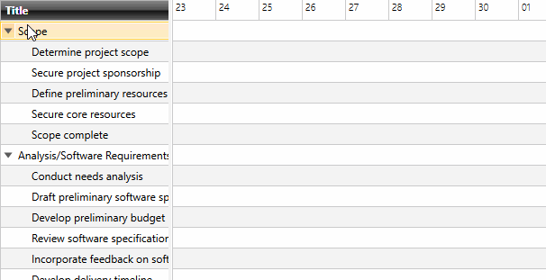
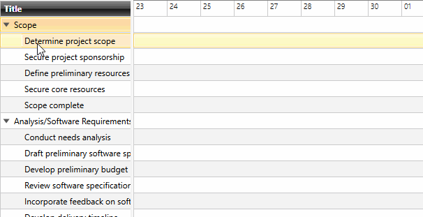
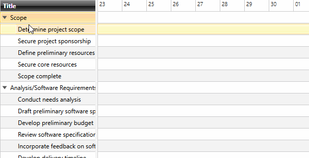
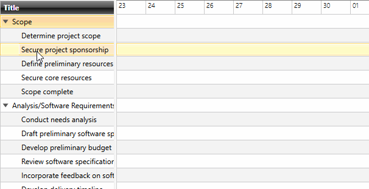

# Selection Behavior

The RadGanttView control provides you with selection functionality, which allows the user to select one or more items at a time. To control this selection mechanism, you must set the **SelectionBehavior** property.

__Example 1: Setting SelectionBehavior__
```XAML
	<telerik:RadGanttView>
		<telerik:RadGanttView.SelectionBehavior>
			<telerik:SingleSelectionBehavior />
		</telerik:RadGanttView.SelectionBehavior>			
	</telerik:RadGanttView>
```

There is a set of predefined selection behaviors, however, you're free to define your custom behavior as long as it implements the **ISelectionBehavior** interface.

> The default behavior is [SchedulingSelectionBehavior](#schedulingselectionbehavior).

Below you will find the list of available behaviors.

## SingleSelectionBehavior

As the name suggests, when using the **SingleSelectionBehavior**, only a single item can be selected at a time both programmatically and through the UI. If multiple items are added to the control's **SelectedItems** collection, only the last one will remain.

#### __Figure 1: Selecting items with SingleSelectionBehavior__


## ReadOnlySelectionBehavior

The **ReadOnlySelectionBehavior** differs from the SingleSelectionBehavior in that it does not allow selection from the user interface. Items can only by added to the current selection only through the **SelectedItems** collection.

#### __Figure 2: Selecting items with ReadOnlySelectionBehavior__



## MultiSelectionBehavior

In contrast, the **MultiSelectionBehavior** allows the selection of mutilple items by selecting individual items from the UI. The first click adds the item to the **SelectedItems** collection, while a click on an already selected item removes it from the current selection.

#### __Figure 3: Selecting items with MultiSelectionBehavior__



## ExtendedSelectionBehavior

The **ExtendedSelectionBehavior** behaves like the SingleSelectionBehavior, however, using the **Ctrl** and **Shift** keys, users can extend the selection by a single item or select a group of contiguous items similarly to the selection behavior observed in **Windows Explorer**.

#### __Figure 4: Selecting items with ExtendedSelectionBehavior__



## SchedulingSelectionBehavior

The **SchedulingSelectionBehavior** further extends the functionality of the ExtendedSelectionBehavior by allowing the user to select multiple groups of neighboring items by using the **Shift** key.

#### __Figure 5: Selecting items with SchedulingSelectionBehavior__



## See Also
* [Getting Started]()
* [Special Slots]()
* [Scrolling]()
