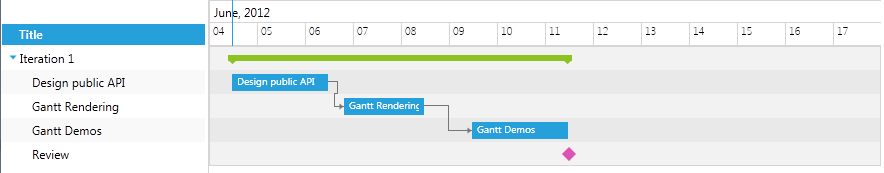
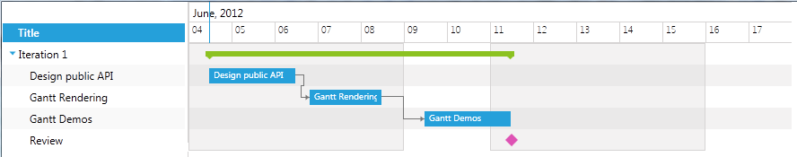
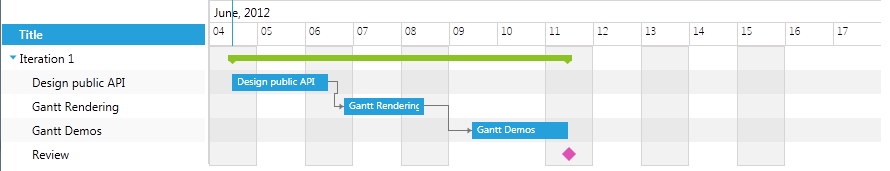

# Special Slots

__RadGanttView__ provides __SpecialSlotsGenerator__ property which can be used to mark certain intervals along the visible range of the control as special slots.

SpecialSlotsGenerator is of type __IRangeGenerator__ and can be set to any of the following types:

* [SingleRangeGenerator;](#singlerangegenerator)

* [WeekDaysGenerator;](#weekdaysgenerator)

* [Custom IRangeGenerator.](#custom-irangegenerator)

We will go through each of them separately.

## SingleRangeGenerator

SingleRangeGenerator applies a single special slot to the whole visible range of RadGanttView. It can be set like this:


```XAML
	<telerik:RadGanttView x:Name="ganttView" TasksSource="{Binding Tasks}" >
	    <telerik:RadGanttView.SpecialSlotsGenerator>
	        <telerik:SingleRangeGenerator />
	    </telerik:RadGanttView.SpecialSlotsGenerator>
	</telerik:RadGanttView>
```

And here is the end result:



## WeekDaysGenerator

WeekDaysGenerator allows you to set special slots on certain week days. It provides two properties:

* FirstDay;

* DaysCount.

So it can be used to mark the working days, for example:


```XAML
	<telerik:RadGanttView x:Name="ganttView1" TasksSource="{Binding Tasks}" >
	    <telerik:RadGanttView.SpecialSlotsGenerator>
	        <telerik:WeekDaysGenerator FirstDay="Monday" DaysCount="5" />
	    </telerik:RadGanttView.SpecialSlotsGenerator>
	</telerik:RadGanttView>
```



## Custom IRangeGenerator

You just need to create a custom class which implements __IRangeGenerator__ interface and implement GetRanges method which receives as a parameter the current VisibleRange of the GanttView:


```C#
	public class CustomRangeGenerator : ViewModelBase, IRangeGenerator
	{
	    public System.Collections.Generic.IEnumerable<IDateRange> GetRanges(IDateRange visibleRange)
	    {
	        for (DateTime current = visibleRange.Start; current < visibleRange.End; current += TimeSpan.FromDays(1))
	        {
	            int addDays = (int)current.DayOfWeek;
	            if (addDays < 7 && (int)current.DayOfWeek % 2 != 0)
	            {
	                yield return new DateRange(current, current.AddDays(1));
	                addDays = addDays + 1;
	            }
	        }
	    }
	}
```

Set the newly created class to the SpecialSlotsGenerator property:


```XAML
	<telerik:RadGanttView x:Name="ganttView2" TasksSource="{Binding Tasks}" >
	    <telerik:RadGanttView.SpecialSlotsGenerator>
	        <local:CustomRangeGenerator />
	    </telerik:RadGanttView.SpecialSlotsGenerator>
	</telerik:RadGanttView>
```

And the result is the following:



You can check the GanttView Special Slots example at [UI for Silverlight demos](https://demos.telerik.com/silverlight/#GanttView/Programming/SpecialSlots)[UI for WPF demos](https://demos.telerik.com/wpf/).
