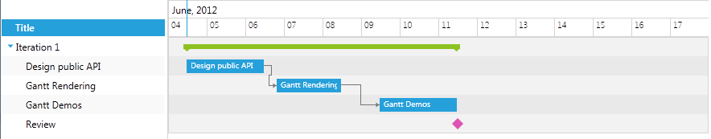
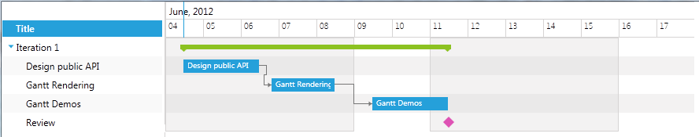
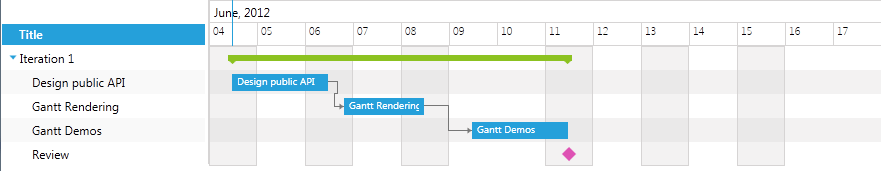

# Special Slots

__RadGanttView__ provides __SpecialSlotsGenerator__ property which can be used to mark certain intervals along the visible range of the control as special slots.

SpecialSlotsGenerator is of type __IRangeGenerator__ and can be set to any of the following types:

* [SingleRangeGenerator;](#singlerangegenerator)

* [WeekDaysGenerator;](#weekdaysgenerator)

* [Custom IRangeGenerator.](#custom-irangegenerator)

We will go through each of them separately.

## SingleRangeGenerator

SingleRangeGenerator applies a single special slot to the whole visible range of RadGanttView. It can be set like this:

<snippet id='radganttview-features-specialslots-block_1-xaml' />

And here is the end result:

## WeekDaysGenerator

WeekDaysGenerator allows you to set special slots on certain week days. It provides two properties:

* FirstDay;

* DaysCount.

So it can be used to mark the working days, for example:

<snippet id='radganttview-features-specialslots-block_2-xaml' />

## Custom IRangeGenerator

You just need to create a custom class which implements __IRangeGenerator__ interface and implement GetRanges method which receives as a parameter the current VisibleRange of the GanttView:

<snippet id='radganttview-features-specialslots-block_3-cs' />

Set the newly created class to the SpecialSlotsGenerator property:

<snippet id='radganttview-features-specialslots-block_4-xaml' />

And the result is the following:

You can check the GanttView Special Slots example at [UI for Silverlight demos](https://demos.telerik.com/silverlight/#GanttView/Programming/SpecialSlots)[UI for WPF demos](https://demos.telerik.com/wpf/).
