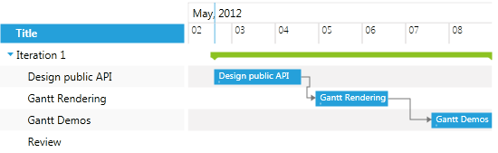
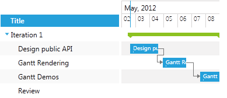
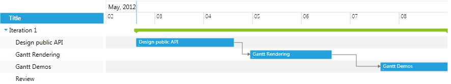
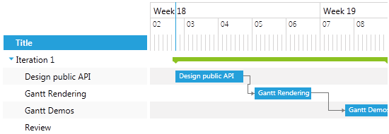
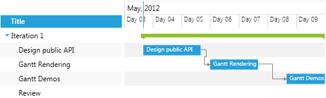
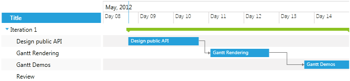
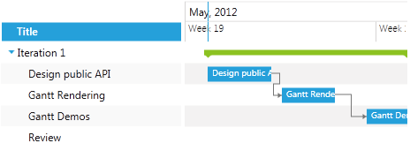

# Configuring the TimeRuler

This topic describes how you can configure the TimeRuler of the GanttView control. There are two key properties you can use:

* [PixelLength property](#pixellength-property)

* [TimeRulerLines property](#timerulerlines-property)

## PixelLength property

With the __PixelLength__ property you  can specify how much time is displayed in the time ruler and scale the time per pixel ratio. __PixelLength__ sets the TimeSpan that will be rendered as one pixel.

>The default PixelLength is 30 min.

Here are some examples:

* The default behavior:

#### __XAML__

{{region radganttview-features-timeruler-configuring_0}}
	<telerik:RadGanttView x:Name="ganttView" TasksSource="{Binding Tasks}">		
	</telerik:RadGanttView>
{{endregion}}

* Setting PixelLength to 1h:

#### __XAML__

{{region radganttview-features-timeruler-configuring_1}}
	<telerik:RadGanttView x:Name="ganttView" TasksSource="{Binding Tasks}" PixelLength="01:00:00">		
	</telerik:RadGanttView>
{{endregion}}

* Setting PixelLength to 15min:

#### __XAML__

{{region radganttview-features-timeruler-configuring_2}}
	<telerik:RadGanttView x:Name="ganttView" TasksSource="{Binding Tasks}" PixelLength="00:15:00">		
	</telerik:RadGanttView>
{{endregion}}

## TimeRulerLines property

Using the __TimeRulerLines__ property you could customize the count, the type and the intervals of the time ruler lines in RadGanttView. There are three types of lines:  __GroupTickLine__, __MajorTickLine__  and __MinorTickLine__, each having different styling and default properties.

Here is a simple example:

#### __XAML__

{{region radganttview-features-timeruler-configuring_3}}
	<telerik:RadGanttView x:Name="ganttView" TasksSource="{Binding Tasks}" >
		<telerik:RadGanttView.TimeRulerLines>
			<telerik:GroupTickLine>
				<telerik:TickInterval Interval="OneWeek" />
			</telerik:GroupTickLine>
			<telerik:MajorTickLine>
				<telerik:TickInterval Interval="OneDay" />				
			</telerik:MajorTickLine>
			<telerik:MinorTickLine>
				<telerik:TickInterval Interval="ThreeHours" />
			</telerik:MinorTickLine>
		</telerik:RadGanttView.TimeRulerLines>
	</telerik:RadGanttView>
{{endregion}}

And the result is:

Each time ruler line has  a collection of __TickIntervals__ objects. The most important properties of the __TickInterval__ object are:

* Interval  - it is of enum type and can be set to any of the following values:

	* OneSecond

	* FiveSeconds

	* TenSeconds

	* FifteenSeconds

	* ThirtySeconds

	* OneMinute

	* FiveMinutes

	* TenMinutes

	* TenMinutes

	* ThirtyMinutes

	* OneHour

	* TwoHours

	* ThreeHours

	* SixHours

	* TwelveHours

	* OneDay

	* OneWeek

	* OneMonth

	* OneYear

* FormatString  - you can set the format of the text for the tick interval.

* MinLength – sets the min length needed for the tick to be shown.

Let’s have the example modified like this:

#### __XAML__

{{region radganttview-features-timeruler-configuring_4}}
	<telerik:RadGanttView x:Name="ganttView" TasksSource="{Binding Tasks}" >
		<telerik:RadGanttView.TimeRulerLines>
			<telerik:GroupTickLine>
					<telerik:TickInterval Interval="OneMonth" FormatString="{}{0:MMMM, yyyy}" />
			</telerik:GroupTickLine>
			<telerik:MajorTickLine>
					<telerik:TickInterval Interval="OneDay" FormatString="Day {0:dd}" />					
			</telerik:MajorTickLine>
		</telerik:RadGanttView.TimeRulerLines>
	</telerik:RadGanttView>
{{endregion}}

And the time ruler will have only GroupTickLine and MajorTickLine with formatted text:

You can have more than one TickInterval for a time ruler line – the GanttView will select the most suitable according to each TickInterval’s Interval and MinLength properties as well as PixelLength property of the control.

Let’s modify the example like this:

#### __XAML__

{{region radganttview-features-timeruler-configuring_5}}
	<telerik:RadGanttView x:Name="ganttView" TasksSource="{Binding Tasks}" PixelLength="00:20:00">
		<telerik:RadGanttView.TimeRulerLines>
			<telerik:GroupTickLine>
					<telerik:TickInterval Interval="OneMonth" FormatString="{}{0:MMMM, yyyy}" />
			</telerik:GroupTickLine>
			<telerik:MajorTickLine>					
					<telerik:TickInterval Interval="OneDay" FormatString="Day {0:dd}" MinLength="45" />
					<telerik:TickInterval Interval="OneWeek"  />
			</telerik:MajorTickLine>
		</telerik:RadGanttView.TimeRulerLines>
	</telerik:RadGanttView>
{{endregion}}

Note that we’ve set two TickIntervals for the MajorTickLine.  So when PixelLength is set to 20min, the result will be the following:If we change the PixelLength to 40min, the Week interval will be chosen:

#### __XAML__

{{region radganttview-features-timeruler-configuring_6}}
	<telerik:RadGanttView x:Name="ganttView" TasksSource="{Binding Tasks}" PixelLength="00:40:00">
		<telerik:RadGanttView.TimeRulerLines>
			<telerik:GroupTickLine>
				<telerik:TickInterval Interval="OneMonth" FormatString="{}{0:MMMM, yyyy}" />
			</telerik:GroupTickLine>
			<telerik:MajorTickLine>					
				<telerik:TickInterval Interval="OneDay" FormatString="Day {0:dd}" MinLength="45" />
				<telerik:TickInterval Interval="OneWeek"  />
			</telerik:MajorTickLine>
		</telerik:RadGanttView.TimeRulerLines>
	</telerik:RadGanttView>
{{endregion}}

You can check the GanttView TimeRuler example at [UI for Silverlight demos](http://demos.telerik.com/silverlight/#GanttView/Configuration/TimeRuler)[UI for WPF demos](http://demos.telerik.com/wpf/) to see the time ruler properties in action. 
