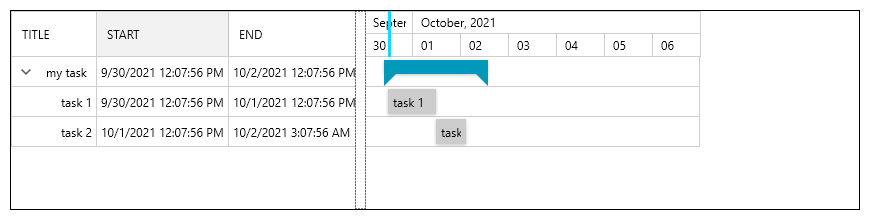
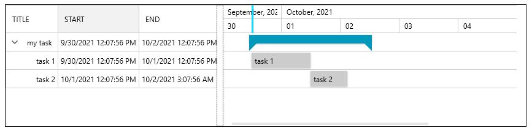
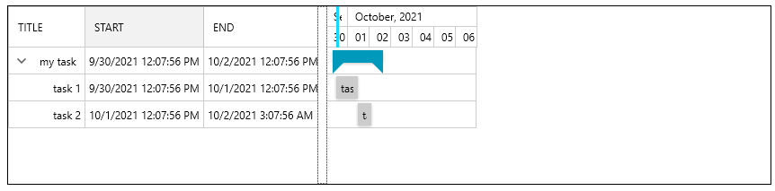
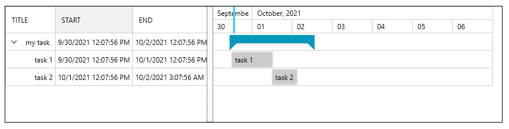
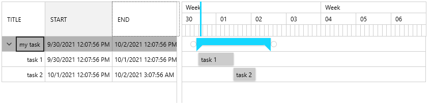
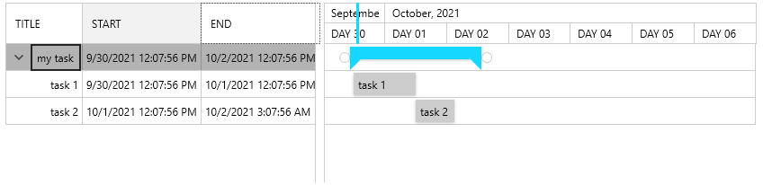
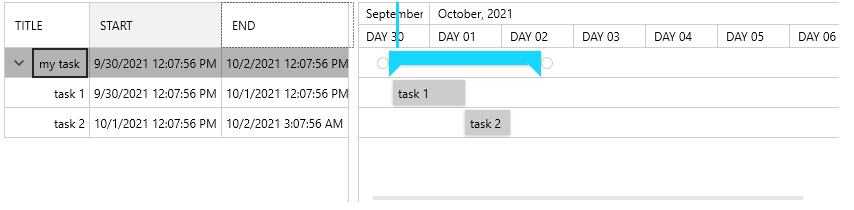
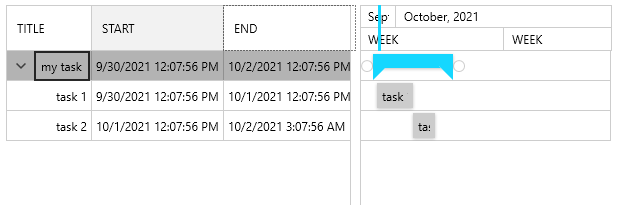

# TimeRuler

The TimeRuler of RadGanttView is the area at the left of the data grid part. The task containers and relations are drawn there, along with the timeline visualization.

This topic describes how to configure the TimeRuler size and time intervals. 

## Configurating Size

The size of the TimeRuler can be customized using the __PixelLength__ and __AutoSizeTimeline__ properties.

__PixelLength__ controls the __time per pixel ratio__, thus it determines how much time is displayed in the timeline. The property accepts a TimeSpan object that determines the time-based size of one screen pixel. The __default__ PixelLength is __30 min__. 

The combination between PixelLength and [VisibleRange]() allows to adjust the size of the TimeRuler area.

__AutoSizeTimeline__ determines if the PixelLength will be automatically calculated based on the available size of the control, thus stretching the TimeRuler.

#### __[XAML] Example 1: Default settings without auto-sizing or PixelLength settings__  
{{region xaml-radganttview-features-timeruler-configuring_0}}
	<telerik:RadGanttView TasksSource="{Binding Tasks}" BorderBrush="Black" BorderThickness="1"/>
{{endregion}}

#### Figure 1: Default behavior withou auto-sizing or PixelLength settings

Figure 1 and the following sizing examples show the RadGanttView with a thin border in order to illustrate how the sizing behaves in the different scenarios.

#### __[XAML] Example 2: Setting PixelLength to 15 minutes__
{{region xaml-radganttview-features-timeruler-configuring_1}}
	<telerik:RadGanttView TasksSource="{Binding Tasks}" PixelLength="00:15:00" BorderBrush="Black" BorderThickness="1"/>
{{endregion}}

#### Figure 2: PixelLength set to 15 minutes

#### __[XAML] Example 3: Setting PixelLength to 1 hour__
{{region xaml-radganttview-features-timeruler-configuring_2}}
	<telerik:RadGanttView TasksSource="{Binding Tasks}" PixelLength="01:00:00" BorderBrush="Black" BorderThickness="1"/>
{{endregion}}

#### Figure 3: PixelLength set to 1 hour

#### __[XAML] Example 4: Setting AutoSizeTimeline__
{{region xaml-radganttview-features-timeruler-configuring_3}}
	<telerik:RadGanttView TasksSource="{Binding Tasks}" AutoSizeTimeline="True" BorderBrush="Black" BorderThickness="1"/>
{{endregion}}

#### Figure 4: Auto-sized timeline

## Configurating Intervals

The timeline of the TimeRuler area provides three types of interval lines - group ticks, major ticks and minor ticks. The __TimeRulerLines__ collection property of RadGanttView allows you to adjust the interval lines. The collection works with objects of type __GroupTickLine__, __MajorTickLine__  and __MinorTickLine__, each having different styling and default properties. This can be used to customize the count, type and invervals of the lines. 

Each tick line object added in the TimeRulerLines collection will generate a new row with ticks in the UI of the timeline.

#### __[XAML] Example 5: Setting TimeRulerLines__
{{region xaml-radganttview-features-timeruler-configuring_4}}
	<telerik:RadGanttView TasksSource="{Binding Tasks}">
	    <telerik:RadGanttView.TimeRulerLines>
	        <telerik:GroupTickLine>
	            <telerik:TickInterval Interval="OneWeek" />
	        </telerik:GroupTickLine>
	        <telerik:MajorTickLine>
	            <telerik:TickInterval Interval="OneDay" />
	        </telerik:MajorTickLine>
	        <telerik:MinorTickLine>
	            <telerik:TickInterval Interval="ThreeHours" />
	        </telerik:MinorTickLine>
	    </telerik:RadGanttView.TimeRulerLines>
	</telerik:RadGanttView>
{{endregion}}

#### Figure 5: Custom TimeRulerLines

The __TickInterval__ element gives control over the interval of the tick line object. It is added in the __TickIntervals__ collection of the tick line.

TickInterval provides three useful properties - __Interval__, __FormatString__ and __MinLength__.

The __Interval__ property is an enum that can be set to one of the following values:

* OneSecond
* FiveSeconds
* TenSeconds
* FifteenSeconds
* ThirtySeconds
* OneMinute
* FiveMinutes
* TenMinutes
* TenMinutes
* ThirtyMinutes
* OneHour
* TwoHours
* ThreeHours
* SixHours
* TwelveHours
* OneDay
* OneWeek
* OneMonth
* OneYear

The __FormatString__ property sets the format of the text for the tick interval.

The __MinLength__ property sets the minimum length needed for the tick to be displayed. This is the minimum pixel length between two adjacent ticks.

#### __[XAML] Example 6: Customizing intervals__  
{{region xaml-radganttview-features-timeruler-configuring_5}}
	<telerik:RadGanttView TasksSource="{Binding Tasks}" >
	    <telerik:RadGanttView.TimeRulerLines>
	        <telerik:GroupTickLine>
	            <telerik:TickInterval Interval="OneMonth" FormatString="{}{0:MMMM, yyyy}" />
	        </telerik:GroupTickLine>
	        <telerik:MajorTickLine>
	            <telerik:TickInterval Interval="OneDay" FormatString="Day {0:dd}" />
	        </telerik:MajorTickLine>
	    </telerik:RadGanttView.TimeRulerLines>
	</telerik:RadGanttView>
{{endregion}}

#### Figure 6: Custom intervals and formatting

In case you define more than one TickInterval in the TimeIntervals collection of the tick line object, RadGanttView will select the most suitable according to each TickInterval’s Interval and MinLength properties as well as PixelLength property of the control. The following two examples illustrate this.

#### __[XAML] Example 7: Adding multiple TickInterval objects - 20 minutes pixel length__  
{{region xaml-radganttview-features-timeruler-configuring_6}}
	<telerik:RadGanttView TasksSource="{Binding Tasks}" PixelLength="00:20:00">
	    <telerik:RadGanttView.TimeRulerLines>
	        <telerik:GroupTickLine>
	            <telerik:TickInterval Interval="OneMonth" FormatString="{}{0:MMMM, yyyy}" />
	        </telerik:GroupTickLine>
	        <telerik:MajorTickLine>
	            <telerik:TickInterval Interval="OneDay" FormatString="Day {0:dd}" MinLength="45" />
	            <telerik:TickInterval Interval="OneWeek"  />
	        </telerik:MajorTickLine>
	    </telerik:RadGanttView.TimeRulerLines>
	</telerik:RadGanttView>
{{endregion}}

In Example 7 the PixelLength is set to 20 minutes which selects the TickInterval with Interval set to OneDay. 

#### Figure 7: Multiple TickIntervals - OneDay interval

In Example 8, the PixelLength is set to 40 minutes which selects the other TickInterval (with Interval set to OneWeek). This happens because the length of the day slot that occur between two adjacent ticks becomes smaller than 45 pixels. In this case, the TickInterval is changed, if suitable one is available.

#### __[XAML] Example 8: Adding multiple TickInterval objects - 40 minutes pixel length__  
{{region xaml-radganttview-features-timeruler-configuring_7}}
	<telerik:RadGanttView TasksSource="{Binding Tasks}" PixelLength="00:40:00">
	    <telerik:RadGanttView.TimeRulerLines>
	        <telerik:GroupTickLine>
	            <telerik:TickInterval Interval="OneMonth" FormatString="{}{0:MMMM, yyyy}" />
	        </telerik:GroupTickLine>
	        <telerik:MajorTickLine>
	            <telerik:TickInterval Interval="OneDay" FormatString="Day {0:dd}" MinLength="45" />
	            <telerik:TickInterval Interval="OneWeek"  />
	        </telerik:MajorTickLine>
	    </telerik:RadGanttView.TimeRulerLines>
	</telerik:RadGanttView>
{{endregion}}

#### Figure 8: Multiple TickIntervals - OneWeek interval

>tip Find a project with a GanttView TimeRuler example at [UI for Silverlight demos](https://demos.telerik.com/silverlight/#GanttView/Configuration/TimeRuler)[UI for WPF demos](https://demos.telerik.com/wpf/) to see the time ruler properties in action. 

## See Also  
* [Visual Structure]()
