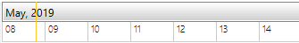
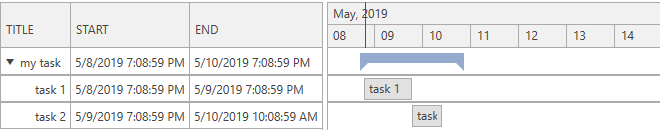
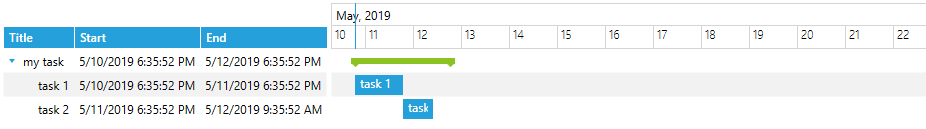

# Getting Started with {{ site.framework_name }} GanttView

This tutorial will walk you through the creation of a sample application that contains a __RadGanttView__.

## Adding Telerik Assemblies Using NuGet

To use __RadGanttView__ when working with NuGet packages, install the `Telerik.Windows.Controls.GanttView.for.Wpf.Xaml` package. The [package name may vary]() slightly based on the Telerik dlls set - [Xaml or NoXaml]()

Read more about NuGet installation in the [Installing UI for WPF from NuGet Package]() article.

>tip With the 2025 Q1 release, the Telerik UI for WPF has a new licensing mechanism. You can learn more about it [here]().

## Adding Assembly References Manually

If you are not using NuGet packages, you can add a reference to the following assemblies:

* __Telerik.Licensing.Runtime__
* __Telerik.Windows.Controls__
* __Telerik.Windows.Controls.GanttView__
* __Telerik.Windows.Scheduling.Core__

## Adding RadGanttView to your project

You can add __RadGanttView__ by writing the XAML code in __Example 1__. You can also add the control by dragging it from the Visual Studio Toolbox and dropping it over the XAML view. 

__Example 1: Defining a RadGanttView__

```XAML
	<UserControl xmlns:telerik="http://schemas.telerik.com/2008/xaml/presentation">
	    <Grid>
	        <telerik:RadGanttView x:Name="ganttView" />
	    </Grid>
	</UserControl>
```

If you run the application now, you will see an empty RadGanttView as demonstrated in __Figure 1__:

#### __Figure 1: Empty RadGanttView__


## Define columns

You can manually define columns in order to showcase information from the displayed tasks as demonstrated in __Example 2__.

__Example 2: Defining columns__

```XAML
	<telerik:RadGanttView x:Name="ganttView2">
	    <telerik:RadGanttView.Columns>
	        <telerik:TreeColumnDefinition Header="Title" Width="AutoHeaderAndContent"/>
	        <telerik:ColumnDefinition MemberBinding="{Binding Start}" Header="Start" Width="AutoHeaderAndContent"/>
	        <telerik:ColumnDefinition MemberBinding="{Binding End}" Header="End" Width="AutoHeaderAndContent"/>
	    </telerik:RadGanttView.Columns>
	</telerik:RadGanttView>
```

>Check the [Columns Overview]() topic for more information about the columns of the data grid.    

## Bind the RadGanttView

In order to populate a RadGanttView control with sample data, you can create a collection of __GanttTask__ objects as demonstrated in __Example 3__. The example also shows how you can specify a __DateRange__ object in order to bind it to the __VisibleRange__ property of RadGanttView. It will control the range that is visible in the timeline section of the control.  

__Example 3: Creating a ViewModel__

```C#
    public class ViewModel : ViewModelBase
    {
        private DateRange visibleRange;

        public ViewModel()
        {
            var date = DateTime.Now;

            var task1 = new GanttTask(date, date.AddDays(1), "task 1");
            var task2 = new GanttTask(date.AddDays(1), date.AddDays(1).AddHours(15), "task 2");

            var mainTask = new GanttTask(date, date.AddDays(2), "my task")
            {
                Children = { task1, task2 }
            };

            this.Tasks = new ObservableCollection<GanttTask>() { mainTask };

            this.VisibleRange = new DateRange(date.AddHours(-12), date.AddDays(12));
        }
        public ObservableCollection<GanttTask> Tasks { get; set; }

        public DateRange VisibleRange
        {
            get
            {
                return this.visibleRange;
            }
            set
            {
                this.visibleRange = value;
                this.OnPropertyChanged(() => this.VisibleRange);
            }
        }
    }
```
```VB.NET
	Public Class ViewModel
		Inherits ViewModelBase
			Private _visibleRange As DateRange

			Public Sub New()
				Dim [date] = Date.Now

				Dim task1 = New GanttTask([date], [date].AddDays(1), "task 1")
				Dim task2 = New GanttTask([date].AddDays(1), [date].AddDays(1).AddHours(15), "task 2")

				Dim mainTask = New GanttTask([date], [date].AddDays(2), "my task") With {
					.Children = { task1, task2 }
				}

				Me.Tasks = New ObservableCollection(Of GanttTask)() From {mainTask}

				Me.VisibleRange = New DateRange([date].AddHours(-12), [date].AddDays(12))
			End Sub
			Public Property Tasks() As ObservableCollection(Of GanttTask)

			Public Property VisibleRange() As DateRange
				Get
					Return Me._visibleRange
				End Get
				Set(ByVal value As DateRange)
					Me._visibleRange = value
					Me.OnPropertyChanged(Function() Me.VisibleRange)
				End Set
			End Property
	End Class
```

__Example 4: Binding to a TaskSource__

```XAML
	<Grid>
        <Grid.DataContext>
            <local:ViewModel />
        </Grid.DataContext>
        <telerik:RadGanttView x:Name="ganttView2" TasksSource="{Binding Tasks}" VisibleRange="{Binding VisibleRange}">
            <telerik:RadGanttView.Columns>
                <telerik:TreeColumnDefinition Header="Title" Width="AutoHeaderAndContent"/>
                <telerik:ColumnDefinition MemberBinding="{Binding Start}" Header="Start" Width="AutoHeaderAndContent"/>
                <telerik:ColumnDefinition MemberBinding="{Binding End}" Header="End" Width="AutoHeaderAndContent"/>
            </telerik:RadGanttView.Columns>
        </telerik:RadGanttView>
    </Grid>
```

#### __Figure 2: Result from Example 4 in the Office2016 theme__



## Setting a Theme

The controls from our suite support different themes. You can see how to apply a theme different than the default one in the [Setting a Theme]() help article.

>important Changing the theme using implicit styles will affect all controls that have styles defined in the merged resource dictionaries. This is applicable only for the controls in the scope in which the resources are merged. 

To change the theme, you can follow the steps below:
* Choose between the themes and add reference to the corresponding theme assembly (ex: **Telerik.Windows.Themes.Windows8.dll**). You can see the different themes applied in the **Theming** examples from our [WPF Controls Examples](https://demos.telerik.com/wpf/)[Silverlight Controls Examples](https://demos.telerik.com/silverlight/#GridView/Theming) application.

* Merge the ResourceDictionaries with the namespace required for the controls that you are using from the theme assembly. For __RadGanttView__, you will need to merge the following resources:

	* __Telerik.Windows.Controls__
	* __Telerik.Windows.Controls.GanttView__

__Example 5__ demonstrates how to merge the ResourceDictionaries so that they are applied globally for the entire application.

__Example 5: Merge the ResourceDictionaries__  
```XAML
	<Application.Resources>
		<ResourceDictionary>
			<ResourceDictionary.MergedDictionaries>
				<ResourceDictionary Source="/Telerik.Windows.Themes.Windows8;component/Themes/System.Windows.xaml"/>
				<ResourceDictionary Source="/Telerik.Windows.Themes.Windows8;component/Themes/Telerik.Windows.Controls.xaml"/>
				<ResourceDictionary Source="/Telerik.Windows.Themes.Windows8;component/Themes/Telerik.Windows.Controls.GanttView.xaml"/>
			</ResourceDictionary.MergedDictionaries>
		</ResourceDictionary>
	</Application.Resources>
```
	
#### __Figure 3: RadGanttView with the Windows8 theme applied__



## Telerik UI for WPF Learning Resources

* [Telerik UI for WPF GanttView Component](https://www.telerik.com/products/wpf/ganttview.aspx)
* [Getting Started with Telerik UI for WPF Components]()
* [Telerik UI for WPF Installation]()
* [Telerik UI for WPF and WinForms Integration]()
* [Telerik UI for WPF Visual Studio Templates]()
* [Setting a Theme with Telerik UI for WPF]()
* [Telerik UI for WPF Virtual Classroom (Training Courses for Registered Users)](https://learn.telerik.com/learn/course/external/view/elearning/16/telerik-ui-for-wpf) 
* [Telerik UI for WPF License Agreement](https://www.telerik.com/purchase/license-agreement/wpf-dlw-s)


## See Also

* [Events]()
* [Drag&Drop Overview]()
* [Types of Items]({slug radganttview-features-items-types})
