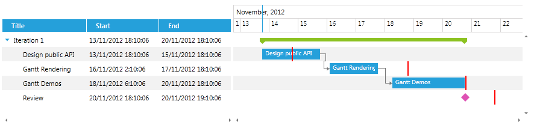
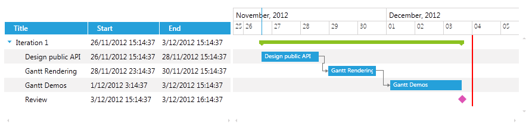

# Customize the TimeLine Data and Containers

In __RadGanttView__ it is possible to customize the way items are rendered in the TimeLine portion of the control and add additional custom elements by creating a custom __TimeLineVisualizationBehavior__.

## Creating a TaskDeadline

In the next example we will show how to create a deadline for each task in the TasksSource of the GanttView control and render a corresponding visual line on the TimeLine portion of the control.

The example will go through on the following key steps:

* Creating a custom __TimeLineEventInfo__

* Creating a custom __TimeLineContainer__

* Creating a custom __TimeLineContainerSelector__

* Creating a custom __TimeLineBehavior__

>Before proceeding with this tutorial you should get familiar with [Implementing View-ViewModel]() help article.

<!-- -->

>It is important to note that when creating a custom TimeLineVisualizationBehavior you will need to set a negative Margin to the Style for the custom TimeLineContainer (Step 7) in order for the visual element to be visible in the TimeLine portion of the control. Also you will need to set the Template of the container (Step 7).

1. First you will need to create a custom GanttTask and add the need GanttDeadLine property:

	#### __C#__

	```C#
			public class GanttDeadlineTask : GanttTask
			{
				private DateTime? ganttDeadLine;
			
				public DateTime? GanttDeadLine
				{
					get
					{
						return this.ganttDeadLine;
					}
					set
					{
						if (this.ganttDeadLine != value)
						{
							this.ganttDeadLine = value;
							this.OnPropertyChanged(() => this.GanttDeadLine);
						}
					}
				}
			}
	```

1. Create a ViewModel, initialize and populate its __Tasks__ and __VisibleTime__ properties with some sample data:

	#### __C#__

	```C#
			public class MyViewModel : ViewModelBase
			{
				private ObservableCollection<GanttTask> _Tasks;
				private DateRange _VisibleTime;
			
				public MyViewModel()
				{
					var date = DateTime.Now;
					var ganttAPI = new GanttDeadlineTask()
					{
						Start = date,
						End = date.AddDays(2),
						Title = "Design public API",
						Description = "Description: Design public API",
						GanttDeadLine = date.AddDays(1)
					};
					var ganttRendering = new GanttDeadlineTask()
					{
						Start = date.AddDays(2).AddHours(8),
						End = date.AddDays(4),
						Title = "Gantt Rendering",
						Description = "Description: Gantt Rendering",
						GanttDeadLine = date.AddDays(5)
					};
					var ganttDemos = new GanttDeadlineTask()
					{
						Start = date.AddDays(4.5),
						End = date.AddDays(7),
						Title = "Gantt Demos",
						Description = "Description: Gantt Demos",
						GanttDeadLine = date.AddDays(7)
					};
					var milestone = new GanttDeadlineTask()
					{
						Start = date.AddDays(7),
						End = date.AddDays(7).AddHours(1),
						Title = "Review",
						Description = "Review",
						GanttDeadLine = date.AddDays(8),
						IsMilestone = true
					};
					ganttRendering.Dependencies.Add(new Dependency() { FromTask = ganttAPI });
					ganttDemos.Dependencies.Add(new Dependency() { FromTask = ganttRendering });
					var iterationTask = new GanttTask(date, date.AddDays(7), "Iteration 1")
					{
						Children = { ganttAPI, ganttRendering, ganttDemos, milestone }
					};
					this._Tasks = new ObservableCollection<GanttTask>() { iterationTask };
					this._VisibleTime = new DateRange(date.AddDays(-1), date.AddDays(9));
				}
			
				public ObservableCollection<GanttTask> Tasks
				{
					get { return this._Tasks; }
					set
					{
						if (this._Tasks != value)
						{
							this._Tasks = value;
							this.OnPropertyChanged(() => this.Tasks);
						}
					}
				}
			
				public DateRange VisibleTime
				{
					get { return this._VisibleTime; }
					set
					{
						if (this._VisibleTime != value)
						{
							this._VisibleTime = value;
							this.OnPropertyChanged(() => this.VisibleTime);
						}
					}
				}
			}
	```

1. Next you will need to create a __TimeLineDeadlineEventInfo__ class that inherits SlotInfo class, this class will hold the information for the containers that need to be rendered in the TimeLine portion of the GanttView control:

	#### __C#__

	```C#
			public class TimeLineDeadlineEventInfo : SlotInfo
			{
			    public TimeLineDeadlineEventInfo(Range<long> timeRange, int index)
			        : base(timeRange, index, index)
			    {
			    }
			
			    public override bool Equals(object obj)
			    {
			        return this.Equals(obj as TimeLineDeadlineEventInfo);
			    }
			
			    public override int GetHashCode()
			    {
			        return base.GetHashCode();
			    }
			}
	```

1. Create __TimeLineDeadlineBehavior__ class that inherits DefaultGanttTimeLineVisualizationBehavior class and override its __GetEventInfos()__ method:

	#### __C#__

	```C#
			public class TimeLineDeadlineBehavior : DefaultGanttTimeLineVisualizationBehavior
			{
			    protected override IEnumerable<IEventInfo> GetEventInfos(TimeLineVisualizationState state, Telerik.Windows.Core.HierarchicalItem hierarchicalItem)
			    {
			        foreach (var eventInfo in base.GetEventInfos(state, hierarchicalItem))
			        {
			            yield return eventInfo;
			        }
			
			        var task = hierarchicalItem.SourceItem as GanttDeadlineTask;
			        var deadline = task != null ? task.GanttDeadLine : default(DateTime?);
			
			        if (deadline.HasValue)
			        {
			            var roundedDeadline = state.Rounder.Round(new DateRange(deadline.Value, deadline.Value));
			            var deadlineRange = new Range<long>(roundedDeadline.Start.Ticks, roundedDeadline.End.Ticks);
			
			            if (deadlineRange.IntersectsWith(state.VisibleTimeRange))
			            {
			                yield return new TimeLineDeadlineEventInfo(deadlineRange, hierarchicalItem.Index);
			            }
			        }
			    }
			}
	```

	>The __DefaultGanttTimeLineVisualizationBehavior__ is responsible for rendering the Tasks, their relations and highlight drag visual in the TimeLine portion of the control.

1. Create a __TimeLineDeadlineBehavior__ property of type ITimeLineVisualizationBehavior and initialize it in the __ViewModel__.

	#### __C#__

	```C#
			public class MyViewModel : ViewModelBase
			{
			    //...
			    private ITimeLineVisualizationBehavior _TimeLineDeadlineBehavior;
			
			    public MyViewModel()
			    {
			        //...
			        this._TimeLineDeadlineBehavior = new TimeLineDeadlineBehavior();
			    }
			
			    //...
			
			    public ITimeLineVisualizationBehavior TimeLineDeadlineBehavior
			    {
			        get { return this._TimeLineDeadlineBehavior; }
			        set
			        {
			            if (this._TimeLineDeadlineBehavior != value)
			            {
			                this._TimeLineDeadlineBehavior = value;
			                this.OnPropertyChanged(() => this.TimeLineDeadlineBehavior);
			            }
			        }
			    }
			}
	```

1. Create a custom __TimeLineDeadlineContainer__ that inherits Control class and implements IDataContainer interface: 

	#### __C#__

	```C#
			public class TimeLineDeadlineContainer : Control, IDataContainer
			{
				public TimeLineDeadlineContainer()
				{
					this.DefaultStyleKey = typeof(TimeLineDeadlineContainer);
				}
			
				public object DataItem { get; set; }
			}
	```

1. Create a Style that targets the newly created TimeLineDeadlineContainer and set its properties:

	#### __XAML__

	```XAML
		<Style TargetType="local:TimeLineDeadlineContainer">
		    <Setter Property="telerik:ZIndexManager.ZIndex" Value="100"/>
		    <Setter Property="BorderBrush" Value="Red" />
		    <Setter Property="BorderThickness" Value="1" />
		    <Setter Property="Margin" Value="0 0 -3 0" />
		    <Setter Property="Template">
		        <Setter.Value>
		            <ControlTemplate>
		                <Grid>
		                    <Rectangle Width="2" Fill="Red" VerticalAlignment="Stretch"/>
		                </Grid>
		            </ControlTemplate>
		        </Setter.Value>
		    </Setter>
		</Style>
	```

1. Next you will need to create a custom __TimeLineDeadlineContainerSelector__ that inherits DefaultTimeLineContainerSelector and override its __GetContainerType()__ method in order to return the custom container.

	#### __C#__

	```C#
			public class TimeLineDeadlineContainerSelector : DefaultTimeLineContainerSelector
			{
				private static readonly ContainerTypeIdentifier timelineDeadlineEventInfoContainerType = ContainerTypeIdentifier.FromType<TimeLineDeadlineContainer>();
			
				public override ContainerTypeIdentifier GetContainerType(object item)
				{
					if (item is TimeLineDeadlineEventInfo)
					{
						return timelineDeadlineEventInfoContainerType;
					}
			
					return base.GetContainerType(item);
				}
			}
	```

1. Finally you will need to add the GanttView control in XAML by setting its __TasksSource__, __TimeLineVisualizationBehavior__, __VisibleRange__ and __TimelineContainerSelector__. The GanttView control should look like this:  

	#### __XAML__

	```XAML
		<telerik:RadGanttView TasksSource="{Binding Tasks}"
		TimeLineVisualizationBehavior="{Binding TimeLineDeadlineBehavior}"
		VisibleRange="{Binding VisibleTime}"
		PixelLength="00:30:00">
		    <telerik:RadGanttView.TimelineContainerSelector>
		        <local:TimeLineDeadlineContainerSelector/>
		    </telerik:RadGanttView.TimelineContainerSelector>
		    <telerik:RadGanttView.Columns>
		        <telerik:TreeColumnDefinition Header="Title" MemberBinding="{Binding Title}" Width="AutoHeaderAndContent"/>
		        <telerik:ColumnDefinition MemberBinding="{Binding Start}" Header="Start" Width="AutoHeaderAndContent"/>
		        <telerik:ColumnDefinition MemberBinding="{Binding End}" Header="End" Width="AutoHeaderAndContent"/>
		    </telerik:RadGanttView.Columns>
		</telerik:RadGanttView>
	```

The next screenshot shows the final result (the red lines represent the deadlines for each task):



## Creating a ProjectDeadline

The following example shows how to customize the __EventInfo__ and __TimeLineVisualizationBehavior__ of the previous example in order to create a major deadline for the whole project in the GanttView control. 

Repeat the steps from the preview example but on __step 3__ create the __EventInfo__ as follows:

#### __C#__

```C#
		public class TimeLineDeadlineEventInfo : TimeSlotInfo
		{
			public TimeLineDeadlineEventInfo(Range<long> timeRange)
				: base(timeRange)
			{
			}
		
			public override bool Equals(object obj)
			{
				return this.Equals(obj as TimeLineDeadlineEventInfo);
			}
		
			public override int GetHashCode()
			{
				return base.GetHashCode();
			}
		}
	```

And on __step 4__ create the custom __TimeLineDeadlineBehavior__ as follows:

#### __C#__

```C#
		public class TimeLineDeadlineBehavior : DefaultGanttTimeLineVisualizationBehavior
		{
			private DateTime projectDeadline;
		
			public DateTime ProjectDeadline
			{
				get { return this.projectDeadline; }
				set
				{
					if (this.projectDeadline != value)
					{
						this.projectDeadline = value;
						this.OnPropertyChanged(string.Empty);
					}
				}
			}
		
			protected override System.Collections.IEnumerable GetBackgroundData(TimeLineVisualizationState state)
			{
				foreach (var background in base.GetBackgroundData(state))
				{
					yield return background;
				}
		
				var visibleRange = state.VisibleTimeRange;
				var deadline = state.Rounder.Round(new DateRange(this.projectDeadline, this.projectDeadline));
				var deadlineRange = new Range<long>(deadline.Start.Ticks, deadline.End.Ticks);
		
				if (visibleRange.IntersectsWith(deadlineRange))
				{
					yield return new TimeLineDeadlineEventInfo(deadlineRange);
				}
			}
		}
	```

Finally we will need to create a __ProjectDeadline__ property in the ViewModel of type DateTime and initialize it with a sample data:

#### __C#__

```C#
		public class MyViewModel : ViewModelBase
		{
		    //...
		    private DateTime _ProjectDeadline;
		
		    public MyViewModel()
		    {
		        //...
		        this.ProjectDeadline = DateTime.Now.AddDays(8);
		    }
		
		    public DateTime ProjectDeadline
		    {
		        get { return this._ProjectDeadline; }
		        set
		        {
		            if (this._ProjectDeadline != value)
		            {
		                this._ProjectDeadline = value;
		                var behavior = this._TimeLineDeadlineBehavior as TimeLineDeadlineBehavior;
		                if (behavior != null)
		                {
		                    behavior.ProjectDeadline = value;
		                }
		                this.OnPropertyChanged(() => this.ProjectDeadline);
		            }
		        }
		    }
		
		    public TimeLineDeadlineBehavior _TimeLineDeadlineBehavior { get; set; }
		}
	```

The next screenshot shows the final result (the red line represents the ProjectDeadline):


