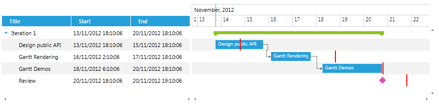
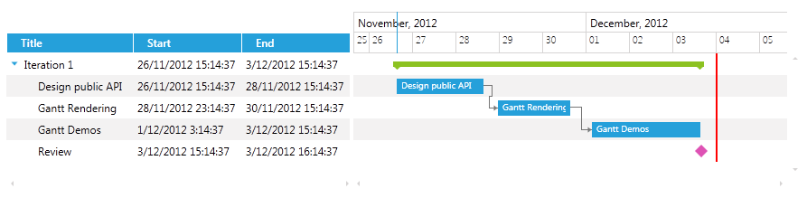

# Customize the TimeLine Data and Containers

In __RadGanttView__ it is possible to customize the way items are rendered in the TimeLine portion of the control and add additional custom elements by creating a custom __TimeLineVisualizationBehavior__.

## Creating a TaskDeadline

In the next example we will show how to create a deadline for each task in the TasksSource of the GanttView control and render a corresponding visual line on the TimeLine portion of the control.

The example will go through on the following key steps:

* Creating a custom __TimeLineEventInfo__

* Creating a custom __TimeLineContainer__

* Creating a custom __TimeLineContainerSelector__

* Creating a custom __TimeLineBehavior__

>Before proceeding with this tutorial you should get familiar with [Implementing View-ViewModel]() help article.

<!-- -->

>It is important to note that when creating a custom TimeLineVisualizationBehavior you will need to set a negative Margin to the Style for the custom TimeLineContainer (Step 7) in order for the visual element to be visible in the TimeLine portion of the control. Also you will need to set the Template of the container (Step 7).

1. First you will need to create a custom GanttTask and add the need GanttDeadLine property:

	<snippet id='radganttview-howto-customize-the-timeline-block_1-cs' />

1. Create a ViewModel, initialize and populate its __Tasks__ and __VisibleTime__ properties with some sample data:

	<snippet id='radganttview-howto-customize-the-timeline-block_2-cs' />

1. Next you will need to create a __TimeLineDeadlineEventInfo__ class that inherits SlotInfo class, this class will hold the information for the containers that need to be rendered in the TimeLine portion of the GanttView control:

	<snippet id='radganttview-howto-customize-the-timeline-block_3-cs' />

1. Create __TimeLineDeadlineBehavior__ class that inherits DefaultGanttTimeLineVisualizationBehavior class and override its __GetEventInfos()__ method:

	<snippet id='radganttview-howto-customize-the-timeline-block_4-cs' />

	>The __DefaultGanttTimeLineVisualizationBehavior__ is responsible for rendering the Tasks, their relations and highlight drag visual in the TimeLine portion of the control.

1. Create a __TimeLineDeadlineBehavior__ property of type ITimeLineVisualizationBehavior and initialize it in the __ViewModel__.

	<snippet id='radganttview-howto-customize-the-timeline-block_5-cs' />

1. Create a custom __TimeLineDeadlineContainer__ that inherits Control class and implements IDataContainer interface: 

	<snippet id='radganttview-howto-customize-the-timeline-block_6-cs' />

1. Create a Style that targets the newly created TimeLineDeadlineContainer and set its properties:

	<snippet id='radganttview-howto-customize-the-timeline-block_7-xaml' />

1. Next you will need to create a custom __TimeLineDeadlineContainerSelector__ that inherits DefaultTimeLineContainerSelector and override its __GetContainerType()__ method in order to return the custom container.

	<snippet id='radganttview-howto-customize-the-timeline-block_8-cs' />

1. Finally you will need to add the GanttView control in XAML by setting its __TasksSource__, __TimeLineVisualizationBehavior__, __VisibleRange__ and __TimelineContainerSelector__. The GanttView control should look like this:  

	<snippet id='radganttview-howto-customize-the-timeline-block_9-xaml' />

The next screenshot shows the final result (the red lines represent the deadlines for each task):

## Creating a ProjectDeadline

The following example shows how to customize the __EventInfo__ and __TimeLineVisualizationBehavior__ of the previous example in order to create a major deadline for the whole project in the GanttView control. 

Repeat the steps from the preview example but on __step 3__ create the __EventInfo__ as follows:

<snippet id='radganttview-howto-customize-the-timeline-block_10-cs' />

And on __step 4__ create the custom __TimeLineDeadlineBehavior__ as follows:

<snippet id='radganttview-howto-customize-the-timeline-block_11-cs' />

Finally we will need to create a __ProjectDeadline__ property in the ViewModel of type DateTime and initialize it with a sample data:

<snippet id='radganttview-howto-customize-the-timeline-block_12-cs' />

The next screenshot shows the final result (the red line represents the ProjectDeadline):

