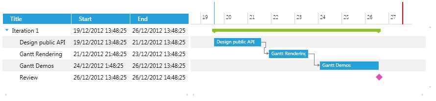

# Customize the TimeRuler Data and Containers

In __RadGanttView__ it is possible to customize the way items are rendered in the TimeRuler portion of the control and add additional custom elements by creating a custom __TimeRulerVisualizationBehavior__.
    
## Creating ProjectDeadLine

In the next example we will show how to create a project deadline marker in the TimeRuler portion of the GanttView control.

>Before proceeding with this tutorial you should get familiar with [Implementing View-ViewModel]() help article.

The example will go through on the following key steps:

* Creating a custom __TimeRulerTickInfo__

* Creating a custom __TimeRulerContainer__

* Creating a custom __TimeRulerContainerSelector__

* Creating a custom __TimeRulerBehavior__

>It is important to note that when creating a custom TimeRulerVisualizationBehavior you will need to set a negative Margin to the Style for the custom TimeRulerContainer (Step 6) in order for the visual element to be visible in the TimeRuler portion of the control. Also you will need to set the Template of the container (Step 6).

The next steps go through on how to create a custom TimeRulerVisualizationBehavior, create a ProjectDeadline property and render a corresponding visual line in the TimeRuler of the GanttView control.

1. Create a ViewModel, initialize and populate its __Tasks__ and __VisibleTime__ properties with some sample data:

	```C#
			public class MyViewModel : ViewModelBase
			{
				private ObservableCollection<GanttTask> tasks;
			
				private DateRange visibleTime;
			
				public MyViewModel()
				{
					var date = DateTime.Now;
					var ganttAPI = new GanttTask()
					{
						Start = date,
						End = date.AddDays(2),
						Title = "Design public API",
						Description = "Description: Design public API"
					};
			
					var ganttRendering = new GanttTask()
					{
						Start = date.AddDays(2).AddHours(8),
						End = date.AddDays(4),
						Title = "Gantt Rendering",
						Description = "Description: Gantt Rendering"
					};
			
					var ganttDemos = new GanttTask()
					{
						Start = date.AddDays(4.5),
						End = date.AddDays(7),
						Title = "Gantt Demos",
						Description = "Description: Gantt Demos"
					};
			
					var milestone = new GanttTask()
					{
						Start = date.AddDays(7),
						End = date.AddDays(7).AddHours(1),
						Title = "Review",
						Description = "Review",
						IsMilestone = true
					};
			
			
					ganttRendering.Dependencies.Add(new Dependency { FromTask = ganttAPI });
					ganttDemos.Dependencies.Add(new Dependency { FromTask = ganttRendering });
			
					var iterationTask = new GanttTask()
					{
						Start = date,
						End = date.AddDays(7),
						Title = "Iteration 1",
						Children = { ganttAPI, ganttRendering, ganttDemos, milestone }
					};
			
					this.tasks = new ObservableCollection<GanttTask>() { iterationTask };
					this.visibleTime = new DateRange(date.AddDays(-1), date.AddDays(9));
				}
			
				public ObservableCollection<GanttTask> Tasks
				{
					get
					{
						return tasks;
					}
					set
					{
						tasks = value;
						OnPropertyChanged(() => Tasks);
					}
				}
			
				public DateRange VisibleTime
				{
					get
					{
						return this.visibleTime;
					}
					set
					{
						if (this.visibleTime != value)
						{
							this.visibleTime = value;
							this.OnPropertyChanged(() => this.VisibleTime);
						}
					}
				}
			}
	```

1. Create a __TimeRulerDeadlineTickInfo__ class that implements IEventInfo and ICellCoordinates interfaces. This class will hold the information for the container that needs to be rendered in the TimeRuler portion of the GanttView control:

	```C#
			public class TimeRulerDeadlineTickInfo : IEventInfo, ICellCoordinates
			{
				private Range<long> timeRange;
			
				public TimeRulerDeadlineTickInfo(long timeRange)
				{
					this.timeRange = new Range<long>(timeRange);
				}
			
				public Range<long> TimeRange
				{
					get { return this.timeRange; }
				}
			
				public Range<int> CellCoordinates
				{
					get { return new Range<int>(0, 2); }
				}
			}
	```

1. Create __TimeRulerDeadlineBehavior__ class that inherits DefaultTimeRulerVisualizationBehavior class, override its GetVisibleItems () method and add a ProjectDeadline property of type DateTime:

	```C#
			public class TimeRulerDeadlineBehavior : DefaultTimeRulerVisualizationBehavior
			{
				private DateTime projectDeadline;
				public DateTime ProjectDeadline
				{
					get { return this.projectDeadline; }
					set
					{
						if (this.projectDeadline != value)
						{
							this.projectDeadline = value;
							this.OnPropertyChanged(string.Empty);
						}
					}
				}
			
				public override System.Collections.IEnumerable GetVisibleItems(TimeRulerVisualizationState state)
				{
					foreach (var majorTick in base.GetVisibleItems(state))
					{
						yield return majorTick;
					}
			
					yield return new TimeRulerDeadlineTickInfo(this.projectDeadline.Ticks);
				}
			}
	```

	>The DefaultTimeRulerVisualizationBehavior is responsible for rendering the time ticks in the TimeRuler portion of the control.

1. Create a __TimeRulerDeadlineBehavior__ property, a __ProjectDeadline__ property of type DateTime and initialize them in the __ViewModel__.

	```C#
			public class MyViewModel : ViewModelBase
			{
			       //...
				private DateTime projectDeadline = DateTime.Today;
			
				private TimeRulerDeadlineBehavior timeRulerDeadlineBehavior;
			
				public MyViewModel()
				{
			           //...
					this.timeRulerDeadlineBehavior = new TimeRulerDeadlineBehavior();
					this.ProjectDeadline = DateTime.Now.AddDays(8);
				}
			
			       //...
			
				public DateTime ProjectDeadline
				{
					get
					{
						return this.projectDeadline;
					}
					set
					{
						if (this.projectDeadline != value)
						{
							this.projectDeadline = value;
							var behavior = this.timeRulerDeadlineBehavior as TimeRulerDeadlineBehavior;
							if (behavior != null)
							{
								behavior.ProjectDeadline = value;
							}
							this.OnPropertyChanged(() => this.ProjectDeadline);
						}
					}
				}
			
				public TimeRulerDeadlineBehavior TimeRulerDeadlineBehavior
				{
					get
					{
						return timeRulerDeadlineBehavior;
					}
					set
					{
						timeRulerDeadlineBehavior = value;
						OnPropertyChanged(() => this.TimeRulerDeadlineBehavior);
					}
				}
			}
	```

1. Create a custom __TimeRulerDeadlineContainer__ that inherits Control class and implements IDataContainer interface:

	```C#
			public class TimeRulerDeadlineContainer : Control, IDataContainer
			{
				public TimeRulerDeadlineContainer()
				{
					this.DefaultStyleKey = typeof(TimeRulerDeadlineContainer);
				}
			
				public object DataItem { get; set; }
			}
	```

1. Create a __Style__ that targets the newly created __TimeRulerDeadlineContainer__ and set its properties:

	```XAML
		<Style TargetType="local:TimeRulerDeadlineContainer">
		    <Setter Property="Canvas.ZIndex" Value="100"/>
		    <Setter Property="BorderBrush" Value="Red"/>
		    <Setter Property="BorderThickness" Value="1"/>
		    <Setter Property="Margin" Value="0 0 -1 0"/>
		    <Setter Property="Template">
		        <Setter.Value>
		            <ControlTemplate>
		                <Grid>
		                    <Rectangle Margin="0 0 -1 0" Width="2" Fill="Red" VerticalAlignment="Stretch"/>
		                </Grid>
		            </ControlTemplate>
		        </Setter.Value>
		    </Setter>
		</Style>
	```

1. Next you will need to create a custom TimeRulerDeadlineContainerSelector that inherits DefaultTimeRulerContainerSelector and override its GetContainerType() method in order to return the custom container.

	```C#
			public class TimeRulerDeadlineContainerSelector : DefaultTimeRulerContainerSelector
			{
				private static readonly ContainerTypeIdentifier timeRulerDeadlineContainerType = ContainerTypeIdentifier.FromType<TimeRulerDeadlineContainer>();
			
				public override ContainerTypeIdentifier GetContainerType(object item)
				{
					if (item is TimeRulerDeadlineTickInfo)
					{
						return timeRulerDeadlineContainerType;
					}
					return base.GetContainerType(item);
				}
			}
	```

1. Finally you will need to set the GanttView control in the XAML by setting its TasksSource, TimeLineVisualizationBehavior, VisibleRange and TimeRulerContainerSelector. The XAML for the GanttView should look like this:

	```XAML
		<telerik:RadGanttView TasksSource="{Binding Tasks}" Margin="5"
		                      TimeRulerVisualizationBehavior="{Binding TimeRulerDeadlineBehavior}"
		                      VisibleRange="{Binding VisibleTime}"
		                      PixelLength="00:30:00"
		                      Height="200">
		    <telerik:RadGanttView.TimeRulerContainerSelector>
		        <local:TimeRulerDeadlineContainerSelector/>
		    </telerik:RadGanttView.TimeRulerContainerSelector>
		    <telerik:RadGanttView.Columns>
		        <telerik:TreeColumnDefinition Header="Title" MemberBinding="{Binding Title}" Width="AutoHeaderAndContent"/>
		        <telerik:ColumnDefinition MemberBinding="{Binding Start}" Header="Start" Width="AutoHeaderAndContent"/>
		        <telerik:ColumnDefinition MemberBinding="{Binding End}" Header="End" Width="AutoHeaderAndContent"/>
		    </telerik:RadGanttView.Columns>
		</telerik:RadGanttView>
	```

The next screenshot shows the final result (the red line represents the ProjectDeadline):

