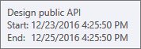
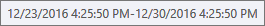
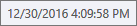
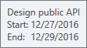

# Customize the Tooltips for TimeLine Containers

The different types of RadGanttView tasks have different tooltip contents as demonstrated in **figures 1-3**.

#### __Figure 1: Event Container Tooltip__



#### __Figure 2: Summary Container Tooltip__



#### __Figure 3: Milestone Container Tooltip__



In order to modify these tooltips, you will need to predefine the **ToolTipTemplate** of the containers for each RadGanttView task type. **Example 1** shows a sample **DataTemplate** for the tooltips.

__Example 1: Sample Tooltip Template__

```XAML
	<DataTemplate x:Key="CustomToolTipTemplate">
        <Grid Margin="2">
            <Grid.ColumnDefinitions>
                <ColumnDefinition Width="Auto"/>
                <ColumnDefinition Width="\*" MinWidth="130"/>
            </Grid.ColumnDefinitions>
            <Grid.RowDefinitions>
                <RowDefinition/>
                <RowDefinition/>
                <RowDefinition/>
            </Grid.RowDefinitions>
            <TextBlock Text="{Binding Title}" Grid.ColumnSpan="2" Margin="0" TextWrapping="NoWrap" TextTrimming="None"/>
            <TextBlock telerik:LocalizationManager.ResourceKey="Start" Grid.Row="1" Margin="0 0 3 0"/>
            <TextBlock Text="{Binding Start, StringFormat='M/dd/yyyy'}" Grid.Row="1" Grid.Column="1" TextWrapping="NoWrap" TextTrimming="None"/>
            <TextBlock telerik:LocalizationManager.ResourceKey="End" Grid.Row="2" Margin="0 0 3 0"/>
            <TextBlock Text="{Binding End, StringFormat='M/dd/yyyy'}" Grid.Row="2" Grid.Column="1" TextWrapping="NoWrap" TextTrimming="None"/>
        </Grid>
    </DataTemplate>
```

You should then set this template for each of the containers as demonstrated in **Example 2**.

__Example 2: Set ToolTipTemplate__

```XAML
	<Style TargetType="telerik:EventContainer">
        <Setter Property="ToolTipTemplate" Value="{StaticResource CustomToolTipTemplate}"/>
    </Style>
    <Style TargetType="telerik:SummaryContainer">
        <Setter Property="ToolTipTemplate" Value="{StaticResource CustomToolTipTemplate}"/>
    </Style>
    <Style TargetType="telerik:MilestoneContainer">
        <Setter Property="ToolTipTemplate" Value="{StaticResource CustomToolTipTemplate}"/>
    </Style>
```

>If you're using [Implicit styles](), you should base the styles on **EventContainerStyle**, **SummaryContainerStyle** and **MilestoneContainerStyle** respectively.

**Figure 4** shows the appearance of the final custom tooltips.

#### __Figure 4: Custom Container Tooltip__


