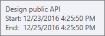
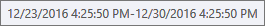
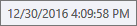
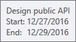

# Customize the Tooltips for TimeLine Containers

The different types of RadGanttView tasks have different tooltip contents as demonstrated in **figures 1-3**.

#### __Figure 1: Event Container Tooltip__

#### __Figure 2: Summary Container Tooltip__

#### __Figure 3: Milestone Container Tooltip__

In order to modify these tooltips, you will need to predefine the **ToolTipTemplate** of the containers for each RadGanttView task type. **Example 1** shows a sample **DataTemplate** for the tooltips.

__Example 1: Sample Tooltip Template__

<snippet id='radganttview-howto-customize-timeline-containers-tooltips-example_1_sample_tooltip_template-xaml' />

You should then set this template for each of the containers as demonstrated in **Example 2**.

__Example 2: Set ToolTipTemplate__

<snippet id='radganttview-howto-customize-timeline-containers-tooltips-example_2_set_tooltiptemplate-xaml' />

>If you're using [Implicit styles](), you should base the styles on **EventContainerStyle**, **SummaryContainerStyle** and **MilestoneContainerStyle** respectively.

**Figure 4** shows the appearance of the final custom tooltips.

#### __Figure 4: Custom Container Tooltip__

