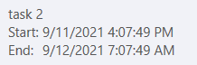
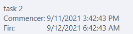

# Localization

The built-in localization mechanism in {{site.framework_name}} allows you to localize any string resource used by the RadGanttView control. Once translated, you might use your resources in both {{site.framework_name}} projects without changing anything.

>tip To learn more about the ways to localize the controls from the UI for {{site.framework_name}} suite please read the common topic about [Localization]().

In __RadGanttView__ you can localize the Start and End text in task tooltips:

The next image shows the tooltip localized in French:

>tip You can also localize the __RadDateTimePicker__  which is present when choosing a date. More information on how to achieve this can be found in the [DateTimePicker Localization]() article. 

## Supported Languages

__RadGanttView__ can be translated in one of the following supported languages using the framework's localization mechanism:

* English
* German
* Spanish
* French
* Italian
* Dutch
* Turkish

More information on how to achieve this can be found the [Localization Using Built-In Resources]() article.

## Resource Keys

The resources of the control can be localized by using an unique identifier called resource key that is assigned to each localizable string. Below you may find a list of the Resources available and their default values:
		
Key | Value
---|---
DraggingItem | Dragging item:
DrawRelationFrom | Draw relation from:
DrawRelationTo | To:
End | End:
Gantt_Week | Week
RelationToolTip | Drag to create relation
Start | Start:
