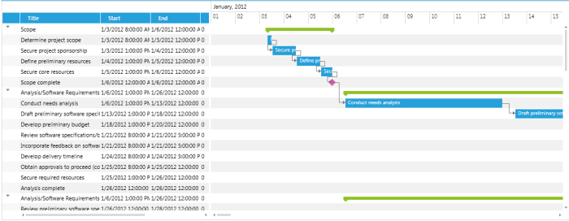
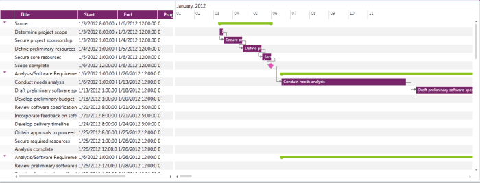

# Overview








Telerik __RadGanttView__ is a control used for managing and visualization project planning data in a MVVM friendly way.



__Key features__ list includes:

* __Support for various project data__ - visualize different item types like Regular Tasks, Project Milestones, Summaries and the Relations between them, check [here]() for more details.

* __Highlight critical items__ - highlight different types of important items like late or critical tasks.[Read more]().

* __Built with performance in mind__ - the control is taking advantage of Data and UI virtualization to achieve fast scrolling and navigation through thousands of items.

* __MVVM Support__ - the control uses MVVM-friendly API to better facilitate the separation of the View layer. The control can be easily bound to a datasource via a single property.

* __Import MS Project Data__ - import your MS project data into the __GanttView__ control and visualize it in a user-friendly way.

* __Silverlight/WPF Code Compatibility__ - the SilverlightWPF GanttView shares a single codebase with its WPFSilverlight counterpart. This means that you can achieve close to 100% code reuse for your GanttView logic if you have parallel Silverlight/WPF development. 

You can check __RadGanttView__ demos at [https://demos.telerik.com/silverlight/](https://demos.telerik.com/silverlight/#GanttView/FirstLook)[https://demos.telerik.com/wpf/](https://demos.telerik.com/wpf/)