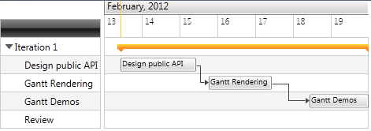

# Implementing View-ViewModel

The purpose of this tutorial is to show you how to bind a __RadGanttView__ with a ViewModel.

>Before reading this tutorial you should get familiar with the [Data Binding]() support of the __RadGanttView__ control. 

* Add a new __RadGanttView__ declaration in your XAML:

#### __XAML__

```XAML
	<telerik:RadGanttView x:Name="ganttView" />
```

* Create a new class named __MyViewModel__:

#### __C#__

```C#
	public class MyViewModel
	{
	}
```

* In the __MyViewModel__ class add Tasks property. We will bind the __TasksSource__ property of the __RadGanttView__ to this property. 

#### __C#__

```C#
	public class MyViewModel : PropertyChangedBase
	{
	    private ObservableCollection<GanttTask> tasks;
	
	    public ObservableCollection<GanttTask> Tasks
	    {
	        get
	        {
	            return tasks;
	        }
	        set
	        {
	            tasks = value;
	            OnPropertyChanged(() => Tasks);
	        }
	    }
	}
```

* All we have to do is to initialize the tasks field: 

#### __C#__

```C#
	public MyViewModel()
	{
	    var date = DateTime.Now;
	
	    var ganttAPI = new GanttTask() { Start = date, End = date.AddDays(2), Title = "Design public API" };
	    var ganttRendering = new GanttTask() { Start = date.AddDays(2).AddHours(8), End = date.AddDays(4), Title = "Gantt Rendering" };
	    var ganttDemos = new GanttTask() { Start = date.AddDays(5), End = date.AddDays(7), Title = "Gantt Demos" };
	
	    var milestone = new GanttTask() { Start = date.AddDays(7), End = date.AddDays(7).AddHours(1), Title = "Review", IsMilestone = true };
	
	    ganttRendering.Dependencies.Add(new Dependency() { FromTask = ganttAPI });
	    ganttDemos.Dependencies.Add(new Dependency() { FromTask = ganttRendering });
	
	    var iterationTask = new GanttTask(date, date.AddDays(7), "Iteration 1")
	    {
	        Children = { ganttAPI, ganttRendering, ganttDemos, milestone }
	    };
	
	
	    this.tasks = new ObservableCollection<GanttTask>() { iterationTask };
	}
```

* The ViewModel is complete. Now, let's return to the View. Add TasksSource property to the definition of the __GanttView__:

#### __XAML__

```XAML
	<telerik:RadGanttView x:Name="ganttView1" TasksSource="{Binding Tasks}"  />
```

* Finally, set the DataContext: 	

#### __C#__

```C#
	this.DataContext = new MyViewModel();
```

And the result is:

