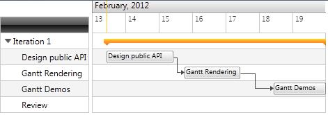

# Implementing View-ViewModel

The purpose of this tutorial is to show you how to bind a __RadGanttView__ with a ViewModel.

>Before reading this tutorial you should get familiar with the [Data Binding]() support of the __RadGanttView__ control. 

* Add a new __RadGanttView__ declaration in your XAML:

<snippet id='radganttview-populating-with-data-viewmodel-block_1-xaml' />

* Create a new class named __MyViewModel__:

<snippet id='radganttview-populating-with-data-viewmodel-block_2-cs' />

* In the __MyViewModel__ class add Tasks property. We will bind the __TasksSource__ property of the __RadGanttView__ to this property. 

<snippet id='radganttview-populating-with-data-viewmodel-block_3-cs' />

* All we have to do is to initialize the tasks field: 

<snippet id='radganttview-populating-with-data-viewmodel-block_4-cs' />

* The ViewModel is complete. Now, let's return to the View. Add TasksSource property to the definition of the __GanttView__:

<snippet id='radganttview-populating-with-data-viewmodel-block_5-xaml' />

* Finally, set the DataContext: 	

<snippet id='radganttview-populating-with-data-viewmodel-block_6-cs' />

And the result is:

