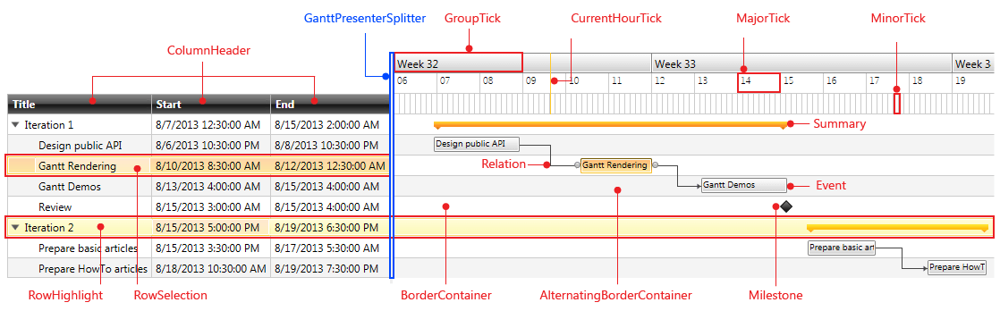
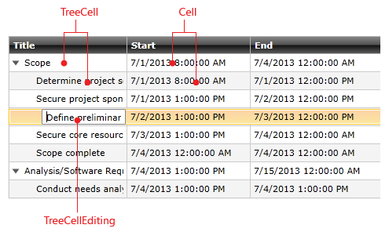
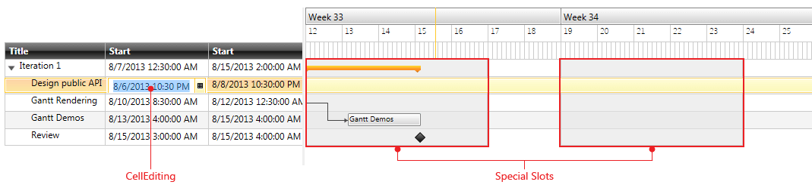
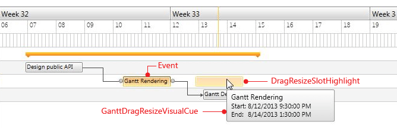
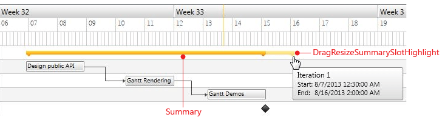
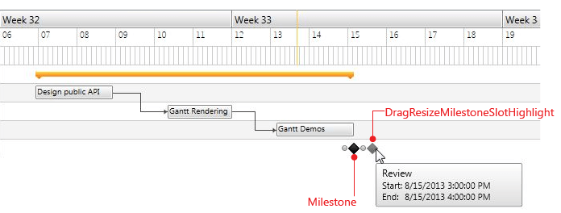
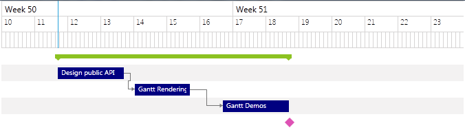
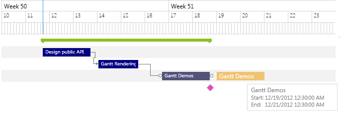

# GanttView Styles

__RadGanttView__ supports styling only with Implicit Styles. You can check how to set a theme to the control in [this topic]().
				Using implicit styles makes it much easier to customize different parts of the control.
			

>Before proceeding, check the
					[Implicit Style](http://www.telerik.com/help/silverlight/styling-apperance-implicit-styles-overview.html)[Implicit Style](http://www.telerik.com/help/wpf/styling-apperance-implicit-styles-overview.html) article.
				

## 

You can modify the look of the __RadGanttView__ and its elements separately by simply creating an implicit style with the correct TargetType.
					Also you will have the option to create a Style based on the default Style for a certain element.
				

Let’s for example have a GanttView control defined like this:

#### __XAML__

{{region radganttview-styles-and-templates-overview_0}}
	<telerik:RadGanttView x:Name="ganttView" TasksSource="{Binding Tasks}" >
		<telerik:RadGanttView.TimeRulerLines>
			<telerik:GroupTickLine>
				<telerik:TickInterval Interval="OneWeek" />
			</telerik:GroupTickLine>
			<telerik:MajorTickLine>
				<telerik:TickInterval Interval="OneDay" />
			</telerik:MajorTickLine>
			<telerik:MinorTickLine>
				<telerik:TickInterval Interval="ThreeHours" />
			</telerik:MinorTickLine>
		</telerik:RadGanttView.TimeRulerLines>
		<telerik:RadGanttView.Columns>
			<telerik:TreeColumnDefinition MemberBinding="{Binding Title}" Header="Title" Width="AutoHeaderAndContent"/>
			<telerik:ColumnDefinition MemberBinding="{Binding Start}" Header="Start" Width="AutoHeaderAndContent"/>
			<telerik:ColumnDefinition MemberBinding="{Binding End}" Header="End" Width="AutoHeaderAndContent"/>
		</telerik:RadGanttView.Columns>
	</telerik:RadGanttView>
	{{endregion}}

The following scheme shows the name of each element  that can be styled:

In the next screenshots we will focus on the Columns part of the GanttView control:
				

>CellHighlight and TreeCellHighlight are used for both highlighted and selected states of the Cell/TreeCell respectively.

If we have CellTemplate and/or CellEditTemplate defined, the generated containers are different. For example, let&s change our GanttView Columns like this:
				

#### __XAML__

{{region radganttview-styles-and-templates-overview_4}}
	<telerik:RadGanttView x:Name="ganttView" TasksSource="{Binding Tasks}" >
		...
		<telerik:RadGanttView.Columns>
			<telerik:TreeColumnDefinition Header="Title" MemberBinding="{Binding Title}" Width="AutoHeaderAndContent">
				<telerik:TreeColumnDefinition.CellTemplate >
					<DataTemplate>
						<TextBlock Text="{Binding Title}" />
					</DataTemplate>
				</telerik:TreeColumnDefinition.CellTemplate>
				<telerik:TreeColumnDefinition.CellEditTemplate>
					<DataTemplate>
						<TextBox Text="{Binding Title,Mode=TwoWay}" />
					</DataTemplate>
				</telerik:TreeColumnDefinition.CellEditTemplate>
			</telerik:TreeColumnDefinition>
			<telerik:ColumnDefinition MemberBinding="{Binding Start}" Header="Start" Width="AutoHeaderAndContent">
				<telerik:ColumnDefinition.CellTemplate >
					<DataTemplate>
						<TextBlock Text="{Binding Start}" />
					</DataTemplate>
				</telerik:ColumnDefinition.CellTemplate>
				<telerik:ColumnDefinition.CellEditTemplate>
					<DataTemplate>
						<telerik:RadDateTimePicker SelectedValue="{Binding Start,Mode=TwoWay}" />
					</DataTemplate>
				</telerik:ColumnDefinition.CellEditTemplate>
			</telerik:ColumnDefinition>
			...
		</telerik:RadGanttView.Columns>
	</telerik:RadGanttView>
	{{endregion}}

The containers in the grid will be Cell/TreeCell instead of SimpleCell/SimpleTreeCell. Also the containers for editing will be CellEditing/TreeCellEditing:

In case we have SpecialSlots defined:

#### __XAML__

{{region radganttview-styles-and-templates-overview_1}}
	<telerik:RadGanttView x:Name="ganttView" TasksSource="{Binding Tasks}" >
		...
		<telerik:RadGanttView.SpecialSlotsGenerator>
			<telerik:WeekDaysGenerator FirstDay="Monday" DaysCount="5" />
		</telerik:RadGanttView.SpecialSlotsGenerator>
	</telerik:RadGanttView>
	
	{{endregion}}

We can style them as well:

The next screenshots show all the elements used for DragDrop and Resize functionality of the control:

In the following table you will find the corresponding TargetType for each of these elements:
				
<table><th><tr><td>

Element</td><td>

TargetType</td></tr></th><tr><td>Relation</td><td>RelationContainer</td></tr><tr><td>Event</td><td>EventContainer</td></tr><tr><td>Summary</td><td>SummaryContainer</td></tr><tr><td>Milestone</td><td>MilestoneContainer</td></tr><tr><td>ColumnHeader</td><td>ColumnHeaderContainer</td></tr><tr><td>SimpleCell</td><td>SimpleCellContainer</td></tr><tr><td>Cell</td><td>CellContainer</td></tr><tr><td>CellHighlight</td><td>CellHighlightContainer</td></tr><tr><td>CellEditing</td><td>CellEditingContainer</td></tr><tr><td>SimpleTreeCell</td><td>SimpleTreeCellContainer</td></tr><tr><td>TreeCell</td><td>TreeCellContainer</td></tr><tr><td>TreeCellHighlight</td><td>TreeCellHighlightContainer</td></tr><tr><td>TreeCellEditing</td><td>TreeCellEditingContainer</td></tr><tr><td>BorderContainer</td><td>BorderContainer</td></tr><tr><td>AlternatingBorderContainer</td><td>AlternatingBorderContainer</td></tr><tr><td>SpecialSlot</td><td>SpecialSlotContainer</td></tr><tr><td>GroupTick</td><td>GroupTickContainer</td></tr><tr><td>MinorTick</td><td>MinorTickContainer</td></tr><tr><td>MajorTick</td><td>MajorTickContainer</td></tr><tr><td>CurrentHourTick</td><td>CurrentHourTickContainer</td></tr><tr><td>RowHighlight</td><td>RowHighlightContainer</td></tr><tr><td>RowSelection</td><td>RowSelectionContainer</td></tr><tr><td>DragResizeSlotHighlight</td><td>DragResizeSlotHighlightContainer</td></tr><tr><td>DragResizeMilestoneSlotHighlight</td><td>DragResizeMilestoneSlotHighlightContainer</td></tr><tr><td>DragResizeSummarySlotHighlight</td><td>DragResizeSummarySlotHighlightContainer</td></tr><tr><td>GanttDragResizeVisualCue</td><td>GanttDragResizeVisualCue</td></tr><tr><td>GanttPresenterSplitter</td><td>GanttPresenterSplitter</td></tr><tr><td>ExpandToggleButton</td><td>ToggleButton</td></tr></table>

## Examples

We will go through two examples:

* [Basing Styles on a theme Style](#basing-styles-on-a-theme-style)

* [Setting implicit style to a certain element](#setting-implicit-style-to-a-certain-element)

### Basing Styles on a theme Style

Each of these containers listed in the table has a style formed by the name of the container type followed by a “Style” suffix. For example, for the EventContainer there is a style with x:Key=”EventContainerStyle”.

So, let’s create the following implicit style:

#### __XAML__

{{region radganttview-styles-and-templates-overview_2}}
	
	{{endregion}}

This will lead to the following result:

### Setting implicit style to a certain element

In case you need to further customize an element, you could create an implicit style for it. Here is a simple example for the DragResizeSlotHighlightContainer element:

#### __XAML__

{{region radganttview-styles-and-templates-overview_3}}
	
	{{endregion}}

After adding this Style, the element will look like this:
