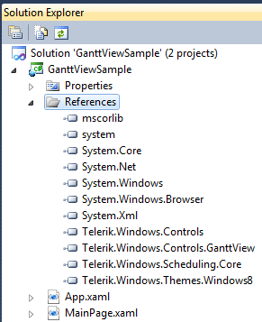
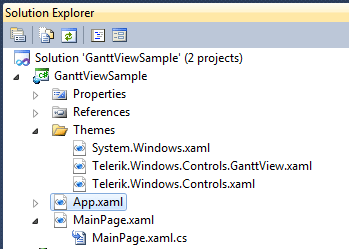
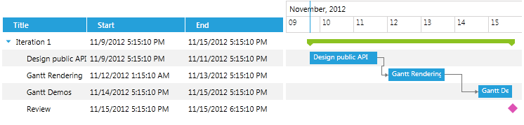

# Setting a Theme

The purpose of this article is to show you how to set a built-in theme to __RadGanttView__ for SilverlightWPF.

>tip Detailed information about the use of implicit styles can be found [here](http://www.telerik.com/help/silverlight/styling-apperance-implicit-styles-overview.html)[here](http://www.telerik.com/help/wpf/styling-apperance-implicit-styles-overview.html).

So, in order to set a theme to the GanttView, you should merge the following xaml files in App.xaml file:

* System.Windows.xaml

* Telerik.Windows.Controls.xaml

* Telerik.Windows.Controls.GanttView.xaml

There are two ways to reference the needed xaml files:

* Directly from the theme assembly:

	Let's, for example, apply Windows8 theme to the control. This means that we should add a reference to Telerik.Windows.Themes.Windows8.dll as well:

	

	Then merge the xaml files in the App.xaml like this:

	```XAML
		<Application.Resources>
		    <ResourceDictionary>
		        <ResourceDictionary.MergedDictionaries>
		            <ResourceDictionary Source="/Telerik.Windows.Themes.Windows8;component/Themes/System.Windows.xaml"/>
		            <ResourceDictionary Source="/Telerik.Windows.Themes.Windows8;component/Themes/Telerik.Windows.Controls.xaml"/>
		            <ResourceDictionary Source="/Telerik.Windows.Themes.Windows8;component/Themes/Telerik.Windows.Controls.GanttView.xaml"/>
		        </ResourceDictionary.MergedDictionaries>
		    </ResourceDictionary>
		</Application.Resources>
	```

* Copy the xaml files to a folder in the project:

	Create a Theme folder and copy the required files from __Themes.Implicit/../Windows8/../Themes/__ folder located in the installation folder of UI for SilverlightWPF:
	
	
	
	Then merge the xaml files in the App.xaml like this:

	```XAML
		<Application.Resources>
		    <ResourceDictionary>
		        <ResourceDictionary.MergedDictionaries>
		            <ResourceDictionary Source="Themes/System.Windows.xaml" />
		            <ResourceDictionary Source="Themes/Telerik.Windows.Controls.xaml" />
		            <ResourceDictionary Source="Themes/Telerik.Windows.Controls.GanttView.xaml" />
		        </ResourceDictionary.MergedDictionaries>
		    </ResourceDictionary>
		</Application.Resources>
	```

Either way you choose, the end result will be the following:

