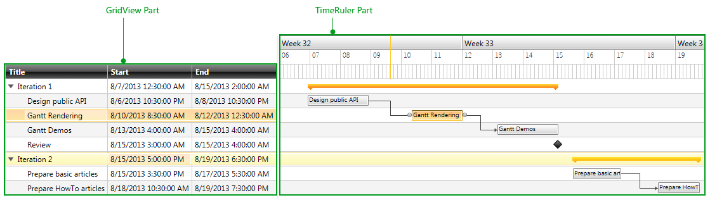

# Visual Structure

This help article will help you understand the visual structure of the RadGanttView control. The next section will focus on the main visual parts of the control.

## Main Control Parts

There are two main parts of the RadGanttView control that are often referred in other help resources:

* The __GridView Part__ – this is the part of the control in which the __Columns__ are visualized. Any __ColumnDefinition__ and their __Templates__ that are added to the Columns collection of the control are visualized in that area.

* The __TimeRuler Part__ – this is the part in which the containers representing the Tasks from the collection bound to the TasksSource are rendered. The horizontal size of this part is determined by both the __VisibleRange__ and __PixelLength__ of the control.

The next figure shows the two parts in the default Office_Black theme:

Figure 1. Main RadGanttView parts

# See Also

 * [GanttView Styles]()
