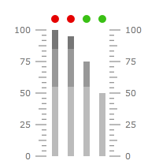
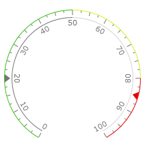

# Groups

There are common scenarios when 1 scale can have few group of ranges (some electric measurement devices, for example) and few groups of indicators, which change its appearance depending on the group of ranges it works with. For example, sound volume indicator on the sound amplifier. The scale have 1 range group with green, yellow and red segments which indicate sound volume, and 1 range group with transparent and red ranges which serves as overload indicator (it turns on when sound volume is close to the end of the scale). The first range list has 4 bar indicators which show sound volume for 4 channels, the second range list - 4 state indicators which show overload status for 4 channels. In this case we need 2 range groups and 2 indicator groups.     

The gauge control allows creation of the indicator and range groups. To create range group we should add __GaugeRangeGroup__ element to the ranges of the scale object. To create indicators group we should add __IndicatorGroup__ element to the indicators of the scale object. We can specify which group of ranges will be used by group of indicators. To do it we should use the __Ranges__ property of the __IndicatorsGroup__ element. The following XAML creates gauge which implements the functionality described above:      

<snippet id='radgauge-features-groups-block_1-xaml' />

Here is a snapshot of the result:

In this example the ranges itself are invisible. In the case when we need to have different groups of ranges visible at the same time we can use __Location__ and __Offset__ properties of the __GaugeRangeGroup__ object to specify position of the ranges. For example:        

<snippet id='radgauge-features-groups-block_2-xaml' />

