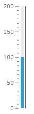
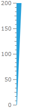
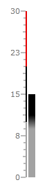

# Bar Indicator

The __Linear__ and the __Radial__ __Bars__ derive from the __BarIndicator__ class. Because of that they provide some common functionality. This topic will focus on the common features between these indicators.

>tipThe __BarIndicator__ class inherits the __IndicatorBase__ class, which is a base class for all indicators, except the __NumericIndicator__. To learn more about the base features of the indicators read [this topic]().

>For the examples in this article a __LinearBar__ indicator will be used, but the examples can be applied to the __RadialBar__ one as well.

It will explain the following:

* [Empty Fill](#empty-fill)

* [Indicator Width](#indicators-width)

* [Range Color Mode](#range-color-mode)

## Empty Fill

The __Empty__ __Fill__ feature allows you to specify a color for the empty part of the indicator, which stretches from the selected value to the other end of the scale. To do this simply use the __EmptyFill__ property. It is used as any other __Brush__ property.         

>tip Additionally you can use the __BorderBrush__ and __StrokeThickness__ properties to display a stroke around the entire bar.

Here is an example:        


```XAML
	<telerik:RadVerticalLinearGauge telerik:StyleManager.Theme="Windows8">
	    <telerik:VerticalLinearScale Min="0" Max="200" >
	        <telerik:VerticalLinearScale.Indicators>
	            <telerik:BarIndicator Value="100" 
	                                  StartWidth="0.06"
	                                  EmptyFill="#20606060"/>
	        </telerik:VerticalLinearScale.Indicators>
	            <telerik:VerticalLinearScale.CustomItems>
	                <Border BorderBrush="#FF606060"
	                    BorderThickness="1,0"
	                    telerik:ScaleObject.Value="100"
	                    telerik:ScaleObject.Location="OverCenter"
	                    telerik:ScaleObject.RelativeHeight="0.8*"
	                    telerik:ScaleObject.RelativeWidth="0.14*"/>
	        </telerik:VerticalLinearScale.CustomItems>
	    </telerik:VerticalLinearScale>
	</telerik:RadVerticalLinearGauge>
```

Here is a snapshot of the result:



## Indicator's Width

The __Bar Indicators__ allow you to specify their end and start width. This way you can make the bar thinner at the start and thicker at the end, for example. To specify the desired values use the __StartWidth__ and __EndWidth__ properties. They are relative to the cell size of the scale. The cell size of the scale is determined by the size of the container it is placed in. For the linear scales it is equal to the height of the container and by the radial scales to the radius of the container.

>tip To learn more about the cell size term, read the [Relative Measurements]() topic.

Here is an example:


```XAML
	<telerik:RadVerticalLinearGauge telerik:StyleManager.Theme="Windows8">
	    <telerik:VerticalLinearScale Min="0" Max="200" >
	        <telerik:VerticalLinearScale.Indicators>
	            <telerik:BarIndicator Value="200" 
	                                  StartWidth="0.01"
	                                  EndWidth="0.1"
	                                  telerik:ScaleObject.Location="OverOutside"/>
	        </telerik:VerticalLinearScale.Indicators>
	    </telerik:VerticalLinearScale>
	</telerik:RadVerticalLinearGauge>
```

Here is a snapshot of the result:



## Range Color Mode

As the __Bar Indicators__ cover the range from the start of the scale to the selected value, they provide some additional properties, which get applied when using the [Range Color]() feature. The common one for the __Linear__ and the __Radial Bar__ is the __RangeColorMode__ property. It allows you to specify how the colors of the ranges, that the bar covers, to be mixed. It can have the following values:

* __Default__ - the bar is colored entirely with the current range color.

* __DefaultAnimated__ - the bar colored entirely with the current range color. If the indicator is animated, the bar changes its color to the colors of the ranges it passes through.

* __HorizontalGradient__ - the bar is colored in the color provided by the current range. When it enters a new range, its color becomes a horizontal gradient, consisting of the colors of the new and the previous ranges. Entering further in the new range, the bar becomes smoothly colored in the color provided by the current range.

* __MixedColor__ - the color of the bar represents a mixture of the colors of the current range and the previous one. As further as the bar goes into the current range as more its color is closer to the one defined by the range.

* __ProportionalBrush__ - the bar is split into the same ranges as the scale and each chunk has the color, defined by the respective range.

* __ProportionalGradient__ - this one is the same as the __ProportionalBrush__, excpet that there are gradients between the chunks.

* __ProportionalLastRangesBrush__ - the bar is split into two chunks. One of the chuks is the part of the bar, that covers the current range. It is colored in the color provided by the current range. The second chunk is the rest of the bar and is colored in the color provided by the previous range.

* __ProportionalLastRangesGradient__ - this one is the same as the __ProportionalLastRangesBrush__, except that there is a gradient between the chunks.

* __VerticalGradient__- the bar is colored in the color provided by the current range. When it enters a new range, its color becomes a vertical gradient, consisting of the colors of the new and the previous ranges. Entering further in the new range, the bar becomes smoothly colored in the color provided by the current range.

>When using Gradient RangeColorMode-s, in order for the gradients between ranges to be observable, you have specify a value for the __RangeColorSmoothing__ property.		

Here is an example:


```XAML
	<telerik:RadVerticalLinearGauge telerik:StyleManager.Theme="Windows8">
	    <telerik:VerticalLinearScale Min="0" Max="30"
	                         IsInteractive="True"
	                         RangeLocation="Outside"
	                         MajorTickOffset="0.02*"
	                         MiddleTickOffset="0.02*"
	                         MinorTickOffset="0.02*">
	        <telerik:VerticalLinearScale.Ranges>
	            <telerik:GaugeRange Background="#FFA3A3A3"
	                                StartWidth="0.02"
	                                EndWidth="0.02"
	                                Min="0" Max="10"
	                                IndicatorBackground="#FFA3A3A3"/>
	            <telerik:GaugeRange Background="#FF000000"
	                                StartWidth="0.02"
	                                EndWidth="0.02"
	                                Min="10" Max="20"
	                                IndicatorBackground="#FF000000" />
	            <telerik:GaugeRange Background="#FFE50000"
	                                StartWidth="0.02"
	                                EndWidth="0.02"
	                                Min="20" Max="30"
	                                IndicatorBackground="#FFE50000" />
	        </telerik:VerticalLinearScale.Ranges>
	        <telerik:VerticalLinearScale.Indicators>
	            <telerik:BarIndicator Value="15"
	                                  RangeColorSmoothing="0.5"
	                                  RangeColorMode="ProportionalGradient"
	                                  UseRangeColor="True" /> 
	        </telerik:VerticalLinearScale.Indicators>
	    </telerik:VerticalLinearScale>
	</telerik:RadVerticalLinearGauge>
```

Here is a snapshot of the result:

