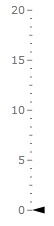
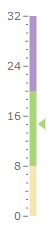

# Basics

The indicator controls, except the __NumericIndicator__, derive from the __IndicatorBase__ class. Because of that they provide some common functionality. This topic will focus on the common features between the available indicators.

>For the examples in this article a __Marker__ indicator will be used, but the examples can be applied to any other indicator that derives from the __IndicatorBase__ class, as well.

>tip To learn more about the __Numeric Indicator__, read [this topic]().

## Animating the Indicator

When the value of the indicator gets changed, it will get positioned on the appropriate place on the scale. By default the indicator will directly go to the respective position, but you are able to make this transition smoother by animating it. To do it, just enable the indicators animation by setting the __IsAnimated__ property to __True__ and set the __Duration__ property to the desired value. Here is an example.

```XAML
	<telerik:RadVerticalLinearGauge telerik:StyleManager.Theme="Windows8">
	    <telerik:VerticalLinearScale  Min="1" Max="12"
	                                  IsInteractive="True">
	        <telerik:VerticalLinearScale.Indicators>
	            <telerik:Marker IsAnimated="True" Duration="0:0:0.5"
	                            telerik:ScaleObject.RelativeHeight="0.05*" />
	        </telerik:VerticalLinearScale.Indicators>
	    </telerik:VerticalLinearScale>
	</telerik:RadVerticalLinearGauge>
```

## Refreshing the Indicator

In a scenario where the gauge is used to visualize the changing of a particular value, the indicator should get updated whenever the value changes. This can be done by simply setting the __Value__ property of the indicator to the new value. However in some scenarios you may have multiple value changes in a very short period of time. This would make the indicator go through several values very fast and make the gauge harder for observing. In this case you can use the __Refresh__ feature of the indicator. It consists in updating the indicator position only at a specific interval of time and displaying a value calculated on the basis of all the values that have occurred in the interval.

To implement this feature you have to use the __RefreshRate__ and __RefreshMode__ properties. The first one represents the interval of time between two updates. It is of type TimeSpan. [Here](http://msdn.microsoft.com/en-us/library/se73z7b9.aspx) you can read about the format, that TimeSpan.Parse() uses. The second one specifies the way the final value gets calculated. You can choose between the following:        

* __None__ __(default)__ - disables refreshing.

* __Average__ - displays the average of the values, that occurred in the interval.

* __Max__ - displays the greatest from the values, that occured in the interval.

* __Min__ - display the smallest of the values, that occured in the interval.

Here is an example:


```XAML
	<telerik:RadVerticalLinearGauge telerik:StyleManager.Theme="Windows8">
	    <telerik:VerticalLinearScale Min="1" Max="12">
	        <telerik:VerticalLinearScale.Indicators>
	            <telerik:Marker RefreshMode="Min"
	                            RefreshRate="0:0:5"
	                            telerik:ScaleObject.RelativeHeight="0.05*" />
	        </telerik:VerticalLinearScale.Indicators>
	    </telerik:VerticalLinearScale>
	</telerik:RadVerticalLinearGauge>
```

## Snapping the Indicator

The __Snapping__ feature allows the gauge to display values only for a fixed positions or values which match a specific interval. An example for snapping is the following scenario - you are interested to point values 5 and 10 on the gauge, and want all the values between 5 and 10 to be shown as the closest from these two (i.e. 6 will be shown as 5 and 9 will be shown as 10). 

When using a scale that has its [Interactivity](http://www.telerik.com/help/wpf/radgauge-features-indicators-basics.html#Interactivity) feature enabled, the snapping will configure the movement of the indicator along the scale. 

In order to enable and configure the __Snapping__ you have to use the __SnapType__ property, which can be set to the following values:

* __None__ - specifies that the indicator can be moved freely along the scale and positioned anywhere on it.

* __ToGrid__ - specifies that the indicator would snap to the scale's ticks.

* __ToInterval__ - specifies that the indicator would snap to values of the scale, that belong to a specific interval. For this purpose you have to use the __SnapInterval__ property too. For example, an initial value of the indicator of __1__ and an interval of __2__ will make the indicator snap only to the values __1, 3, 5, 7__, etc.

Here is an example:


```XAML
	<telerik:RadVerticalLinearGauge telerik:StyleManager.Theme="Windows8">
	    <telerik:VerticalLinearScale Min="0" Max="20"
	                         IsInteractive="True">
	        <telerik:VerticalLinearScale.Indicators>
	            <telerik:Marker SnapType="ToInterval"
	                            SnapInterval="5" 
	                            telerik:ScaleObject.RelativeHeight="0.05*" />
	        </telerik:VerticalLinearScale.Indicators>
	    </telerik:VerticalLinearScale>
	</telerik:RadVerticalLinearGauge>
```

## Indicator's Size

To manipulate the indicator's size, simply use the __RelativeHeight__ and __RelativeWidth__ attached properties. As the names suggest, their value are relative to the cell size of the scale. The cell size of the scale is determined by the size of the container it is place in. For the linear scales it is equal to the height of the container and by the radial scales to the radius of the container.

>tip To learn more about the cell size term, read the [Relative Measurements]() topic.

Here is an example:


```XAML
	<telerik:RadVerticalLinearGauge telerik:StyleManager.Theme="Windows8">
	    <telerik:VerticalLinearScale Min="0" Max="20"
	                         IsInteractive="True">
	        <telerik:VerticalLinearScale.Indicators>
	            <telerik:Marker telerik:ScaleObject.RelativeWidth="0.1*"
	                            telerik:ScaleObject.RelativeHeight="0.05*" />
	        </telerik:VerticalLinearScale.Indicators>
	    </telerik:VerticalLinearScale>
	</telerik:RadVerticalLinearGauge>
```

Here is a snapshot of the result:



## Indicator's Value

The indicators have a __Value__ property, which specifies the value from the scale they should point to. You can set this property to a desired value, whenever you need to reposition the indicator.

## Using the Range Color

If you use ranges in your scale, you can make the indicator consistent with their color. This way, when the indicator enters into a specific range, it will take the color defined for it by the range. For this purpose you have to set the __UseRangeColor__ property of the indicator to __True__ and the __IndicatorBackground__ property of the range to the desired indicator color.

>tip To learn more about ranges, read the [Ranges]() topic.

Here is an example.


```XAML
	<telerik:RadVerticalLinearGauge telerik:StyleManager.Theme="Windows8">
	    <telerik:VerticalLinearScale Min="0" Max="32"
	                    IsInteractive="True"
	                    RangeLocation="OverCenter">
	        <telerik:VerticalLinearScale.Ranges>
	            <telerik:GaugeRange Background="#F5E7B3"
	                            Min="0"
	                            Max="8"
	                            IndicatorBackground="#F5E7B3"/>
	            <telerik:GaugeRange Background="#acd47b"
	                            Min="8"
	                            Max="20"
	                            IndicatorBackground="#acd47b" />
	            <telerik:GaugeRange Background="#ad95c9"
	                            Min="20"
	                            Max="32"
	                            IndicatorBackground="#ad95c9" />
	        </telerik:VerticalLinearScale.Ranges>
	        <telerik:VerticalLinearScale.Indicators>
	            <telerik:Marker telerik:ScaleObject.RelativeWidth="0.16*"
	                    telerik:ScaleObject.RelativeHeight="0.03*"
	                    telerik:ScaleObject.Location="Inside"
	                    UseRangeColor="True"/>
	        </telerik:VerticalLinearScale.Indicators>
	    </telerik:VerticalLinearScale>
	</telerik:RadVerticalLinearGauge>
```

Here is a snapshot of the result.



## Value's Source

This feature of the indicators allow you to specify a data source.The values in the data source can get displayed by the marker in their representive order. This allow you to bind the __RadGauge__ control to a dynamic set of data. To learn more about this feature of the indicators and the __RadGauge__ control, read the [Data Binding]() topic.
