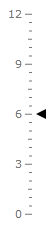

# Marker

The __Marker__ is one of the indicator types that the __RadGauge__ control introduces. It directly inherits the __InteractiveIndicator__ class and doesn't introduce any specific features.

>tipTo learn more about the base features of the indicators read [this topic]().

The __Marker__ control is represented by a triangle shape. The appearance and the shape can be easily modified.

>tip You can change the background and the border color of the Marker via its __Background__ and __BorderBrush__ properties.

>The __Marker__ indicator can be used in both linear and radial scales.

<!-- -->
>Indicators should always be placed inside a __Indicators__ property of the scale object.

Here is an example of a __Marker__ definition:


```XAML
	<telerik:RadVerticalLinearGauge telerik:StyleManager.Theme="Windows8">
	    <telerik:VerticalLinearScale Min="0" Max="12">
	        <telerik:VerticalLinearScale.Indicators>
	            <telerik:Marker Value="6"
	                    telerik:LinearScale.RotateForVertical="True"
	                    telerik:ScaleObject.RelativeWidth="0.1*"
	                    telerik:ScaleObject.RelativeHeight="0.04*"
	                    telerik:ScaleObject.Offset="0.04*" />
	        </telerik:VerticalLinearScale.Indicators>
	    </telerik:VerticalLinearScale>
	</telerik:RadVerticalLinearGauge>
```

Here is a snapshot of the result:

