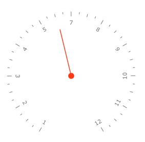
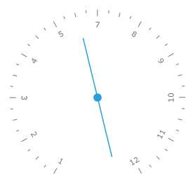

# Needle

The needle is one of the indicator types, that the __RadGauge__ control introduces. It inherits the __InteractiveIndicator__ class and introduces some specific features.

>tip To learn more about the base features of the indicators read [this topic]().

Here is a list of the __Needle__ control's specific features:

* [Tail Height](#tail-height)

The __Needle__ control is represented by an arrow that points to a value from the scale. The appearance and the shape of it can be easily modified. To learn how read the Styling the Needle topic.

>tip You can change the background and the border color of the needle via its __Background__ and __BorderBrush__ properties.

>The __Needle__ indicator should be used only in radial scales.

<!-- -->
>Indicators should always be placed inside a __Indicators__ property of the scale object.

Here is an example of a __Needle__ definition:


```XAML
	<telerik:RadRadialGauge telerik:StyleManager.Theme="Windows8">
	    <telerik:RadialScale Min="1" Max="12">
	        <telerik:RadialScale.Indicators>
	            <telerik:Needle Value="6" Background="#FFFE3914" />
	            <telerik:Pinpoint Background="#FFFE3914" />
	        </telerik:RadialScale.Indicators>
	    </telerik:RadialScale>
	</telerik:RadRadialGauge>
```

Here is a snapshot of the result:



## Tail Height

Gets or sets the relative height of the needle tail. You can change the height of the needle tail by using the __TailHeight__ property. To calculate its height you'll need to substract the radial scale __Width__ (0.1 by default) from the scale __Radius__. 


```XAML
	<telerik:RadRadialGauge telerik:StyleManager.Theme="Windows8">
	    <telerik:RadialScale Min="1" Max="12" 
	                         Radius="1" 
	                         StartWidth="0.1"
	                         EndWidth="0.1">
	        <telerik:RadialScale.Indicators>
	            <telerik:Needle Value="6"
	                    telerik:ScaleObject.Location="Inside" 
	                    telerik:ScaleObject.Offset="0.2*" 
	                    TailHeight="0.7" />
	            <telerik:Pinpoint />
	        </telerik:RadialScale.Indicators>
	    </telerik:RadialScale>
	</telerik:RadRadialGauge>
```

Here is a snapshot of the result: 

