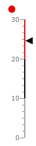

# State Indicator

The __State Indicator__ is a shape with arbitrary size located anywhere in the scale. It gets colored in the same color as the range to which the indicator's value belong. Via the __ScaleObject.RelativeWidth__ and __ScaleObject.RelativeHeight__ attachable properties of the indicator you can specify its size. To position it, use the __ScaleObject.RelativeX__ and __ScaleObject.RelativeY__ attachable properties.

>These properties are relative to the cell size of the gauge. To learn more about it read the [Relative Measurements]() topic. 

>tip To learn more about the common features for the RadGauge's indicators, read the [Basics]() topic.

As the ranges can be described also as the states a RadGauge can go through, the StateIndicator is built to work with them. It gets colored with the range to which the current value belongs. 

As the indicator should display the state of the current value, you can bind it to one of the other indicator types. Here is an example where a __Marker__ is used to point the value and a __StateIndicator__ is used to display its state.

#### __XAML__
```XAML
	<telerik:RadVerticalLinearGauge telerik:StyleManager.Theme="Windows8" Width="100" Height="250">
	    <telerik:VerticalLinearScale Min="0" Max="30"
	                         MajorTicks="3"
	                         IsInteractive="True"
	                         RangeLocation="Outside"
	                         MajorTickOffset="0.02*"
	                         MiddleTickOffset="0.02*"
	                         MinorTickOffset="0.02*">
	        <telerik:VerticalLinearScale.Ranges>
	            <telerik:GaugeRange Background="#FFA3A3A3"
	                                StartWidth="0.02"
	                                EndWidth="0.02"
	                                Min="0" Max="10"
	                                IndicatorBackground="#FFA3A3A3"/>
	            <telerik:GaugeRange Background="#FF000000"
	                                StartWidth="0.02"
	                                EndWidth="0.02"
	                                Min="10" Max="20"
	                                IndicatorBackground="#FF000000" />
	            <telerik:GaugeRange Background="#FFE50000"
	                                StartWidth="0.02"
	                                EndWidth="0.02"
	                                Min="20" Max="30"
	                                IndicatorBackground="#FFE50000" />
	        </telerik:VerticalLinearScale.Ranges>
	        <telerik:VerticalLinearScale.Indicators>
	            <telerik:Marker Name="marker" Value="25" 
	                                         telerik:ScaleObject.RelativeHeight="0.05*"
	                                         telerik:ScaleObject.RelativeWidth="0.12*"/>
	            <telerik:StateIndicator Value="{Binding Value, ElementName=marker}"
	                                         telerik:ScaleObject.RelativeHeight="0.05*"
	                                         telerik:ScaleObject.RelativeWidth="0.12*"
	                                         telerik:ScaleObject.RelativeY="0.05"
	                                         telerik:ScaleObject.RelativeX="0.2"
	                                         UseRangeColor="True"/>
	        </telerik:VerticalLinearScale.Indicators>
	    </telerik:VerticalLinearScale>
	</telerik:RadVerticalLinearGauge>
```

Here is a snapshot of the result:

