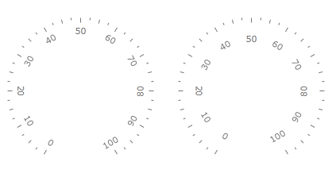
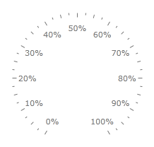
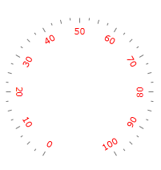
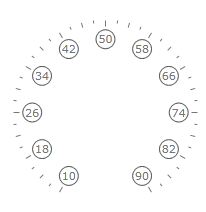

# Basics

The scales, derived from the [GraphicScale]() class, allow you to modify and configure the labels displayed next to the ticks.
        This is done by using the __Label__ related properties of the scale. These properties allow you to modify the following things:

* __Label Location__ - via the __LabelLocation__ property you can specify the desired location for the labels.

* __Offset (LabelOffset__ property)- specifies the offset towards the scale relatively to the cell size of the scale. In the case of the linear scale, this means to the width of the scale's container when the scale orientation
            is vertical or to the height of the scale's container when the scale orientation is horizontal, and in case of radial scale - to the radius of the scale's container.

* __LabelTemplate__ - allows you to define a __DataTemplate__ for the label's contents. The __DataContext__ for the elements in the template is of type TickLabel.

* __LabelFormat__ - allow you to specify a format string for the label value. Note that if an __LabelTemplate__ is defined, this value is applied via binding of the __FormattedValue__ property.

* __Use Range Color__ - the __LabelUseRangeColor__ property specifies that the label should use the color specified by the range it is part of.

* [Location](#location)

* [Offset](#offset)

* [Format](#format)

* [Appearance](#appearance)

## Location

The [GraphicScale]() class exposes a __LabelLocation__ property, which allows you to specify the location of the labels towards the scale. This property is an enumeration of type ScaleObjectLocation. Here is an example.


```XAML
	<telerik:RadRadialGauge telerik:StyleManager.Theme="Windows8">
	    <telerik:RadialScale
	                    Min="0"
	                    Max="100"
	                    LabelLocation="Outside" >
	    </telerik:RadialScale>
	</telerik:RadRadialGauge>
```

Here is a snapshot of the result:


## Offset

Besides using the __LabelLocation__ property, you can also use the __LabelOffset__ one, in order to apply an offset to the labels in order to fine position them. The offset is applied towards the scale and is relative to the cell size of the scale. In the case of the linear scale, this means to the width of the scale's container when the scale orientation is vertical or to the height of the scale's container when the scale orientation is horizontal, and in case of radial scale - to the radius of the scale's container.

>To learn more about the cell size term, read the [Relative Measurements]() topic.


```XAML
	<telerik:RadRadialGauge telerik:StyleManager.Theme="Windows8">
	    <telerik:RadialScale
	                    Min="0"
	                    Max="100"
	                    LabelOffset="0.1*" >
	    </telerik:RadialScale>
	</telerik:RadRadialGauge>
```

Here is a snapshot of the result:



## Format

In order to allow you to format the value, that the labels display, The GraphicScale class exposes a __LabelFormat__ property. It allows you to specify a format string for the value displayed in the label.

>Defining format strings in XAML can be done in the following way - `{} {0:your format string}`. To learn more about formatting visit the [Formatting Overview](http://msdn.microsoft.com/en-us/library/26etazsy.aspx) chapter in MSDN.

```XAML
	<telerik:RadRadialGauge telerik:StyleManager.Theme="Windows8">
	    <telerik:RadialScale
	                    Min="0"
	                    Max="100"
	                    LabelOffset="0.05*"
	                    LabelRotationMode="None"
	                    LabelFormat="{}{0}%" >
	    </telerik:RadialScale>
	</telerik:RadRadialGauge>
```

Here is a snapshot of the result:



## Appearance

The RadialScale and LinearScale objects which inherit the GraphicScale class provide you with two ways of modifying the labels' appearance.

## Modifying Label's Foreground

To modify the labels foreground, simply set the Foreground property of the GraphicScale object (RadialScale or LinearScale) to the desired color. Here is an example:

```XAML
	<telerik:RadRadialGauge telerik:StyleManager.Theme="Windows8">
	    <telerik:RadialScale
	                    Min="0"
	                    Max="100"
	                    Foreground="Red">
	    </telerik:RadialScale>
	</telerik:RadRadialGauge>
```



## Specifying a LabelTemplate

The other way of specifying the appearance of the label is by defining an entire LabelTemplate for it, which will get applied to each of the labels. In it you can define the visual appearance of the label as you desire and bind the used elements to the data context of the template, where needed. The data context of the template would be an object of type TickLabel. You can bind to its properties as desired, but the most important of them is the FormattedValue property. It stores the display value for the label according to the label format which is specified in the scale.

```XAML
	<telerik:RadRadialGauge telerik:StyleManager.Theme="Windows8">
	    <telerik:RadialScale Min="10"
	                         Max="90"
	                         LabelRotationMode="None">
	            <telerik:RadialScale.LabelTemplate>
	                <DataTemplate>
	                    <Border BorderBrush="#FF606060" 
	                            BorderThickness="1"
	                            CornerRadius="10"
	                            Width="20"
	                            Height="20">
	                        <TextBlock HorizontalAlignment="Center"
	                                   VerticalAlignment="Center"
	                                   FontFamily="{Binding FontFamily}"
	                                   FontSize="{Binding FontSize}"
	                                   FontStretch="{Binding FontStretch}"
	                                   FontStyle="{Binding FontStyle}"
	                                   FontWeight="{Binding FontWeight}"
	                                   Foreground="{Binding Foreground}"
	                                   Text="{Binding FormattedValue}" />
	                    </Border>
	                </DataTemplate>
	            </telerik:RadialScale.LabelTemplate>
	        </telerik:RadialScale>
	</telerik:RadRadialGauge>
```

Here is a snapshot of the result:

