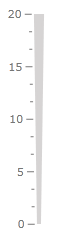
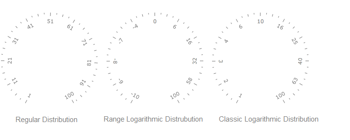
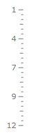
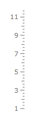

# Basics

The __GraphicScale__ class is used as a base class for the LinearScale and the RadialScale classes. It provides common functionality for the both scales. This topic will explain you the major features of the GraphicScale class. Here is a list of them:

* [Scale Offsets](#scale-offsets)

* [Scale Width](#scale-width)

* [Interactivity](#interactivity)

* [Logarithmic Scale](#logarithmic-scale)

* [Reversed Scale](#reversed-scale)

* [Show First and Last Label](#show-first-and-last-label)

* [Ranges](#ranges)

* [Labels](#labels)

* [Ticks](#ticks)

>The __ScaleBase__ class cannot be used on its own as a scale. You should use either the [Radial]() or [Linear Scales]().

## Scale Offsets

The scales display values depending on their __Min__ and __Max__ properties. However there are cases, in which you might want to modify the value of the first or the last tick of the scale. For example if you have a scale with minimum value of __0.95__ and maximum value of __20.8__, but you want to show the ticks for integer values only (from 1 to 20 only), you can use the __StartTickOffset__ and the __EndTickOffset__ properties of the scale to adjust the fist and the last tick's values. Here is an example:

#### __XAML__
{{region radgauge-features-linear-and-radial-scales-basics_0}}
	<telerik:RadVerticalLinearGauge Width="102" Height="210" telerik:StyleManager.Theme="Windows8">
	    <telerik:VerticalLinearScale Min="0.95" Max="20.8"
	                         EndTickOffset="-0.8"
	                         StartTickOffset="0.05"
	                         RelativeY="0"
	                         RelativeHeight="1"
	                         Fill="#FFD6D4D4"
	                         StartWidth="0.06"
	                         EndWidth="0.06"
	                         MajorTickOffset="0.03*" MinorTickOffset="0.03*"
	                         LabelOffset="0.13*"
	                         MajorTickRelativeHeight="0.003*" MinorTickRelativeHeight="0.003*"
	                         MiddleTicks="1" MinorTicks="3"/>
	</telerik:RadVerticalLinearGauge>
{{endregion}}

Here is a snapshot of the result:

## Scale Width

You are allowed to specify the width of the scale at its beginning and at its end. For this purpose the GraphicScale class exposes the StartWidth and EndWidth properties. Their value is relative to the cell size of the scale. In the case of the linear scale, this means to the width of the scale's container.

>tip To learn more about the cell size term, read the [Relative Measurements]() topic.

Here is an example:

#### __XAML__
{{region radgauge-features-linear-and-radial-scales-basics_1}}
	<telerik:RadVerticalLinearGauge Width="102" Height="210" telerik:StyleManager.Theme="Windows8">
	    <telerik:VerticalLinearScale Min="0" Max="20"
	                         RelativeY="0"
	                         RelativeHeight="1"
	                         StartWidth="0.02" EndWidth="0.08"
	                         Fill="#FFD6D4D4"
	                         Stroke="#FFD6D4D4"
	                         MajorTickOffset="0.03*" MinorTickOffset="0.03*"
	                         LabelOffset="0.13*"
	                         MajorTickRelativeHeight="0.003*" MinorTickRelativeHeight="0.003*"
	                         MiddleTicks="1" MinorTicks="3"/>
	</telerik:RadVerticalLinearGauge>
{{endregion}}

Here is a snapshot of the result:

## Interactivity

The __Interactivity__ feature allows the user to interact with the scale. Enabling the feature will allow him to drag the marker along the scale. By default this feature is turned off. In order to toggle it use the __IsInteractive__ property of the scale. Here is an example:

#### __XAML__
{{region radgauge-features-linear-and-radial-scales-basics_2}}
	<telerik:RadVerticalLinearGauge x:Name="linearGauge" telerik:StyleManager.Theme="Windows8"
	                        Width="102" Height="210">
	    <telerik:VerticalLinearScale x:Name="linearScale"
	                            Min="1"
	                            Max="12"
	                            IsInteractive="True">
	        <telerik:Marker Value="1" />
	    </telerik:VerticalLinearScale>
	</telerik:RadVerticalLinearGauge>
{{endregion}}

## Logarithmic Scale

Both radial and linear scales have Distribution property which specify value distribution along the scale (linear, logarithmic, exponential and etc.). This property is defined in the GraphicScale class and have type of the IValueDistribution interface. This interface converts real scale value (given as value between Min and Max property of the scale) to the relative value (value in the [0...1] interval) which represents relative position of the value along the scale and vice versa. It also possible to calculate value for the tick mark using its index and total number of ticks. Currently there are 3 basic implementations of this interface:

* __Regular__ - the default distribution which is represented by linear function. See the first example below.

* __Range logarithmic__ - the distribution which maps logarithmic function on any value range (i.e. tick marks have close values at the beginning of the range and wide distance at the end of range). It corresponds to the IsLogarithmic mode in the old implementation. See the second example below.

* __Classic logarithmic__ – the distribution which is represented by logarithmic function. It represents classic meaning of the logarithmic scale. In contrast to the range logarithmic distribution it can’t be used on arbitrary value range, but on the positive numbers only. See the third example below.

>tip The default value for the __LogarithmicBase__ property is __10__.

## Reversed Scale

The scales allow you to reverse the direction, in which they display their values. To do it just set the __IsReversed__ property to __False__.

Here is an example:

#### __XAML__
{{region radgauge-features-linear-and-radial-scales-basics_4}}
	<telerik:RadVerticalLinearGauge x:Name="linearGauge" telerik:StyleManager.Theme="Windows8"
	                        Width="102" Height="210">
	    <telerik:VerticalLinearScale x:Name="linearScale"
	                            Min="1"
	                            Max="12"
	                            IsReversed="True">
	    </telerik:VerticalLinearScale>
	</telerik:RadVerticalLinearGauge>
{{endregion}}

Here is a snapshot of the result:

## Show First and Last Label

You can specify the scale to either display or not its last and first labels. Their visibility is controlled by the __ShowLastLabel__ and __ShowFirstLabel__ properties. This can be very useful when one of these labels is overlapping the labels next to it.

>The __ShowLastLabel__ value is applied only, when the ticks of the scale are defined via the __MajorTickStep__ property.

Here is an example:

#### __XAML__
{{region radgauge-features-linear-and-radial-scales-basics_5}}
	<telerik:RadVerticalLinearGauge x:Name="linearGauge" telerik:StyleManager.Theme="Windows8"
	                        Width="102" Height="210">
	    <telerik:VerticalLinearScale x:Name="linearScale"
	                            Min="1"
	                            Max="12"
	                            ShowFirstLabel="True"
	                            ShowLastLabel="False"
	                            MajorTickStep="2">
	    </telerik:VerticalLinearScale>
	</telerik:RadVerticalLinearGauge>
{{endregion}}

Here is a snapshot of the result:

## Ranges

The __RadGauge__ control allows you to define ranges for your scales. The range is used for wrapping a specific section of the scale, that meets a condition. To allow you to use ranges with the different types of scales, the __RadGauge__ control provides you with a scale specific range objects. To learn more about working with ranges, read the [Ranges]() section of the documentation.

## Labels

The __GraphicScale__ class allows you to modify and configure the labels displayed next to the ticks of the scales. This is done by using the set of the __LabelXXXX__ properties (i.e. *LabelLocation*, *LabelOffset*, *LabelTemplate* and so on) of the scale. To learn more about configuring the labels, read the [Labels]() section of the documentation.

## Ticks

The __GraphicScale__ class exposes three sets of properties - __MajorTickXXXX__, __MiddleTickXXXX__, __MinorTickXXXX__. They are used to configure the displaying of the different tick types on the scale. To learn more about configuring the ticks read the [Ticks]() section of the documentation.
