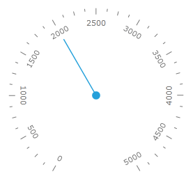
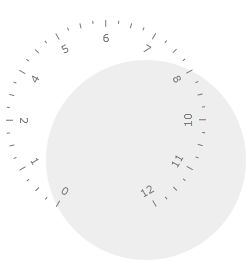
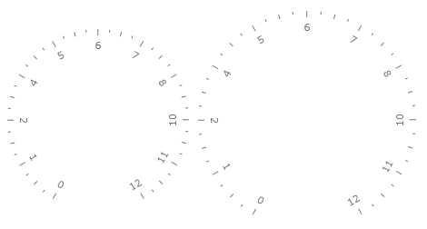
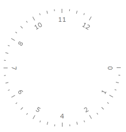
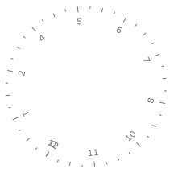

# Radial Scale

This topic will explain you the specifics regarding the usage of the __RadialScale__ control.

The __RadialScale__ control allows you to display a scale of radial form. Typically the __RadialScale__ is used in the 1 of the 9 radial gauge controls, but it can be directly used in the other Gauge controls available or even on its own. This topic will explain you the specifics regarding the usage of the __RadialScale__ control.

>tip As the scales provided by the __Gauge__ control share common functionality, you might found useful to read the [Base Scale]() topic. In it you will find information regarding the features shared between the different scales.

>tip The scales derived from the __Graphic Scale__ class, can use any of the indicators provided by the __Gauge__ control. To learn how read the [Base Scale]() topic.

Here is the list of the __RadialScale__ features:

* [Multiplier](#multiplier)

* [Scale Center](#scale-center)

* [Label Rotation Mode](#label-rotation-mode)

* [Scale Radius](#scale-radius)

* [Start Angle](#start-angle)

* [Sweep Angle](#sweep-angle)

## Multiplier

The Multiplier property of the __Radial Scale__ allows applying a multiplier to the scale range and to the current value of each element which is displayed on the scale.


```XAML
	<telerik:RadRadialGauge telerik:StyleManager.Theme="Windows8">
	    <telerik:RadialScale Min="0" Max="50" Multiplier="100">
	        <telerik:RadialScale.Indicators>
	            <telerik:Needle x:Name="needle" Value="20"/>
	            <telerik:Pinpoint/>
	        </telerik:RadialScale.Indicators>
	    </telerik:RadialScale>
	</telerik:RadRadialGauge>
```

Here is a snapshot of the result:



## Scale Center

The __RadialScale__ allows you to specify towards which point in its parent container it should get centered. This is done by using the __Center__ property of the control. It represents a point which value is relative towards the cell size of the scale. For example, if you want to position the scale in the center of the parent container, you have to set the __Center__ property to __0.5, 0.5__(this is the default value). Here is an example where the center of the scale is __0.3, 0.3__.

>tip To learn more about the cell size term, read the [Relative Measurements]() topic.


```XAML
	<telerik:RadRadialGauge OuterBackground="#EEEEEE" telerik:StyleManager.Theme="Windows8">
	    <telerik:RadialScale Min="0"
	                         Max="12"
	                         Center="0.3,0.3">
	    </telerik:RadialScale>
	</telerik:RadRadialGauge>
```

Here is a snapshot of the result:



## Label Rotation Mode

The __RadialScale__ control allows you to specify the way the labels get rotated around the scale. This is done by using the __LabelRotationMode__ enumeration property. It can have one of the following values:

* __Auto (default)__ - specifies that the labels get automatically rotated depending on their position on the scale.

* __None__ - specifies that the labels won't get rotated.

* __SurroundIn__ - specifies that the labels surround the radial scale with character’s base line directed towards the center of the scale. 

* __SurroundOut__ - specifies that the labels surround the radial scale with character’s base line directed backwards the center of the scale. 

Here is an example of __RadialScale__ with a __LabelRotationMode__ of __SurroundOut__:


```XAML
	<telerik:RadRadialGauge OuterBackground="#EEEEEE" telerik:StyleManager.Theme="Windows8">
	    <telerik:RadialScale Min="0"
	                         Max="12"
	                         Center="0.3,0.3"
	                         LabelRotationMode="SurroundOut">
	    </telerik:RadialScale>
	</telerik:RadRadialGauge>
```

Here is a snapshot of the result:


## Scale Radius

You can specify the radius of the __RadialScale__. This is done via the __Radius__ property. The value of the __Radius__ property is relative to the cell size of the scale. For example if you set the radius to be __1.2__, the width/height of the scale will be 20% larger than the width/height of the parent container. Here is an example of such __RadialScale__.

>tip To learn more about the cell size term, read the [Relative Measurements]() topic.


```XAML
	<telerik:RadRadialGauge Width="200" Height="200" telerik:StyleManager.Theme="Windows8">
	    <telerik:RadialScale Min="0"
	                         Max="12"
	                         Radius="1">
	    </telerik:RadialScale>
	</telerik:RadRadialGauge>
	
	<telerik:RadRadialGauge Width="200" Height="200" Grid.Column="2" telerik:StyleManager.Theme="Windows8">
	    <telerik:RadialScale Min="0"
	                         Max="12"
	                         Radius="1.2">
	    </telerik:RadialScale>
	</telerik:RadRadialGauge>
```

Here is a snapshot of the result:



## Start Angle

The StartAngle property of the __Graphic Scale__ allows you to specify the angle from which the drawing of the scale should start. The default value is at 7 o'clock and a start angle of __0__ will make the scale start at 3 o'clock. The value of the angle grows clockwise. Here is an example.

>tip Another ways to control the positioning of the scale values is to use properties like the __MajorTickStep__, which are exposed by the __ScaleBase__ control, from which the __RadialScale__ derives. To learn more about the base features of the different scales, read the [Base Scale]() topic.


```XAML
	<telerik:RadRadialGauge telerik:StyleManager.Theme="Windows8">
	    <telerik:RadialScale Min="0"
	                         Max="12"
	                         StartAngle="0">
	    </telerik:RadialScale>
	</telerik:RadRadialGauge>
```

Here is a snapshot of the result:



## Sweep Angle

The sweep angle represents the amount of the scale that is used to display ticks. By default there is space between the first and the last value of the scale. 

If you want to specify the sweep angle use the __SweepAngle__ property. For example a value of __360__ will make the scale to form a complete circle and the first and the last value will overlap each other. A value of __180__ will make the scale to use only half of the circle to display the values.

Here is an example:


```XAML
	<telerik:RadRadialGauge telerik:StyleManager.Theme="Windows8">
	    <telerik:RadialScale Min="0"
	                         Max="12"
	                         SweepAngle="360">
	    </telerik:RadialScale>
	</telerik:RadRadialGauge>
```

Here is a snapshot of the result:

