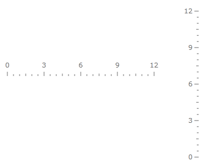
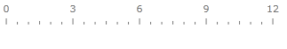
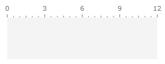

# Linear Scale

The __LinearScale__ control allows you to display a scale of linear form. Typically the __LinearScale__ is used in the __LinearGauge__ control, but it can directly used in the other __Gauge__ controls available or even on its own. This topic will explain you the specifics regarding the usage of the __LinearScale__ control.

>tip As the scales provided by the __RadGauge__ control share common functionality, you might found useful to read the [Base Scale]() topic. In it you will find information regarding the features shared between the different scales.

>tip The scales derived from the __Graphic Scale__ class, can use any of the indicators provided by the __RadGauge__ control. To learn how read the [Base Scale]() topic.

Here is the list of the __LinearScale__ features:

* [Orientation](#orientation)

* [Relative Size](#relative_size)

* [Placement](#placement)

## Orientation

The LinearScale control can have either a horizontal or vertical orientation. The orientation could be defined using the appropriate container: the __RadVerticalLinearGauge__ for vertical scale and the __RadHorizontalLinearGauge__ for horizontal scale respectively.

Here is an example of a __LinearScale__ with horizontal orientation:

#### __XAML__
```XAML
	<telerik:RadHorizontalLinearGauge Width="300"
	                                  Height="100"
	                                  telerik:StyleManager.Theme="Windows8">
	    <telerik:HorizontalLinearScale Min="0"
	                         Max="12" />
	</telerik:RadHorizontalLinearGauge>
```

Here is an example of a __LinearScale__ with vertical orientation:

#### __XAML__
```XAML
	<telerik:RadVerticalLinearGauge Width="100"
	                                Height="300"
	                                telerik:StyleManager.Theme="Windows8">
	    <telerik:VerticalLinearScale Min="0"
	                         Max="12" />
	</telerik:RadVerticalLinearGauge>
```

Both results can be seen below:



## Relative Size

The __Relative Size__ feature allows you to specify the size of the scale towards its container. This can be done by using the __RelativeHeight__ and __RelativeWidth__ property of the __LinearScale__. For example a value of __RelativeHeight = 1__ will make the scale have a scale equal to the height of the container and a value of __RelativeWidth = 1__ will make the scale have a width equal to the width of the container.

>When using the LinearScale in horizontal mode, the value of the RelativeHeight property will get applied to the width of the container.

Here is an example:

#### __XAML__
```XAML
	<telerik:RadHorizontalLinearGauge Width="300"
	                                  Height="100"
	                                  telerik:StyleManager.Theme="Windows8">
	    <telerik:HorizontalLinearScale Min="0"
	                         Max="12"
	                         RelativeWidth="1"
	                         RelativeHeight="1"/>
	</telerik:RadHorizontalLinearGauge>
```

Here is a snapshot of the result:



## Placement

The __LinearScale__ exposes the __RelativeX__ and __RelativeY__ properties, which allows you to position the scale towards its container. The values of these two properties are relative to the height and respectively to the width of the scale's container.

Here is an example:

#### __XAML__
```XAML
	<telerik:RadHorizontalLinearGauge Width="250"
	                                    Height="70"
	                                    OuterBackground="#F4F4F4"
	                                    OuterBorderThickness="0"
	                                    telerik:StyleManager.Theme="Windows8">
	    <telerik:HorizontalLinearScale Min="0"
	                            Max="12"
	                            RelativeX="0"
	                            RelativeY="0"
	                            RelativeWidth="1"
	                            RelativeHeight="1" 
	                            StartWidth="0"
	                            EndWidth="0"/>
	</telerik:RadHorizontalLinearGauge>
```

Here is a snapshot of the result:

