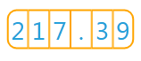
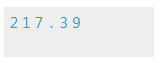
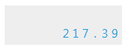
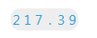
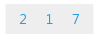

# Numeric Indicator

The __Numeric Indicator__ is used for displaying numeric values as digits. It does not inherit the __IndicatorBase__ class as the other indicators do, but provides functionality similar to theirs. Here is a list of the features of the __Numeric Indicator__:      

* [Number Positions](#number-positions)

* [Size](#size)

* [Placement](#placement)

* [Corner Radius](#corner-radius)

* [Display Value Format](#display-value-format)

* [Value](#value)

As appearance it is similar to the display of the digital clock. It can be used with any of the scales provided by the __gauge__ control.

## Number Positions

By default the __Numeric Indicator__ won't display its values. You have to define the number positions to display the value's digits. This can be done by adding a number position objects to the Positions collection of the __NumericIndicator__. You can use the following types of number position:

* __SevenSegsNumberPosition__ - the digit get displayed via 7 rectangular segments.

* __HexagonalNumberPosition__ - the digit get displayed via 7 hexagonal segments.

* __FontNumberPosition__ - the digit is displayed as characters. In this case the values of the various font properties, like __FontFamily__, __FontSize__, __FontWeight__ etc., get applied. The font properties can be set to the indicator itself. In this case they will get applied to all of the FontNumberPosition controls in it. You can apply it directly to the FontNumberPosition control as well, in order to have different appearance for each position. The number position objects derive from the __ContentControl__ and expose one additional property:        

	* __CornerRadius__ - specifies the radius of the corners of the control. Also you can use the __ScaleObject.RelativeWidth__ to specify the width of the control relatively to the scale which contains the numeric indicator.        

>tip Using the __BorderBrush__ and the __BorderThickness__ properties of the __NumberPosition__ control you can outline the positions.        

For example, if you want to display three digit number with two additional fractional digits, you have to define six number positions. Note that one of the position will be used by the decimal point.        


```XAML
	<Grid x:Name="LayoutRoot" Width="150" Height="50">
	    <telerik:NumericScale Min="0" Max="999" telerik:StyleManager.Theme="Windows8">
	        <telerik:NumericScale.Indicators>
	            <telerik:NumericIndicator Value="217.39"
	                                      telerik:ScaleObject.RelativeY="0.05"
	                                      telerik:ScaleObject.RelativeX="0.025"
	                                      telerik:ScaleObject.RelativeWidth="0.95*"
	                                      telerik:ScaleObject.RelativeHeight="0.9*"
	                                      FontSize="28"
	                                      BorderThickness="0">
	                <telerik:NumericIndicator.Positions>
	                    <telerik:FontNumberPosition CornerRadius="10,0,0,10"
	                                                Background="Transparent"
	                                                BorderBrush="Orange"
	                                                BorderThickness="2,2,1,2"
	                                                Padding="0"/>
	                    <telerik:FontNumberPosition CornerRadius="0"
	                                                Background="Transparent"
	                                                BorderBrush="Orange"
	                                                BorderThickness="1,2"
	                                                Padding="0"/>
	                    <telerik:FontNumberPosition CornerRadius="0"
	                                                Background="Transparent"
	                                                BorderBrush="Orange"
	                                                BorderThickness="1,2"
	                                                Padding="0"/>
	                    <telerik:FontNumberPosition CornerRadius="0"
	                                                Background="Transparent"
	                                                BorderBrush="Orange"
	                                                BorderThickness="1,2"
	                                                Padding="0"/>
	                    <telerik:FontNumberPosition CornerRadius="0"
	                                                Background="Transparent"
	                                                BorderBrush="Orange"
	                                                BorderThickness="1,2"
	                                                Padding="0"/>
	                    <telerik:FontNumberPosition CornerRadius="0,10,10,0"
	                                                Background="Transparent"
	                                                BorderBrush="Orange"
	                                                BorderThickness="1,2,2,2"
	                                                Padding="0"/>
	                </telerik:NumericIndicator.Positions>
	            </telerik:NumericIndicator>
	        </telerik:NumericScale.Indicators>
	    </telerik:NumericScale>
	</Grid>
```

Here is a snapshot of the result:



## Size

To manipulate the indicator's size, simply use the __ScaleObject.RelativeHeight__ and __ScaleObject.RelativeWidth__ attachable properties. As the names suggest, their value are relative to the cell size of the scale. The cell size of the scale is determined by the size of the container it is placed in. For the radial scales it is equal to the radius of the container. However, when placed inside a __LinearScale__ or inside a __NumericScale__, then the __ScaleObject.RelativeHeight__ value is relative to the height and the __ScaleObject.RelativeWidth__ to the width of the scale's container.

>tip To learn more about the cell size term, read the [Relative Measurements]() topic.

Here is an example:


```XAML
	<Grid Background="#EEEEEE" Width="150" Height="50">
	    <telerik:NumericScale Min="0" Max="999" telerik:StyleManager.Theme="Windows8">
	        <telerik:NumericScale.Indicators>
	            <telerik:NumericIndicator Value="217.39"
	                                      telerik:ScaleObject.RelativeY="0.05"
	                                      telerik:ScaleObject.RelativeX="0.025"
	                                      telerik:ScaleObject.RelativeWidth="0.5*"
	                                      telerik:ScaleObject.RelativeHeight="0.5*">
	                <telerik:NumericIndicator.Positions>
	                    <telerik:FontNumberPosition CornerRadius="0" FontSize="15"
	                                    Background="Transparent"/>
	                    <telerik:FontNumberPosition CornerRadius="0" FontSize="15"
	                                    Background="Transparent"/>
	                    <telerik:FontNumberPosition CornerRadius="0" FontSize="15"
	                                    Background="Transparent"/>
	                    <telerik:FontNumberPosition CornerRadius="0" FontSize="15"
	                                    Background="Transparent"/>
	                    <telerik:FontNumberPosition CornerRadius="0" FontSize="15"
	                                    Background="Transparent"/>
	                    <telerik:FontNumberPosition CornerRadius="0" FontSize="15"
	                                    Background="Transparent"/>
	                </telerik:NumericIndicator.Positions>
	            </telerik:NumericIndicator>
	        </telerik:NumericScale.Indicators>
	    </telerik:NumericScale>
	</Grid>
```

Here is a snapshot of the result:



## Placement

The __ScaleObject.RelativeX__ and __ScaleObject.RelativeY__ attachable properties allow you to position the __NumericIndicator__ towards the scale's container. The values of these two properties are relative to the height and respectively to the width of the scale's container. 

Here is an example:


```XAML
	<Grid Background="#EEEEEE" Width="150" Height="50">
	    <telerik:NumericScale Min="0" Max="999" telerik:StyleManager.Theme="Windows8">
	        <telerik:NumericScale.Indicators>
	            <telerik:NumericIndicator Value="217.39"
	                                      telerik:ScaleObject.RelativeY="0.45"
	                                      telerik:ScaleObject.RelativeX="0.48"
	                                      telerik:ScaleObject.RelativeWidth="0.5*"
	                                      telerik:ScaleObject.RelativeHeight="0.5*">
	                <telerik:NumericIndicator.Positions>
	                    <telerik:FontNumberPosition CornerRadius="0" FontSize="15" Background="Transparent"/>
	                    <telerik:FontNumberPosition CornerRadius="0" FontSize="15" Background="Transparent"/>
	                    <telerik:FontNumberPosition CornerRadius="0" FontSize="15" Background="Transparent"/>
	                    <telerik:FontNumberPosition CornerRadius="0" FontSize="15" Background="Transparent"/>
	                    <telerik:FontNumberPosition CornerRadius="0" FontSize="15" Background="Transparent"/>
	                    <telerik:FontNumberPosition CornerRadius="0" FontSize="15" Background="Transparent"/>
	                </telerik:NumericIndicator.Positions>
	            </telerik:NumericIndicator>
	        </telerik:NumericScale.Indicators>
	    </telerik:NumericScale>
	</Grid>
```

Here is a snapshot of the result:



## Corner Radius

The __CornerRadius__ property allows you to specify the radius of the indicator's corners. Here is an example:


```XAML
	<Grid x:Name="LayoutRoot" Width="150" Height="50">
	    <telerik:NumericScale Min="0" Max="999" telerik:StyleManager.Theme="Windows8">
	        <telerik:NumericScale.Indicators>
	            <telerik:NumericIndicator Value="217.39"
	                                      CornerRadius="10"
	                                      telerik:ScaleObject.RelativeY="0.45"
	                                      telerik:ScaleObject.RelativeX="0.48"
	                                      telerik:ScaleObject.RelativeWidth="0.5*"
	                                      telerik:ScaleObject.RelativeHeight="0.5*">
	                <telerik:NumericIndicator.Background>
	                    <SolidColorBrush Color="#EEEEEE"/>
	                </telerik:NumericIndicator.Background>
	                <telerik:NumericIndicator.Positions>
	                    <telerik:FontNumberPosition CornerRadius="0" FontSize="15"
	                                                                    Background="Transparent"/>
	                    <telerik:FontNumberPosition CornerRadius="0" FontSize="15"
	                                                                    Background="Transparent"/>
	                    <telerik:FontNumberPosition CornerRadius="0" FontSize="15"
	                                                                    Background="Transparent"/>
	                    <telerik:FontNumberPosition CornerRadius="0" FontSize="15"
	                                                                    Background="Transparent"/>
	                    <telerik:FontNumberPosition CornerRadius="0" FontSize="15"
	                                                                    Background="Transparent"/>
	                    <telerik:FontNumberPosition CornerRadius="0" FontSize="15"
	                                                                    Background="Transparent"/>
	                </telerik:NumericIndicator.Positions>
	            </telerik:NumericIndicator>
	        </telerik:NumericScale.Indicators>
	    </telerik:NumericScale>
	</Grid>
```

Here is a snapshot of the result:



## Display Value Format

The Format property allows you to specify a format string for the indicator's value. When formatting you might have to add or remove some number positions.

>tip Defining format strings in XAML can be done in the following way - `{}:{0:__your format string__}`. To learn more about formatting visit the [Formatting Overview](http://msdn.microsoft.com/en-us/library/26etazsy.aspx) chapter in MSDN.

Here is an example:


```XAML
	<Grid Background="#EEEEEE" Width="175" Height="60">
	    <telerik:NumericScale Min="0" Max="999" telerik:StyleManager.Theme="Windows8">
	        <telerik:NumericScale.Indicators>
	            <telerik:NumericIndicator Value="217.39"
	                                      Format="{}{0:F0}"
	                                      telerik:ScaleObject.RelativeY="0.025"
	                                      telerik:ScaleObject.RelativeX="0.05"
	                                      telerik:ScaleObject.RelativeWidth="0.9*"
	                                      telerik:ScaleObject.RelativeHeight="0.9*"
	                                      FontSize="28">
	                <telerik:NumericIndicator.Positions>
	                    <telerik:FontNumberPosition CornerRadius="0" Background="Transparent"/>
	                    <telerik:FontNumberPosition CornerRadius="0" Background="Transparent"/>
	                    <telerik:FontNumberPosition CornerRadius="0" Background="Transparent"/>
	                </telerik:NumericIndicator.Positions>
	            </telerik:NumericIndicator>
	        </telerik:NumericScale.Indicators>
	    </telerik:NumericScale>
	</Grid>
```

Here is a snapshot of the result:



## Value

The indicators have a __Value__ property, which speicifies the value off the scale they should point to. You can set this property to a desired value, whenever you need to reposition the indicator.
