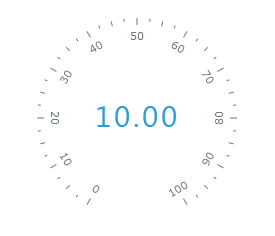

# Numeric Scale

The __NumericScale__ control allows you to display a scale of numeric form. The numeric scales are used for displaying digits. An example for a numerical scale is the digital clock's display.

There is no special container for the numeric scale, as for the radial or linear scales. However you can use any of 9 radial gauge containers as well as *RadHorizontalLinearGauge* and *RadVerticalLinearGauge* controls to wrap the *NumericScale* control. Additionally you can place it in a Grid or another layout control. This topic will explain you the specifics regarding the usage of the NumericScale control.

Here is the list of the __NumericScale__ features:

* [Max and Min Values](#max-and-min-values)

* [Multiplier](#multiplier)

* [Indicators](#indicators)

## Max and Min Values

To specify maximum and minimum values for the scale use the __Min__ and __Max__ properties. Here is an example:


```XAML
	<telerik:NumericScale Min="0" Max="1000">
	</telerik:NumericScale>
```

## Multiplier

The __Multiplier__ property of the __NumericScale__ allows you to apply a multiplier to the current value displayed by the scale. Here is an example of a __NumericScale__ which multiplies its value by 10.


```XAML
	<telerik:NumericScale Min="0"
	                      Max="1000"
	                      Multiplier="10">
	</telerik:NumericScale>
```

## Indicators

The __NumericScale__ typically uses a __NumericIndicator__ control to display its current value. The __NumericIndicator__ is a control that specifies slots for numeric digits. To learn more about it, read the [Numeric Indicator]() topic.

>tip Another indicator that can be used together with the __NumericScale__ control is the [StateIndicator]().

Here is an example:


```XAML
	<telerik:RadRadialGauge Width="200" Height="200" telerik:StyleManager.Theme="Windows8">
	    <telerik:RadialScale Min="0" Max="100"/>
	    <telerik:NumericScale Min="0" Max="1000"
	                          Multiplier="10" >
	        <telerik:NumericIndicator Value="1" 
	                                  telerik:ScaleObject.RelativeX="0.23"
	                                  telerik:ScaleObject.RelativeY="0.38">
	            <telerik:NumericIndicator.Positions>
	                <telerik:FontNumberPosition FontSize="30"/>
	                <telerik:FontNumberPosition FontSize="30" />
	                <telerik:FontNumberPosition FontSize="30" />
	                <telerik:FontNumberPosition FontSize="30" />
	                <telerik:FontNumberPosition FontSize="30" />
	                <telerik:FontNumberPosition FontSize="30" />
	            </telerik:NumericIndicator.Positions>
	        </telerik:NumericIndicator>
	    </telerik:NumericScale>
	</telerik:RadRadialGauge>
```

Here is a snapshot of the result:

