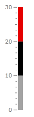
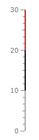
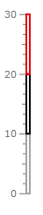
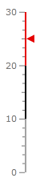
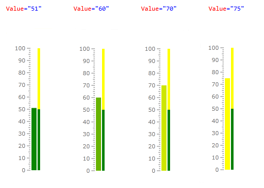
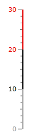

# Gauge Range

The __RadGauge__ control allows you to define ranges for your scales. The range is used for wrapping a specific section of the scale, that meets a condition.

The __Gauge__ control allows you to define ranges for your scales. The range is used for wrapping a specific section of the scale that meets a condition. The __Gauge__ control provides you the single __GaugeRange__ class which can be used with any scale type.

## Max and Min Value

Each range should have a start and and end points. They are defined via the Min and Max properties, where their values represent values from the scale.

>tip Typically each range should be colored in a specific color. To set the desired color to the range use its Background property. 

```XAML
	<telerik:RadVerticalLinearGauge telerik:StyleManager.Theme="Windows8">
	    <telerik:VerticalLinearScale Min="0" Max="30"
	                    MajorTicks="3"
	                    RangeLocation="OverCenter">
	        <telerik:VerticalLinearScale.Ranges>
	            <telerik:GaugeRange Background="#FFA3A3A3" 
	                        Min="0" Max="10" />
	            <telerik:GaugeRange Background="#FF000000" 
	                        Min="10" Max="20"  />
	            <telerik:GaugeRange Background="#FFE50000" 
	                        Min="20" Max="30" />
	        </telerik:VerticalLinearScale.Ranges>
	    </telerik:VerticalLinearScale>
	</telerik:RadVerticalLinearGauge>
```

Here is a snapshot of the result:



## Width

You can control the width of a range at its start and at its end point. This is done via the __StartWidth__ and the __EndWidth__ properties of the range. Their values should be relative to the cell size of the scale. In the case of the linear scale, this means to the width of the scale's container when the scale orientation is vertical or to the height of the scale's container when the scale orientation is horizontal, and in case of radial scale - to the radius of the scale's container.

>tip To learn more about the cell size term, read the [Relative Measurements]() topic.

```XAML
	<telerik:RadVerticalLinearGauge telerik:StyleManager.Theme="Windows8">
	    <telerik:VerticalLinearScale Min="0" Max="30"
	                    MajorTicks="3"
	                    RangeLocation="OverOutside">
	        <telerik:VerticalLinearScale.Ranges>
	            <telerik:GaugeRange Background="#FFA3A3A3"
	                        StartWidth="0.02"
	                        EndWidth="0.02"
	                        Min="0" Max="10"/>
	            <telerik:GaugeRange Background="#FF000000" 
	                        StartWidth="0.02"
	                        EndWidth="0.02"
	                        Min="10" Max="20"  />
	            <telerik:GaugeRange Background="#FFE50000"
	                        StartWidth="0.02"
	                        EndWidth="0.02" 
	                        Min="20" Max="30" />
	        </telerik:VerticalLinearScale.Ranges>
	    </telerik:VerticalLinearScale>
	</telerik:RadVerticalLinearGauge>
```

Here is a snapshot of the result:



## Range Appearance

To control the appearance of a range you can use the following properties:

* __Background__ - specifies the fill color for the range.

* __Stroke__ - specifies the stroke color for the range.

* __StrokeThickness__ - specifies the thickness of the range's stroke.

```XAML
	<telerik:RadVerticalLinearGauge telerik:StyleManager.Theme="Windows8">
	    <telerik:VerticalLinearScale Min="0" Max="30"
	                            MajorTicks="3"
	                            RangeLocation="OverOutside">
	        <telerik:VerticalLinearScale.Ranges>
	            <telerik:GaugeRange Stroke="#FFA3A3A3"
	                        StrokeThickness="2"
	                        StartWidth="0.04"
	                        EndWidth="0.04"
	                        Min="0" Max="10"/>
	            <telerik:GaugeRange Stroke="#FF000000"
	                        StrokeThickness="2"
	                        StartWidth="0.04"
	                        EndWidth="0.04"
	                        Min="10" Max="20"  />
	            <telerik:GaugeRange Stroke="#FFE50000"
	                        StrokeThickness="2"
	                        StartWidth="0.04"
	                        EndWidth="0.04"
	                        Min="20" Max="30" />
	        </telerik:VerticalLinearScale.Ranges>
	    </telerik:VerticalLinearScale>
	</telerik:RadVerticalLinearGauge>
```

Here is a snapshot of the result:



## Indicator Appearance

>To modify the appearance of the indicator via the range, the indicator should be in Use Range Color mode.

You can specify an appearance for the scale's indicator, when it enters inside the range. This is done by using the following of the range object's properties:

* __IndicatorBackground__

* __IndicatorColorMixSensitivity__

## IndicatorBackground

It specifies the background color for the indicator's background when it is in the range. Here is an example:

```XAML
	<telerik:RadVerticalLinearGauge telerik:StyleManager.Theme="Windows8">
	    <telerik:VerticalLinearScale Min="0" Max="30"
	                            MajorTicks="3"
	                            RangeLocation="OverOutside">
	        <telerik:VerticalLinearScale.Ranges>
	            <telerik:GaugeRange Background="#FFA3A3A3"
	                        IndicatorBackground="#FFA3A3A3"
	                        StrokeThickness="2"
	                        StartWidth="0.02"
	                        EndWidth="0.02"
	                        Min="0" Max="10"/>
	            <telerik:GaugeRange Background="#FF000000"
	                        IndicatorBackground="#FF000000"
	                        StrokeThickness="2"
	                        StartWidth="0.02"
	                        EndWidth="0.02"
	                        Min="10" Max="20"  />
	            <telerik:GaugeRange Background="#FFE50000"
	                        IndicatorBackground="#FFE50000"
	                        StrokeThickness="2"
	                        StartWidth="0.02"
	                        EndWidth="0.02"
	                        Min="20" Max="30" />
	        </telerik:VerticalLinearScale.Ranges>
	        <telerik:VerticalLinearScale.Indicators>
	            <telerik:Marker Value="25" 
	                    UseRangeColor="True"
	                    telerik:ScaleObject.RelativeWidth="0.1*"
	                    telerik:ScaleObject.RelativeHeight="0.04*"
	                    telerik:ScaleObject.Offset="0.02*" />
	        </telerik:VerticalLinearScale.Indicators>
	    </telerik:VerticalLinearScale>
	</telerik:RadVerticalLinearGauge>
```

Here is a snapshot with the end result:



## IndicatorColorMixSensitivity

The IndicatorColorMixSensitivity property is used to colorize bar indicator. This feature is typical for the [Bar Indicators]().        

This property is applicable when RangeColorMode property of the indicator is set to MixedColor (works for both radial and linear scales), HorizontalGradient or VerticalGradient (work for linear scale only). The IndicatorColorMixSensitivity property indicates how the colors of two ranges (previous and current) are mixed to create the background of the indicator. Its value can be a double between 0 and 1. For example, if the BarIndicator has its RangeColorMode set to MixedColor and range's IndicatorColorMixSensitivity property is set to 0.5 then the bar indicator will use mixed color from both current and previous ranges. The mixed color will be used when indicator takes a value from the range start and up to the half of it.        

This sample demonstrates how the indicator changes its background in this case:        

```XAML
	<telerik:RadVerticalLinearGauge Name="gauge" Width="100" Height="300" telerik:StyleManager.Theme="Windows8">
	    <telerik:VerticalLinearScale x:Name="scale" MajorTickStep="10" IsInteractive="True">
	        <telerik:VerticalLinearScale.Ranges>
	            <telerik:GaugeRange Min="0" Max="50"
	                                                StartWidth="0.05"
	                                                EndWidth="0.05"
	                                                Background="Green"
	                                                IndicatorBackground="Green" />
	            <telerik:GaugeRange Min="50" Max="100"
	                                                StartWidth="0.05"
	                                                EndWidth="0.05"
	                                                Background="Yellow"
	                                                IndicatorBackground="Yellow"
	                                                IndicatorColorMixSensitivity="0.5" />
	        </telerik:VerticalLinearScale.Ranges>
	        <telerik:VerticalLinearScale.Indicators>
	            <telerik:BarIndicator UseRangeColor="True"
	                                                        RangeColorMode="MixedColor"
	                                                        Value="60" />
	        </telerik:VerticalLinearScale.Indicators>
	    </telerik:VerticalLinearScale>
	</telerik:RadVerticalLinearGauge>
```

Here are snapshots for different values of the bar indicator:        



## Labels Appearance

>To modify the appearance of the labels via the range, they should be in [Use Range Color](#Using_the_Range_Color) mode.

The appearance of the labels in the range can be controlled via the following properties:

* __LabelForeground__ - specifies the foreground color for the labels that belong to the range.

	```XAML
		<telerik:RadVerticalLinearGauge telerik:StyleManager.Theme="Windows8">
			<telerik:VerticalLinearScale Min="0" Max="30"
									MajorTicks="3"
									RangeLocation="OverOutside"                         
									LabelUseRangeColor="True">
				<telerik:VerticalLinearScale.Ranges>
					<telerik:GaugeRange Background="#FFA3A3A3"
								LabelForeground="#FFA3A3A3"
								StrokeThickness="2"
								StartWidth="0.02"
								EndWidth="0.02"
								Min="0" Max="10"/>
					<telerik:GaugeRange Background="#FF000000"
								LabelForeground="#FF000000"
								StrokeThickness="2"
								StartWidth="0.02"
								EndWidth="0.02"
								Min="10" Max="20"  />
					<telerik:GaugeRange Background="#FFE50000"
								LabelForeground="#FFE50000"
								StrokeThickness="2"
								StartWidth="0.02"
								EndWidth="0.02"
								Min="20" Max="30" />
				</telerik:VerticalLinearScale.Ranges>
			</telerik:VerticalLinearScale>
		</telerik:RadVerticalLinearGauge>
	```
	
	

## Ticks Appearance

>To modify the appearance of the ticks via the range, they should be in [Use Range Color](#Using_the_Range_Color) mode.

The appearance of the ticks in the range can be controlled via the following properties:

* __TickBackground__ - specifies the fill color for the ticks that belong to the range.

	Here is an example, where only the major ticks use the range's color for them:

	```XAML
		<telerik:RadVerticalLinearGauge telerik:StyleManager.Theme="Windows8">
			<telerik:VerticalLinearScale Min="0" Max="30"
								MajorTicks="3" 
								MajorTickUseRangeColor="True"
								MiddleTickUseRangeColor="True"
								MinorTickUseRangeColor="True"
								RangeLocation="OverOutside">
				<telerik:VerticalLinearScale.Ranges>
					<telerik:GaugeRange Background="#FFA3A3A3"
								TickBackground="#FFA3A3A3"
								StrokeThickness="2"
								StartWidth="0.02"
								EndWidth="0.02"
								Min="0" Max="10"/>
					<telerik:GaugeRange Background="#FF000000"
								TickBackground="#FF000000"
								StrokeThickness="2"
								StartWidth="0.02"
								EndWidth="0.02"
								Min="10" Max="20"  />
					<telerik:GaugeRange Background="#FFE50000"
								TickBackground="#FFE50000"
								StrokeThickness="2"
								StartWidth="0.02"
								EndWidth="0.02"
								Min="20" Max="30" />
				</telerik:VerticalLinearScale.Ranges>
			</telerik:VerticalLinearScale>
		</telerik:RadVerticalLinearGauge>
	```