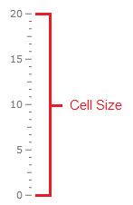
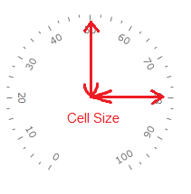

# Relative Measurements

Most of the scale elements have relative size to one common dimension, which is called CellSize. If we set the relative height of the scale to be 0.9 that means that it will be calculated as 0.9 * CellSize. Thus all proportions of the scale elements will be preserved when the container size is changed.

>If the property is not relative to the cell size it would be explicitly mentioned in the article regarding the particular feature.

The cell size depends on the scale type:

* [Linear Scale Cell Size](#linear-scale-cell-size)

* [Radial Scale Cell Size](#radial-scale-cell-size)

## Linear Scale Cell Size

When using a linear scale, the cell size is equal to the height of the scale's container. Note that the cell size takes the entire height of the container. This means that if you have a __LinearGauge__ with a height of __300__ as a container, the cell size will be equal to __300__.

## Radial Scale Cell Size

When using a radial scale, the cell size is equal to the radius of the container. This means that if you have a __RadialGauge__ with height/width of __300__, the cell size will be __150__.

