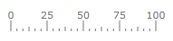
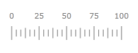
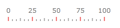
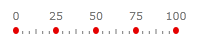

# Basics

You are able to configure the displaying of the different tick types on the scale. For each of the Ticks - Minor, Middle or Major you can configure the following:

* [Size](#size)

* [Location](#location)

* [Appearance](#appearance)

## Size

To specify the size of all major ticks you should use the __MajorTickRelativeWidth__ and __MajorTickRelativeHeight__ properties of the respective __Scale__ object.  You can use the __MinorTickRelativeWidth__ and __MinorTickRelativeHeight__ properties to change the size of the minor ticks or the __MiddleTickRelativeWidth__ and __MiddleTickRelativeHeight__ properties to change the size of the middle ticks respectively. The tick's size is relative to the cell size of the scale.

>tip To learn more about the cell size term, read the [Relative Measurements]() topic.

Here is an example:


```XAML
	<telerik:RadHorizontalLinearGauge Width="200" Height="100" telerik:StyleManager.Theme="Windows8">
	    <telerik:HorizontalLinearScale Min="0" Max="100"
	                         MajorTickRelativeWidth="0.003*"
	                         MajorTickRelativeHeight="0.12*"/>
	</telerik:RadHorizontalLinearGauge> 
```

Here is a snapshot of the result.



## Location

The __TickProperties__ class exposes a __Location__ property, which allows you to specify the location of the ticks towards the scale.

Here is an example:


```XAML
	<telerik:RadHorizontalLinearGauge Width="200" Height="100" telerik:StyleManager.Theme="Windows8">
	    <telerik:HorizontalLinearScale Min="0" Max="100"
	                         MajorTickRelativeHeight="0.2*"
	                         MiddleTickRelativeHeight="0.15*"
	                         MinorTickRelativeHeight="0.1*"
	                         MajorTickLocation="OverCenter"
	                         MiddleTickLocation="OverCenter"
	                         MinorTickLocation="OverCenter" />
	</telerik:RadHorizontalLinearGauge> 
```

Here is a snapshot of the result:



## Appearance

The __TickProperties__ objects provide you with two ways of modifying the ticks' appearance:

* [Modifying Tick's Background](#Modifying-Ticks-Background)

* [Specifying a DataTemplate](#Specifying-a-DataTemplate)

### Modifying Ticks Background

To modify the ticks' background, simply set the __MajorTickBackground__, __MiddleTickBackground__ or the __MinorTickBackground__ property of the respective __Scale__ object to the desired color. Here is an example:


```XAML
	<telerik:RadHorizontalLinearGauge Width="200" Height="100" telerik:StyleManager.Theme="Windows8">
	    <telerik:HorizontalLinearScale Min="0" Max="100" 
	                         MajorTickBackground="#FFE50000"/>
	</telerik:RadHorizontalLinearGauge> 
```

Here is a snapshot of the result:



### Specifying a DataTemplate

The other way of specifying the appearance of the tick is by defining an entire __DataTemplate__ for it, which will get applied to each of the ticks of the respective type. There you can define the visual appearance of the tick as you desire and bind the used elements to the data context of the template where needed.        


```XAML
	<telerik:RadHorizontalLinearGauge Width="200" Height="100" telerik:StyleManager.Theme="Windows8">
	    <telerik:RadHorizontalLinearGauge.Resources>
	        <DataTemplate x:Key="CustomTemplate">
	            <Ellipse Fill="#FFE50000"
	                     HorizontalAlignment="Stretch"
	                     VerticalAlignment="Stretch" />
	        </DataTemplate>
	    </telerik:RadHorizontalLinearGauge.Resources>
	    <telerik:HorizontalLinearScale Min="0" Max="100" 
	                         MajorTickTemplate="{StaticResource CustomTemplate}"
	                         MajorTickRelativeWidth="0.03*"/>
	</telerik:RadHorizontalLinearGauge>
```

Here is a snapshot of the result:

