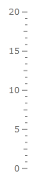
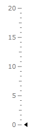

# Creating {{ site.framework_name }} Linear Gauge

One of the gauges you can create with the __RadGauge__ control, is a linear gauge. It is represented by a rectangular container with a linear scale in it. Additionally, it can display various indicators that point to a certain value on the scale. This topic will walk you through the creation of a sample application that contains a linear RadGauge.

* [Adding Telerik Assemblies Using NuGet](#adding-telerik-assemblies-using-nuget)
* [Adding Assembly References Manually](#adding-assembly-references-manually)
* [Defining a Linear Gauge with a Linear Scale](#defining-a-linear-gauge-with-a-linear-scale)
* [Defining an Indicator](#defining-an-indicator)
* [Set Indicator's Position](#set-indicators-position)

## Adding Telerik Assemblies Using NuGet

To use __RadGauge__ when working with NuGet packages, install the `Telerik.Windows.Controls.DataVisualization.for.Wpf.Xaml` package. The [package name may vary]() slightly based on the Telerik dlls set - [Xaml or NoXaml]()

Read more about NuGet installation in the [Installing UI for WPF from NuGet Package]() article.

>tip With the 2025 Q1 release, the Telerik UI for WPF has a new licensing mechanism. You can learn more about it [here]().

## Adding Assembly References Manually

If you are not using NuGet packages, you can add a reference to the following assemblies:

* __Telerik.Licensing.Runtime__
* __Telerik.Windows.Controls__
* __Telerik.Windows.Controls.DataVisualization__

## Defining a Linear Gauge with a Linear Scale

The linear gauge type is represented by the __HorizontalLinearGauge__ or __VerticalLinearGauge__ class. You can use either of them to have vertical or horizontal orientated gauges. The linear gauge control is used for wrapping linear scales. You can place one or more __LinearScale__ objects inside of it. In order to define a scale inside the __LinearGauge__ control, you have to use the __LinearScale__ control. The __LinearGauge__ works as an __ItemsControl__, which takes __LinearScale__ controls as items. This means that you can have more than one scale inside the linear gauge.

>To use the __RadGauge__ control and its components in XAML you have to declare the following namespace:  
>`xmlns:telerik="http://schemas.telerik.com/2008/xaml/presentation"`

__Example 1: Creating RadVerticalLinearGauge with a VerticalLinearScale__
```XAML
	<telerik:RadVerticalLinearGauge Width="100" Height="200">
	    <telerik:VerticalLinearScale Min="0" 
	                    Max="20"
	                    RelativeHeight="1"
	                    RelativeY="0"
	                    MiddleTickRelativeWidth="0.05\*"
	                    MiddleTickRelativeHeight="0.003\*"
	                    MinorTickRelativeHeight="0.003\*"
	                    MajorTickRelativeHeight="0.003\*">
	    </telerik:VerticalLinearScale>
	</telerik:RadVerticalLinearGauge>
```

>tip To learn more about the usage of the __LinearScale__ control, read the [Linear Scale]() topic.

#### __Image 1: Result from Example 1__



> The examples in this article are styled with the [Windows8]() theme.

## Defining an Indicator

The __LinearScale__ control allows you to display different types of indicators that point to a value on the scale. To specify an indicator use the __Indicators__ property, which is of type __ItemCollection__. This means that the __Indicators__ property can hold more than one indicator. Example 2 shows how you can define a LinearScale that uses a Marker indicator to mark the current value.

__Example 2: Adding Indicators__
```XAML
	<telerik:RadVerticalLinearGauge Width="100" Height="200">
	    <telerik:VerticalLinearScale Min="0" 
	                         Max="20"
	                         RelativeHeight="1"
	                         RelativeY="0"
	                         MiddleTickRelativeWidth="0.05\*"
	                         MiddleTickRelativeHeight="0.003\*"
	                         MinorTickRelativeHeight="0.003\*"
	                         MajorTickRelativeHeight="0.003\*">
	        <telerik:VerticalLinearScale.Indicators>
	            <telerik:Marker telerik:LinearScale.RotateForVertical="True"
	                            telerik:ScaleObject.RelativeWidth="0.08\*"
	                            telerik:ScaleObject.RelativeHeight="0.03\*" 
	                            telerik:ScaleObject.Location="OverCenter" />
	        </telerik:VerticalLinearScale.Indicators>
	    </telerik:VerticalLinearScale>
	</telerik:RadVerticalLinearGauge>
```

#### __Image 2: Result from Example 2__



## Set Indicator's Position

To make the indicator point to a certain value on the scale, you have to use the Value property of the indicator. 

__Example 3: Setting indicator's position__
```XAML
	<telerik:RadVerticalLinearGauge Width="100" Height="200">
	    <telerik:VerticalLinearScale Min="0" 
	                         Max="20"
	                         RelativeHeight="1"
	                         RelativeY="0"
	                         MiddleTickRelativeWidth="0.05\*"
	                         MiddleTickRelativeHeight="0.003\*"
	                         MinorTickRelativeHeight="0.003\*"
	                         MajorTickRelativeHeight="0.003\*">
	        <telerik:VerticalLinearScale.Indicators>
	            <telerik:Marker Value="5"
	                            telerik:LinearScale.RotateForVertical="True"
	                            telerik:ScaleObject.RelativeWidth="0.08\*"
	                            telerik:ScaleObject.RelativeHeight="0.03\*" 
	                            telerik:ScaleObject.Location="OverCenter" />
	        </telerik:VerticalLinearScale.Indicators>
	    </telerik:VerticalLinearScale>
	</telerik:RadVerticalLinearGauge>
```

#### __Image 3: Result from Example 3__



## Telerik UI for WPF Learning Resources

* [Telerik UI for WPF Gauge Component](https://www.telerik.com/products/wpf/gauge.aspx)
* [Getting Started with Telerik UI for WPF Components]()
* [Telerik UI for WPF Installation]()
* [Telerik UI for WPF and WinForms Integration]()
* [Telerik UI for WPF Visual Studio Templates]()
* [Setting a Theme with Telerik UI for WPF]()
* [Telerik UI for WPF Virtual Classroom (Training Courses for Registered Users)](https://learn.telerik.com/learn/course/external/view/elearning/16/telerik-ui-for-wpf) 
* [Telerik UI for WPF License Agreement](https://www.telerik.com/purchase/license-agreement/wpf-dlw-s)


## See Also

* [Ranges]()
* [Indicators]()
* [Ticks]()
* [Labels]()