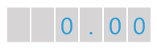
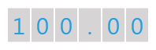

# Creating {{ site.framework_name }} Numeric Gauge

One of the gauges you can create with the __RadGauge__ control, is a numeric gauge. It is represented by a container with a numerical scale in it. The numerical scale uses a numerical indicator to display the desired value. This topic will walk you through the creation of a sample application that contains a numeric RadGauge.

* [Assembly References](#assembly-references)
* [Defining a Numeric Gauge with a NumericScale](#defining-a-numeric-gauge-with-a-numericscale)
* [Defining a Numeric Indicator](#defining-a-numeric-indicator)
* [Set Indicator's Position](#set-indicators-position)

## Assembly References

In order to use the __RadGauge__ control in your projects, you have to add references to the following assemblies:

* __Telerik.Licensing.Runtime__
* __Telerik.Windows.Controls__
* __Telerik.Windows.Controls.DataVisualization__

>tip With the 2025 Q1 release, the Telerik UI for WPF has a new licensing mechanism. You can learn more about it [here]().

### Adding Telerik Assemblies Using NuGet

To use __RadGauge__ when working with NuGet packages, install the `Telerik.Windows.Controls.DataVisualization.for.Wpf.Xaml` package. The [package name may vary]() slightly based on the Telerik dlls set - [Xaml or NoXaml]()

Read more about NuGet installation in the [Installing UI for WPF from NuGet Package]() article.

## Defining a Numeric Gauge with a NumericScale

Unlike the [radial](#defining-a-radialgauge-with-a-radialscale) and [linear](#defining-a-linear-gauge-with-a-linear-scale) scales, the numeric scale doesn't require a special container. However you can use any of the 9 radial gauge and 2 linear gauge controls to wrap the __NumericScale__ control. Additionally, you can put a __NumericScale__ in a __Grid__ container too. In order to define a numerical scale inside the __Gauge__ control, you have to use the __NumericScale__ control. The __Gauge__ works as an __ItemsControl__, which takes __NumericScale__ controls as items. This means that you can have more than one scale inside the gauge.

>To use the __RadGauge__ control and its components in XAML you have to declare the following namespace:
>`xmlns:telerik="http://schemas.telerik.com/2008/xaml/presentation"`

#### __[XAML] Example 1: Creating RadHorizontalLinearGauge with a NumericScale__
{{region xaml-radgauge-getting-started-creating-numeric-gauge_2}}
	<telerik:RadHorizontalLinearGauge Width="200" Height="50">
	    <telerik:NumericScale Min="0" Max="999">
	    </telerik:NumericScale>
	</telerik:RadHorizontalLinearGauge>
{{endregion}}

>tip To learn more about the usage of the __NumericScale__ control read the [Numeric Scale]() topic.

## Defining a Numeric Indicator

The __NumericScale__ control allows you to display numeric indicators that represent a value on the scale. To specify an indicator use the __Indicators__ property, which is of type __ItemCollection__. This means that the __Indicators__ property can hold more than one indicator.

#### __[XAML] Example 2: Adding Indicators__
{{region xaml-radgauge-getting-started-creating-numeric-gauge_3}}
	<telerik:RadHorizontalLinearGauge Width="200" Height="50">
	    <telerik:NumericScale Min="0" Max="999">
	        <telerik:NumericScale.Indicators>
	            <telerik:NumericIndicator telerik:ScaleObject.RelativeX="0.05"
	                                telerik:ScaleObject.RelativeY="0.05"
	                                telerik:ScaleObject.RelativeHeight="0.9*"
	                                telerik:ScaleObject.RelativeWidth="0.9*"
	                                FontSize="30">
	                <telerik:NumericIndicator.Positions>
	                    <telerik:FontNumberPosition Background="#FFD6D4D4" />
	                    <telerik:FontNumberPosition Background="#FFD6D4D4" />
	                    <telerik:FontNumberPosition Background="#FFD6D4D4" />
	                    <telerik:FontNumberPosition Background="#FFD6D4D4" />
	                    <telerik:FontNumberPosition Background="#FFD6D4D4" />
	                    <telerik:FontNumberPosition Background="#FFD6D4D4" />
	                </telerik:NumericIndicator.Positions>
	            </telerik:NumericIndicator>
	        </telerik:NumericScale.Indicators>
	    </telerik:NumericScale>
	</telerik:RadHorizontalLinearGauge>
{{endregion}}

>tip To learn more about the usage of the __NumericIndicator__ control, read the [Numeric Indicator]() topic.

#### __Image 1: Result from Example 2__

> The examples in this article are styled with the [Windows8]() theme.

## Set Indicator's Position

To make the indicator display a certain value on the scale, you have to use the __Value__ property of the indicator.

#### __[XAML] Example 3: Setting indicator's position__
{{region xaml-radgauge-getting-started-creating-numeric-gauge_4}}
	<telerik:RadHorizontalLinearGauge Width="200" Height="50">
	    <telerik:NumericScale Min="0" Max="999">
	        <telerik:NumericScale.Indicators>
	            <telerik:NumericIndicator telerik:ScaleObject.RelativeX="0.05"
	                                telerik:ScaleObject.RelativeY="0.05"
	                                telerik:ScaleObject.RelativeHeight="0.9*"
	                                telerik:ScaleObject.RelativeWidth="0.9*"
	                                FontSize="30"
	                                Value="100">
	                <telerik:NumericIndicator.Positions>
	                    <telerik:FontNumberPosition Background="#FFD6D4D4" />
	                    <telerik:FontNumberPosition Background="#FFD6D4D4" />
	                    <telerik:FontNumberPosition Background="#FFD6D4D4" />
	                    <telerik:FontNumberPosition Background="#FFD6D4D4" />
	                    <telerik:FontNumberPosition Background="#FFD6D4D4" />
	                    <telerik:FontNumberPosition Background="#FFD6D4D4" />
	                </telerik:NumericIndicator.Positions>
	            </telerik:NumericIndicator>
	        </telerik:NumericScale.Indicators>
	    </telerik:NumericScale>
	</telerik:RadHorizontalLinearGauge>
{{endregion}}

#### __Image 2: Result from Example 3__


## Telerik UI for WPF Learning Resources

* [Telerik UI for WPF Gauge Component](https://www.telerik.com/products/wpf/gauge.aspx)
* [Getting Started with Telerik UI for WPF Components]()
* [Telerik UI for WPF Installation]()
* [Telerik UI for WPF and WinForms Integration]()
* [Telerik UI for WPF Visual Studio Templates]()
* [Setting a Theme with Telerik UI for WPF]()
* [Telerik UI for WPF Virtual Classroom (Training Courses for Registered Users)](https://learn.telerik.com/learn/course/external/view/elearning/16/telerik-ui-for-wpf) 
* [Telerik UI for WPF License Agreement](https://www.telerik.com/purchase/license-agreement/wpf-dlw-s)


## See Also

* [Ranges]()
* [Numeric Indicator]()
* [State Indicator]()