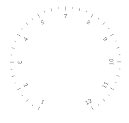
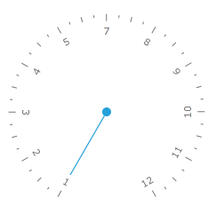

# Creating {{ site.framework_name }} Radial Gauge

One of the gauges you can create with the __RadGauge__ control, is a radial gauge. It is represented by a circle container with a scale in it. Additionally, it can display various indicators that point to a certain value on the scale. This topic will walk you through the creation of a sample application that contains a radial RadGauge.  

* [Adding Telerik Assemblies Using NuGet](#adding-telerik-assemblies-using-nuget)
* [Adding Assembly References Manually](#adding-assembly-references-manually)  
* [Defining a RadialGauge with a Radial Scale](#defining-a-radialgauge-with-a-radialscale)
* [Defining an Indicator](#defining-an-indicator)
* [Set Indicator's Position](#set-indicators-position)

## Adding Telerik Assemblies Using NuGet

To use __RadGauge__ when working with NuGet packages, install the `Telerik.Windows.Controls.DataVisualization.for.Wpf.Xaml` package. The [package name may vary]() slightly based on the Telerik dlls set - [Xaml or NoXaml]()

Read more about NuGet installation in the [Installing UI for WPF from NuGet Package]() article.

>tip With the 2025 Q1 release, the Telerik UI for WPF has a new licensing mechanism. You can learn more about it [here]().

## Adding Assembly References Manually

If you are not using NuGet packages, you can add a reference to the following assemblies:

* __Telerik.Licensing.Runtime__
* __Telerik.Windows.Controls__
* __Telerik.Windows.Controls.DataVisualization__

## Defining a RadialGauge with a RadialScale

The radial gauge type is represented by the __RadRadialGauge__ class. The __RadRadialGauge__ control is used for wrapping radial scales. You can place one or more __RadialScale__ objects inside of it. In order to define a scale inside the RadialGauge control you have to use the RadialScale control. The RadialGauge works as an ItemsControl, which takes RadialScale controls as items. This means that you can have more than one scale inside the radial gauge. 

>To use the __RadGauge__ control and its components in XAML you have to declare the following namespace:
>`xmlns:telerik="http://schemas.telerik.com/2008/xaml/presentation"`	

__Example 1: Creating RadRadialGauge with a RadialScale__
```XAML
	<telerik:RadRadialGauge x:Name="radialGauge"
	                        Width="300"
	                        Height="300">
	    <telerik:RadialScale Min="1"
	                         Max="12">
	    </telerik:RadialScale>
	</telerik:RadRadialGauge>
```

>tip To learn more about the usage of the __RadialScale__ control read the [Radial Scale]() topic.  

#### __Image 1: Result from Example 1__



> The examples in this article are styled with the [Windows8]() theme.

## Defining an Indicator

The __RadialScale__ control allows you to display different types of indicators that point to a value on the scale. To specify an indicator, use the __Indicators__ property, which is of type __UIElementCollection__. This means that the __Indicators__ property can hold more than one indicator. Example 2 shows a RadialScale that uses a __Needle__ indicator to mark the current value as well as __Pinpoint__ to mark the center of the Gauge.        

__Example 2: Adding Indicators__
```XAML
	 <telerik:RadRadialGauge x:Name="radialGauge"
	                        Width="300"
	                        Height="300">
	    <telerik:RadialScale Min="1"
	                         Max="12">
	        <telerik:RadialScale.Indicators>
	            <telerik:Needle />
	            <telerik:Pinpoint/>
	        </telerik:RadialScale.Indicators>
	    </telerik:RadialScale>
	</telerik:RadRadialGauge>
```

#### __Image 2: Result from Example 2__



## Set Indicator's Position

To make the indicator point to a certain value from the scale, you have to use the __Value__ property of the indicator. Example 3 shows how you can work with this property:        

__Example 3: Setting indicator's position__
```XAML
	<telerik:RadRadialGauge Name="radialGauge"
	                    Width="300"
	                    Height="300">
	    <telerik:RadialScale Name="scale"
	                    Min="1"
	                    Max="11">
	        <telerik:RadialScale.Indicators>
	            <telerik:Needle Name="needle" Value="6" />
	            <telerik:Pinpoint />
	        </telerik:RadialScale.Indicators>
	    </telerik:RadialScale>
	</telerik:RadRadialGauge>
```

#### __Image 3: Result from Example 3__



## Telerik UI for WPF Learning Resources

* [Telerik UI for WPF Gauge Component](https://www.telerik.com/products/wpf/gauge.aspx)
* [Getting Started with Telerik UI for WPF Components]()
* [Telerik UI for WPF Installation]()
* [Telerik UI for WPF and WinForms Integration]()
* [Telerik UI for WPF Visual Studio Templates]()
* [Setting a Theme with Telerik UI for WPF]()
* [Telerik UI for WPF Virtual Classroom (Training Courses for Registered Users)](https://learn.telerik.com/learn/course/external/view/elearning/16/telerik-ui-for-wpf) 
* [Telerik UI for WPF License Agreement](https://www.telerik.com/purchase/license-agreement/wpf-dlw-s)



## See also

* [Ranges]()
* [Indicators]()
* [Ticks]()
* [Labels]()