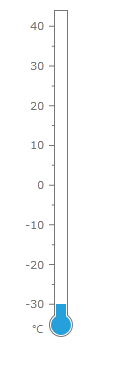
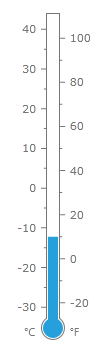

# Create Thermometer

In this tutorial we will show how the thermometer like gauge can be created using RadGauge control.

>This example is made with the Windows8 theme. You can take a look at the [Setting a Theme]() help article to see how to set different theme than the default one.

To create thermometer we will use __RadVerticalLinearGauge__ with 2 scales: one for Celsius and one for Fahrenheit scale. We will start Celsius scale at -30 degree and end it at the 40 degree. Degrees in the Fahrenheit scale correspond to the degrees in the Celsius scale by following formula:

__Fahrenheit Degree = (Celsius Degree * 9) / 5 - 32__

To get Fahrenheit scale show correspondent temperature we should start it at the -22 degree and end it at the 104 degree. To force Fahrenheit scale show "fine" labels like 20, 40, 60 we will shift start and end tick marks of this scale.

At the beginning we should add simple linear gauge with single scale. Since we would like to show Celsius labels at the left of scale bar and Fahrenheit labels at the right we'll add a TextBlock as custom item.

__Example 1: Define the Celsius VerticalLinearScale__
```XAML
	<telerik:RadVerticalLinearGauge Width="24" Height="327" telerik:StyleManager.Theme="Windows8">
	    <telerik:VerticalLinearScale Name="linearScaleC"
	            Min="-30"
	            Max="40"
	            RelativeY="0.05"
	            RelativeHeight="0.85"
	            StartWidth="1"
	            EndWidth="1"
	            MajorTicks="7"
	            MajorTickRelativeWidth="0.2*"
	            MajorTickRelativeHeight="0.003*"
	            MajorTickLocation="OverOutside"
	            MiddleTicks="2"
	            MiddleTickRelativeWidth="0.12*"
	            MiddleTickRelativeHeight="0.003*"
	            MiddleTickOffset="0.12*"
	            MiddleTickLocation="OverOutside"
	            MinorTicks="1" 
	            LabelOffset="0.2*"
	            LabelLocation="Outside"
	            Fill="Transparent"
	            Stroke="Transparent"
	            IsInteractive="True">
	
	        <telerik:VerticalLinearScale.CustomItems>
	            <TextBlock telerik:ScaleObject.RelativeX="-0.7"
	                telerik:ScaleObject.RelativeY="0.95"
	                Text="&#176;C" />
	        </telerik:VerticalLinearScale.CustomItems>
	    </telerik:VerticalLinearScale>
	</telerik:RadVerticalLinearGauge>
```

We'll need a unified look for our Celsius and Fahrenheit labels and scales:

__Example 2: Setting the Celsius and Fahrenheit labels and scales__
```XAML
	<telerik:Windows8Colors x:Key="Windows8Colors" />
	<SolidColorBrush x:Key="AccentBrush" Color="{Binding Source={StaticResource Windows8Colors}, Path=Palette.AccentColor}" />
	<SolidColorBrush x:Key="StrongBrush" Color="{Binding Source={StaticResource Windows8Colors}, Path=Palette.StrongColor}" />
	
	<Style x:Key="CustomLabel" TargetType="TextBlock">
	    <Setter Property="FontSize" Value="11" />
	    <Setter Property="FontFamily" Value="Segoe UI" />
	    <Setter Property="Foreground" Value="{StaticResource StrongBrush}" />
	</Style>
	<Style x:Key="CustomScale" TargetType="telerik:VerticalLinearScale">
	    <Setter Property="Fill" Value="Transparent" />
	    <Setter Property="Stroke" Value="Transparent" />
	</Style>
```

We'll add two Custom Items (for the thermometer bulb) that should give our gauge a look of thermometer:

__Example 3: Setting the CustomItems property__
```XAML
	<telerik:VerticalLinearScale.CustomItems>
	    <Path Data="M5.5,-276.2 L18.5,-276.2 L18.5,25.51 L18.88,25.78 C21.68,27.88 23.5,31.23 23.5,35 C23.5,41.35 18.35,46.5 12,46.5 C5.65,46.5 0.5,41.35 0.5,35 C0.5,31.23 2.32,27.88 5.12,25.78 L5.5,25.51 z" 
	            Stretch="Fill" Stroke="#FF767676"
	            telerik:ScaleObject.RelativeWidth="1*"
	            telerik:ScaleObject.RelativeHeight="1*"/>
	    <Path Data="M5,0 L15,0 L15,3 L15,12.4 L15.2,12.4 C18,14.2 20,17.4 20,21 C20,26.5 15.5,31 10,31 C4.5,31 0,26.5 0,21 C0,17.4 2,14.2 5,12.4 L5,12.3 L5,3 z"
	            Width="20" Height="31"
	            Margin="2,0,0,0"
	            Stretch="Fill" 
	            Fill="{StaticResource AccentBrush}"
	            telerik:ScaleObject.RelativeX="0"
	            telerik:ScaleObject.RelativeY="0.899"  />
	    <TextBlock telerik:ScaleObject.RelativeX="-0.7"
					telerik:ScaleObject.RelativeY="0.95"
					Text="&#176;C"
	                Style="{StaticResource CustomLabel}"/>
	</telerik:VerticalLinearScale.CustomItems>
```

Now our scale looks as following:



The next step is to add the second Fahrenheit linear scale and a linear bar indicator. 

__Example 4: Define the Fahrenheit VerticalLinearScale__
```XAML
	<telerik:RadVerticalLinearGauge Width="24" Height="327" telerik:StyleManager.Theme="Windows8">
		<telerik:VerticalLinearScale Name="linearScaleF"
								RelativeY="0.05"
								RelativeHeight="0.85"
								StartWidth="1"
								EndWidth="1"
								Min="-22"
								Max="104"
								StartTickOffset="2"
								EndTickOffset="-4"
								MajorTicks="6"
								MajorTickLocation="OverInside"
								MajorTickRelativeWidth="0.2*"
								MajorTickRelativeHeight="0.003*"
								MiddleTicks="2"
								MiddleTickLocation="OverInside"
								MiddleTickRelativeWidth="0.12*"
								MiddleTickRelativeHeight="0.003*"
								MiddleTickOffset="0.12*"
								MinorTicks="1" 
								LabelLocation="Inside"
								LabelOffset="0.2*"
								Fill="Transparent"
								Stroke="Transparent">
			<telerik:VerticalLinearScale.Ranges>
				<telerik:GaugeRange x:Name="coldRange"
									Min="-22"
									Max="0"
									StartWidth="0"
									EndWidth="0"
									IndicatorBackground="#FF3ABF15" />
				<telerik:GaugeRange x:Name="overheatRange"
									Min="0"
									Max="104"
									StartWidth="0"
									EndWidth="0"
									IndicatorBackground="#FFE50000" />
			</telerik:VerticalLinearScale.Ranges>
			<telerik:VerticalLinearScale.Indicators>
				<telerik:BarIndicator Name="linearBar"
										Value="10"
										StrokeThickness="0"
										StartWidth="0.42"
										EndWidth="0.42" />
				</telerik:VerticalLinearScale.Indicators>
		
			<telerik:VerticalLinearScale.CustomItems>              
				<TextBlock telerik:ScaleObject.RelativeY="0.95"
							telerik:ScaleObject.RelativeX="1.2"
							Text="&#176;F"
							Style="{StaticResource CustomLabel}"/>
				</telerik:VerticalLinearScale.CustomItems>
		</telerik:VerticalLinearScale>
	</telerik:RadVerticalLinearGauge>
```

The final step is to combine the two __VerticalLinearScale (Celsius and Fahrenheit)__ elements. The final code should look like in __Example 5__.
 
__Example 5: Final code__
```XAML
	<telerik:RadVerticalLinearGauge Width="24" Height="327" telerik:StyleManager.Theme="Windows8">
		<telerik:VerticalLinearScale Name="linearScaleC"
									Min="-30"
									Max="40"
									RelativeY="0.05"
									RelativeHeight="0.85"
									StartWidth="1"
									EndWidth="1"
									MajorTicks="7"
									MajorTickRelativeWidth="0.2*"
									MajorTickRelativeHeight="0.003*"
									MajorTickLocation="OverOutside"
									MiddleTicks="2"
									MiddleTickRelativeWidth="0.12*"
									MiddleTickRelativeHeight="0.003*"
									MiddleTickOffset="0.12*"
									MiddleTickLocation="OverOutside"
									MinorTicks="1" 
									LabelOffset="0.2*"
									LabelLocation="Outside"
									Fill="Transparent"
									Stroke="Transparent"
									IsInteractive="True">
			<telerik:VerticalLinearScale.Ranges>
				<telerik:GaugeRange x:Name="coldRange"
									Min="-22"
									Max="0"
									StartWidth="0"
									EndWidth="0"
									IndicatorBackground="#FF3ABF15" />
				<telerik:GaugeRange x:Name="overheatRange"
									Min="0"
									Max="104"
									StartWidth="0"
									EndWidth="0"
									IndicatorBackground="#FFE50000" />
			</telerik:VerticalLinearScale.Ranges>
			<telerik:VerticalLinearScale.Indicators>
				<telerik:BarIndicator x:Name="linearBar"
									Value="10"
									StrokeThickness="0"
									StartWidth="0.42"
									EndWidth="0.42" />
			</telerik:VerticalLinearScale.Indicators>
			<telerik:VerticalLinearScale.CustomItems>
				<Path Data="M5.5,-276.2 L18.5,-276.2 L18.5,25.51 L18.88,25.78 C21.68,27.88 23.5,31.23 23.5,35 C23.5,41.35 18.35,46.5 12,46.5 C5.65,46.5 0.5,41.35 0.5,35 C0.5,31.23 2.32,27.88 5.12,25.78 L5.5,25.51 z" Stretch="Fill" Stroke="#FF767676" telerik:ScaleObject.RelativeWidth="1*" telerik:ScaleObject.RelativeHeight="1*"/>           
				<Path Data="M5,0 L15,0 L15,3 L15,12.4 L15.2,12.4 C18,14.2 20,17.4 20,21 C20,26.5 15.5,31 10,31 C4.5,31 0,26.5 0,21 C0,17.4 2,14.2 5,12.4 L5,12.3 L5,3 z" Width="20" Height="31" Margin="2,0,0,0" Stretch="Fill" Fill="{StaticResource AccentBrush}" telerik:ScaleObject.RelativeX="0" telerik:ScaleObject.RelativeY="0.899"/>
				<TextBlock telerik:ScaleObject.RelativeX="-0.7" telerik:ScaleObject.RelativeY="0.95" Text="&#176;C" Style="{StaticResource CustomLabel}"/>
				<TextBlock telerik:ScaleObject.RelativeY="0.95" telerik:ScaleObject.RelativeX="1.2" Text="&#176;F" Style="{StaticResource CustomLabel}"/>
			</telerik:VerticalLinearScale.CustomItems>
		</telerik:VerticalLinearScale>
		<telerik:VerticalLinearScale x:Name="linearScaleF"
									RelativeY="0.05"
									RelativeHeight="0.85"
									StartWidth="1"
									EndWidth="1"
									Min="-22"
									Max="104"
									StartTickOffset="2"
									EndTickOffset="-4"
									MajorTicks="6"
									MajorTickLocation="OverInside"
									MajorTickRelativeWidth="0.2*"
									MajorTickRelativeHeight="0.003*"
									MiddleTicks="2"
									MiddleTickLocation="OverInside"
									MiddleTickRelativeWidth="0.12*"
									MiddleTickRelativeHeight="0.003*"
									MiddleTickOffset="0.12*"
									MinorTicks="1" 
									LabelLocation="Inside"
									LabelOffset="0.2*"
									Fill="Transparent"
									Stroke="Transparent">
			<telerik:VerticalLinearScale.Ranges>
				<telerik:GaugeRange x:Name="coldRangeF"
									Min="-22"
									Max="0"
									StartWidth="0"
									EndWidth="0"
									IndicatorBackground="#FF3ABF15" />
				<telerik:GaugeRange x:Name="overheatRangeF"
									Min="0"
									Max="104"
									StartWidth="0"
									EndWidth="0"
									IndicatorBackground="#FFE50000" />
			</telerik:VerticalLinearScale.Ranges>
			<telerik:VerticalLinearScale.Indicators>
				<telerik:BarIndicator x:Name="linearBarF"
									Value="10"
									StrokeThickness="0"
									StartWidth="0.42"
									EndWidth="0.42" />
			</telerik:VerticalLinearScale.Indicators>
			<telerik:VerticalLinearScale.CustomItems>
				<TextBlock telerik:ScaleObject.RelativeY="0.95" telerik:ScaleObject.RelativeX="1.2" Text="&#176;F" Style="{StaticResource CustomLabel}"/>
			</telerik:VerticalLinearScale.CustomItems>
		</telerik:VerticalLinearScale>
	</telerik:RadVerticalLinearGauge>
```

Voilà! The thermometer gauge with all styles applied should look like the following: 



## See also
* [Create Compass]()