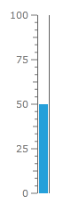
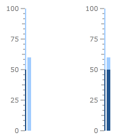
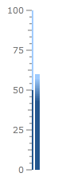

# Bar Indicator

The Bar indicator is a colored bar that is drawn around scale bar. One of ends of this bar points to the scale value. To add bar indicator to the scale you have to include LinearBar element to the list of the scale indicators:

<snippet id='radgauge-linear-scale-bar-indicator-block_1-xaml' />

The Bar indicator supports the following features:

1. Layout 

2. Appearance 

3. Brush is used for the filled part is controlled by Background property.

4. Brush is used for the empty part is controlled by EmptyFill property.

5. You can set stroke thickness (StrokeThickness property) and stroke brush (BorderBrush property).

6. The Bar indicator can be snapped along to scale ticks or to specified interval.

7. Movement animation allows the Bar indicator to smooth its movement when it shows next value.

8. The refresh rate allows calculating the displayed value using values which are assigned during the specified interval according to the specified method.

By default you can set specific color to the bar indicator through the exposed __Background__ property. But sometimes it is useful to change its color depending on the value it points to.

This can be achieved by having several gauge ranges in the linear scale - every range with a specific color set as background. The __UseRangeColor__ property of the bar indicator should be true:

There are several modes which can be used to colorize the bar indicator. Here is the default one:

<snippet id='radgauge-linear-scale-bar-indicator-block_2-xaml' />

If you'd like to have a bar indicator with background that has all range colors, then you should set the __RangeColorMode__ property to "ProportionalBrush":

<snippet id='radgauge-linear-scale-bar-indicator-block_3-xaml' />

Here are the Default and the ProportionalBrush modes:

If you need smooth gradients between the colors then use the __GradientBrush__ mode and set the __RangeColorSmoothing__ property:

<snippet id='radgauge-linear-scale-bar-indicator-block_4-xaml' />

